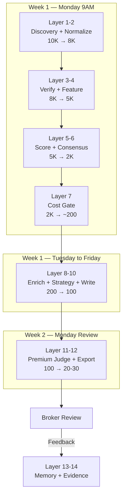

# Jasfo Lead Intelligence Platform — 14-Layer System

> **From 10,000 raw companies to 20-30 high-confidence, outreach-ready leads — one layer at a time.**

## Architecture Overview

The Jasfo Lead Intelligence Platform is a layered, progressive-elimination pipeline that transforms noisy web data into decision-grade commercial intelligence. Each layer is a self-contained stage with a defined input, transformation, model (or no model), and output. Layers compose sequentially — the output of layer N is the input to layer N+1.

The system is designed for **cost-aware intelligence**: expensive models (Claude, MiMo) are reserved for deep evaluation, while cheap/free models (DeepSeek V4 Flash, rule-based scrapers) handle bulk filtering.

```mermaid
flowchart LR
    subgraph Discovery
        L1[Layer 1<br/>Discovery]
        L2[Layer 2<br/>Normalization]
    end
    subgraph Scoring
        L3[Layer 3<br/>Verification]
        L4[Layer 4<br/>Feature Engineering]
        L5[Layer 5<br/>Specialist Agents]
        L6[Layer 6<br/>Consensus Engine]
    end
    subgraph Enrichment
        L7[Layer 7<br/>Cost Gate]
        L8[Layer 8<br/>Contact Enrichment]
        L9[Layer 9<br/>Commercial Strategy]
    end
    subgraph Output
        L10[Layer 10<br/>Outreach]
        L11[Layer 11<br/>Premium Judge]
        L12[Layer 12<br/>Delivery & Learning]
    end
    subgraph Infrastructure
        L13[Layer 13<br/>Memory & Change]
        L14[Layer 14<br/>Evidence Package]
    end

    L1 --> L2 --> L3 --> L4 --> L5 --> L6 --> L7 --> L8 --> L9 --> L10 --> L11 --> L12
    L13 -.->|Cooldown check| L1
    L14 -.->|Evidence bundle| L12
```

## Progressive Elimination

The core design principle is **spend money only on worthy leads**. Each layer acts as a gate that filters out unfit companies before more expensive processing.

| Stage | Layer(s) | Companies | Cost Tier |
|-------|----------|-----------|-----------|
| Bulk Discovery | 1–2 | 10,000 | Free / DeepSeek V4 Flash |
| Scoring & Verification | 3–6 | ~2,000 | DeepSeek V4 Flash + MiMo V2.5 |
| Cost Gate | 7 | 200 max | Free (rule-based) |
| Paid Enrichment | 8–10 | ~200 | Hunter/Apollo/Snov APIs |
| Premium Review | 11 | 20–30 | Claude Sonnet 4 |
| Delivery | 12–14 | 20–30 | Free (export) |

## Layer Map

| # | Layer | Model | Input | Output | Gate |
|---|-------|-------|-------|--------|------|
| 1 | Discovery | None (Firecrawl) | Target list | 10,000 raw records | — |
| 2 | Normalization | DeepSeek V4 Flash | Raw records | Normalized JSON | Schema validation |
| 3 | Verification | MiMo V2.5 | Normalized data | Cross-verified records | 2-source minimum |
| 4 | Feature Engineering | DeepSeek V4 Flash | Verified data | Derived features | NaN/missing check |
| 5 | Specialist Agents | DeepSeek + MiMo | Feature vectors | 8 dimension scores | Score range check |
| 6 | Consensus | MiMo V2.5 | 8 scores | Weighted composite | Agreement threshold |
| 7 | Cost Gate | Rule-based | Composite scores | Enriched subset | Score >= 60 |
| 8 | Contact Enrichment | DeepSeek V4 Flash | Company + score | Decision-maker contacts | Email deliverability |
| 9 | Commercial Strategy | MiMo V2.5 | Company profile | Strategy brief | Objection readiness |
| 10 | Outreach | DeepSeek V4 Flash | Strategy brief | Draft emails | Word count <= 120 |
| 11 | Premium Judge | Claude Sonnet 4 | 20–30 shortlist | Final approval | Claude approval |
| 12 | Delivery & Learning | None (export) | Final leads | CSV/Excel/PDF | Broker feedback |
| 13 | Memory | Hash comparison | All prior leads | Dedup + cooldown | Hash match |
| 14 | Evidence | Aggregation | All prior outputs | Evidence bundle | Completeness check |

## How Layers Compose

## Design Principles

1. **Cost-Aware Routing**: Cheap models (DeepSeek V4 Flash) do 80% of the work. MiMo V2.5 handles scoring and consensus. Claude Sonnet 4 sees only the top 20-30 leads.
2. **Progressive Elimination**: Each layer filters before the next spends money. Leads that fail early never consume paid API quota.
3. **Verification-First**: No derived feature, score, or recommendation is computed without first verifying the underlying data against 2+ sources.
4. **Memory-Enabled**: Layer 13 ensures no company is ever re-sold or re-contacted within a configurable cooldown period.
5. **Evidence-Backed**: Every recommendation includes a full evidence package (Layer 14) so brokers can verify claims before acting.

## Getting Started

- Read **[full-data-flow.md](./full-data-flow.md)** for the end-to-end sequence
- See **[weekly-workflow.md](./weekly-workflow.md)** for the Monday 9AM cron run
- Review **[cost-flow.md](./cost-flow.md)** for budget planning
- Check **[failure-flow.md](./failure-flow.md)** for error handling

## Glossary

| Term | Definition |
|------|-----------|
| Target List | Initial set of company URLs/domains to evaluate |
| Micromarket | Narrow industry subcategory (e.g., "Cloud-based ERP for mid-market manufacturing") |
| Pillar | One of 8 scoring dimensions (Financial Health, Digital Presence, Growth Trajectory, Team Strength, Market Fit, Tech Stack, Regulatory Exposure, Commercial Readiness) |
| Cost Gate | Rule-based filter that prevents low-scoring leads from consuming paid API quota |
| Cooldown | Minimum period (default 90 days) before a company can be re-evaluated |
| Evidence Package | Structured JSON bundle of all sources, scores, and verification data per lead |
