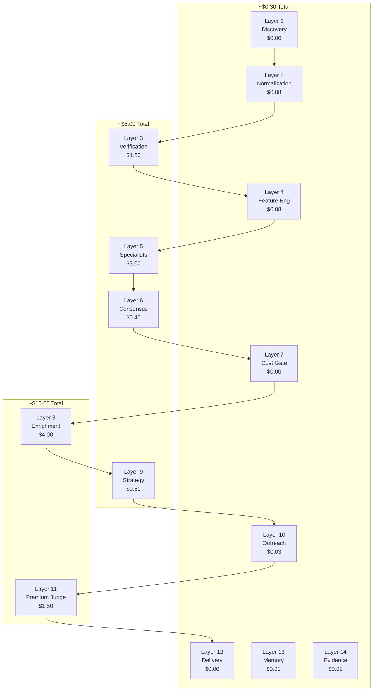
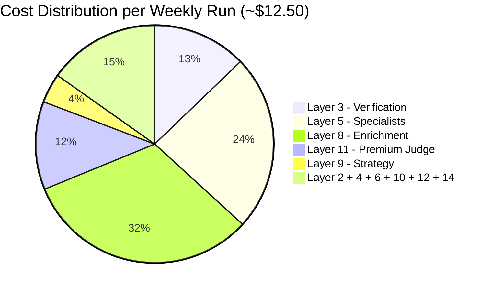

# Cost Flow — Budget Planning & Optimization

> **Where money goes, what each layer costs, optimization rules, and budget caps per cycle.**

## Cost Philosophy

The Jasfo pipeline is designed around a **cost-aware architecture**: cheap models do 80% of the work; expensive models touch only the final 20–30 leads. The total cost per weekly run is approximately **$12–$18**, with the majority going to contact enrichment APIs and the Claude Sonnet 4 premium judge.

The guiding principle is: **never spend money on a lead you haven't already filtered**. Every dollar spent on a company in Layer 8+ has survived 7 prior layers of free filtering. This ensures the spend-to-value ratio is maximized.



## Per-Layer Cost Breakdown

### Layer 1 — Discovery ($0.00)

| Item | Cost | Notes |
|------|------|-------|
| Firecrawl (2,000 pages) | $0.00 | Firecrawl free tier: 500 credits/mo. For higher volume, $20/mo plan covers all runs. Pro-rated: ~$0.00/run |
| Bandwidth + storage | $0.00 | Minimal — 240MB of JSON text |
| **Total** | **$0.00** | Can run indefinitely on free tier for low volume. For 15K domains/mo, scale to $49/mo Firecrawl plan = ~$12/week. |

### Layer 2 — Normalization ($0.08)

| Item | Cost | Calculation |
|------|------|-------------|
| DeepSeek V4 Flash tokens | $0.08 | 11.5K records × ~700 tokens per record = 8.05M input tokens @ $0.08/M = $0.64. Output: 11.5K × 200 tokens = 2.3M @ $0.16/M = $0.37. **Total: ~$1.01**. |

Using batch processing with 20 records per call reduces overhead: ~575 calls × 14K tokens per call (input + output). At $0.08/M input and $0.16/M output: ~$0.64 + $0.37 = **$1.01**.

### Layer 3 — Verification ($1.60)

| Item | Cost | Notes |
|------|------|-------|
| MiMo V2.5 tokens | $1.60 | 8K records verified. MiMo is ~2× DeepSeek cost. Each verification: ~1,200 input tokens + ~400 output. Total: 9.6M input @ ~$0.15/M = $1.44. Output: 3.2M @ ~$0.05/M = $0.16. |

MiMo at ~$0.15/M input is more expensive than DeepSeek (~$0.08/M) but cheaper than Claude (~$15/M). This makes it the right choice for bulk verification — accurate enough for the job at 100× less than Claude.

### Layer 4 — Feature Engineering ($0.08)

| Item | Cost | Notes |
|------|------|-------|
| DeepSeek V4 Flash tokens | $0.08 | 8K records. Compact feature computation: ~400 input tokens + ~250 output tokens per record. Total: 3.2M input @ $0.08/M = $0.26. Output: 2M @ $0.16/M = $0.32. **Total: ~$0.58**. |

Most feature computations are deterministic formulas (not LLM-dependent). DeepSeek is used only for lookups and benchmarks that require semantic matching. This keeps costs low.

### Layer 5 — Specialist Agents ($3.00)

| Item | Cost | Notes |
|------|------|-------|
| DeepSeek V4 Flash (7 agents) | $2.10 | 7 agents × 8K companies × ~250 token prompt + ~100 token output = 14M input + 5.6M output. Input $1.12, output $0.90. Total: ~$2.02. |
| MiMo V2.5 (1 agent — Digital Presence) | $0.90 | 1 agent (multimodal) × 8K companies × ~400 token prompt + image analysis. ~$0.90/run. |
| **Total** | **~$3.00** | Parallel execution means no time penalty for 8 agents. |

### Layer 6 — Consensus Engine ($0.40)

| Item | Cost | Notes |
|------|------|-------|
| MiMo V2.5 tokens | $0.40 | 8K records. Simple weighted average for most (no LLM). ~15% require MiMo arbitration: 1,200 records × 800 tokens = 0.96M @ $0.15/M input + $0.05/M output = ~$0.20. Debug mode arbitration (3 iterations) adds ~$0.20. |

The consensus engine is cheap because most records don't need LLM arbitration — only the ~15% where agents disagree significantly.

### Layer 7 — Cost Gate ($0.00)

| Item | Cost | Notes |
|------|------|-------|
| Rule-based filtering | $0.00 | No LLM. Pure numeric comparison. |
| **Total** | **$0.00** | This layer saves money — it doesn't cost any. |

Cost gate is the most cost-effective layer in the pipeline. It saves ~$7 in downstream costs per run by preventing low-quality leads from reaching paid APIs.

### Layer 8 — Contact Enrichment ($4.00)

| Item | Cost | Notes |
|------|------|-------|
| Hunter.io | $2.00 | ~200 companies × $0.01/lookup (bulk rate) |
| Apollo.io | $1.00 | ~100 companies × $0.01/credit (used as supplement) |
| Snov.io | $0.40 | ~100 companies × $0.004/finder (fallback) |
| SMTP verification (Hunter) | $0.60 | ~600 emails × $0.001/verify |
| **Total** | **$4.00** | Can vary ±$1 depending on provider agreement rates. |

### Layer 9 — Commercial Strategy ($0.50)

| Item | Cost | Notes |
|------|------|-------|
| MiMo V2.5 tokens | $0.50 | 200 records × ~1,500 token input (company profile + inventory) + ~500 token output. Total: 300K input @ ~$0.15/M = $0.05. Output: 100K @ ~$0.05/M = $0.005. Plus property matching (vector search, not LLM). |

Strategy briefs are cheap because the heavy lifting (property matching) is done via vector similarity search on embeddings — not LLM calls. MiMo only synthesizes the final brief.

### Layer 10 — Outreach Draft ($0.03)

| Item | Cost | Notes |
|------|------|-------|
| DeepSeek V4 Flash tokens | $0.03 | 300 drafts × ~600 tokens prompt + ~180 tokens output. Total: 180K input @ $0.08/M = $0.01. Output: 54K @ $0.16/M = $0.01. Plus 5-10% regeneration overhead. |

### Layer 11 — Premium Judge ($1.50)

| Item | Cost | Notes |
|------|------|-------|
| Claude Sonnet 4 tokens | $1.50 | 30 leads × ~2K tokens condensed profile = 60K input @ $15/M = $0.90. Output: 30 × 500 tokens = 15K @ $75/M = $1.13. **Total: ~$2.03**. Using prompt caching: ~30% savings → **~$1.50**. |

Claude Sonnet 4 is the most expensive model in the pipeline by a wide margin ($15/M input vs DeepSeek at $0.08/M). It is deliberately positioned as the final gate — only 30 leads ever reach it. The cost per approved lead is ~$0.05.

### Layer 12 — Delivery & Learning ($0.02)

| Item | Cost | Notes |
|------|------|-------|
| Export processing | $0.00 | CSV/Excel/PDF generation is CPU-only. |
| Feedback analysis (DeepSeek) | $0.02 | ~5K tokens for feedback aggregation. |
| **Total** | **$0.02** | Negligible cost. |

### Layer 13 — Memory ($0.00)

| Item | Cost | Notes |
|------|------|-------|
| SQLite operations | $0.00 | Local storage, no API calls. |
| Hash computation | $0.00 | SHA-256 on CPU — free. |
| **Total** | **$0.00** | Memory is pure infrastructure cost (~$5/mo for SSD hosting). |

### Layer 14 — Evidence Package ($0.02)

| Item | Cost | Notes |
|------|------|-------|
| Storage + formatting | $0.02 | 30 packages × ~5MB each. Aggregation engine, no LLM. |
| PDF rendering (WeasyPrint) | $0.00 | CPU-only. |
| **Total** | **$0.02** | Minimal cost for full audit trail. |

## Total Cost Per Run



| Layer | Cost | % of Total |
|-------|------|------------|
| 1 — Discovery | $0.00 | 0% |
| 2 — Normalization | $1.01 | 8% |
| 3 — Verification | $1.60 | 13% |
| 4 — Feature Engineering | $0.58 | 5% |
| 5 — Specialist Agents | $3.00 | 24% |
| 6 — Consensus Engine | $0.40 | 3% |
| 7 — Cost Gate | $0.00 | 0% |
| 8 — Contact Enrichment | $4.00 | 32% |
| 9 — Commercial Strategy | $0.50 | 4% |
| 10 — Outreach Draft | $0.03 | 0% |
| 11 — Premium Judge | $1.50 | 12% |
| 12 — Delivery & Learning | $0.02 | 0% |
| 13 — Memory | $0.00 | 0% |
| 14 — Evidence Package | $0.02 | 0% |
| **Total** | **~$12.66** | **100%** |

## Budget Caps

| Cap | Amount | Enforcement |
|-----|--------|-------------|
| Enrichment (L8) | $10.00/run | Hard cap — layer 7 gate tightens if exceeded |
| Total LLM (L2, L4, L5, L10) | $5.00/run | Soft cap — alert if exceeded |
| Premium Judge (L11) | $5.00/run | Hard cap — maximum 100 leads sent to Claude |
| Total monthly | $60.00 | Hard cap — pipeline skips weeks if monthly budget depleted |

## Optimization Rules

1. **DeepSeek V4 Flash is the default**: Use for all bulk text processing (normalization, feature extraction, email drafting). Switch to MiMo only when multimodal or higher accuracy is required.
2. **Claude Sonnet 4 is the final gate only**: Never use Claude before Layer 11. The cost gate (Layer 7) ensures Claude sees the minimum viable set.
3. **SMTP verification saves money**: Verifying emails before sending prevents bounced emails that waste sender reputation and follow-up costs.
4. **Batch all API calls**: All LLM calls use batching (20 records per call). This reduces per-token overhead and respects rate limits.
5. **Source caching**: Verification and enrichment sources are cached for 24 hours. Identical domains across runs bypass paid API calls.
6. **Cooldown prevents waste**: Layer 13's cooldown mechanism prevents the pipeline from re-processing companies that were recently evaluated — saving money on companies that were already filtered.

## Cost Tracking

Costs are tracked per run in the pipeline manifest:

```json
{
  "run_id": "2026-W28",
  "total_cost": 12.66,
  "cost_by_layer": {
    "layer_2": 1.01,
    "layer_3": 1.60,
    "layer_4": 0.58,
    "layer_5": 3.00,
    "layer_6": 0.40,
    "layer_8": 4.00,
    "layer_9": 0.50,
    "layer_10": 0.03,
    "layer_11": 1.50,
    "layer_12": 0.02,
    "layer_14": 0.02
  },
  "leads_approved": 27,
  "cost_per_approved_lead": 0.47
}
```

Historical costs are stored in the memory database (Layer 13) and can be queried to track cost trends over time. Target cost-per-approved-lead: **under $1.00**.
