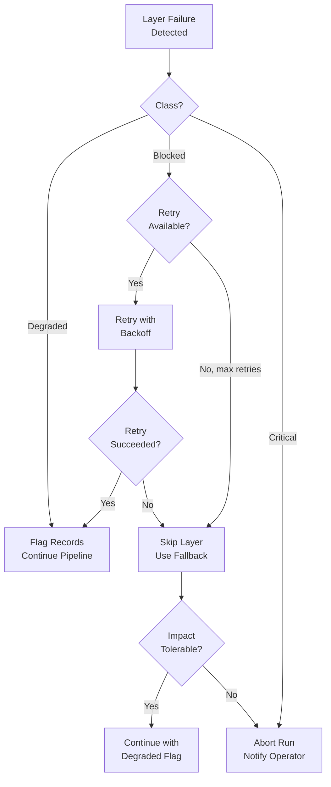

# Failure Flow — Failure Modes, Detection & Recovery

> **Every layer has specific failure modes. This document catalogs them with detection methods, recovery procedures, and prevention strategies.**

## Failure Classification

Failures in the pipeline fall into three categories:

| Class | Impact | Examples | Response |
|-------|--------|----------|----------|
| **Degraded** | Pipeline continues but output quality may suffer | Partial scrape, low-confidence verification, missing features | Run completes with flags; operator reviews flags |
| **Blocked** | Pipeline cannot proceed past current layer | API key invalid, provider down, schema validation mass failure | Retry batch; escalate if persistent |
| **Critical** | Pipeline must abort | Budget cap exceeded without control, data corruption, memory DB integrity failure | Abort run, notify operator immediately |

## Layer-by-Layer Failure Modes

### Layer 1 — Discovery

| Failure | Class | Detection | Recovery | Prevention |
|---------|-------|-----------|----------|------------|
| Firecrawl API unavailable | Blocked | Zero records after 60s timeout, HTTP 503 | Retry 2× with 5min backoff. If still down, use cached scrape from last run (max 2 weeks stale). | Monitor Firecrawl status page. Maintain hot cache from last successful run. |
| Target list is empty | Critical | Input file has 0 lines | Abort immediately. Notify operator to provide target list. | Validate target list in pre-run hook. |
| All domains unreachable | Degraded | <5% reachable rate | Flag run as `low_quality`. May proceed if target list was deliberately narrow. | Run sample batch before full scrape. |
| HTTP redirect loop | Degraded | Max redirects exceeded | Mark domain `redirect_loop`, skip it. | Enforce max redirect count (5). |
| Rate limited by target domain | Degraded | HTTP 429 on specific domains | Skip that domain, retry later in batch. Others continue. | Randomized crawl order, 2 req/sec cap per domain. |

### Layer 2 — Normalization

| Failure | Class | Detection | Recovery | Prevention |
|---------|-------|-----------|----------|------------|
| DeepSeek API timeout | Blocked | Request exceeds 30s per batch | Retry batch 1×. Split into smaller batches on retry. | Batch size capped at 20 records. |
| Mass schema validation failure | Degraded | >20% of batch fails schema | Quarantine failing records. Investigate schema mismatch. | Pin JSON Schema version. Run schema diff when updating. |
| All outputs null | Degraded | Extraction confidence <0.3 for all fields | Flag as `extraction_failure`, route to reduced path. | Include "guess or null" instruction in prompt. |
| DeepSeek structured output not JSON | Degraded | JSON parse fails on response | Retry 2× with stricter formatting prompt. If persist, flag record. | Use response_format: json_object parameter. |

### Layer 3 — Verification

| Failure | Class | Detection | Recovery | Prevention |
|---------|-------|-----------|----------|------------|
| MiMo API unavailable | Blocked | HTTP 503 | Retry 3× with exponential backoff. If still down, skip verification (degraded output). | Have DeepSeek as verification fallback (lower accuracy). |
| All sources unreachable for a record | Degraded | 0 sources respond | Accept normalized data as-is with `verification_status: "unverified"`. | N/A — some private companies have no public data. |
| Conflicting sources (all disagree) | Degraded | 0 fields pass 2-source rule | Flag `verification_conflict`. Accept majority where possible, null the rest. | Increase source pool (add SEC, industry registries). |
| Source rate limiting | Degraded | LinkedIn blocks >100 req/hr | Switch to cached data (24hr cache). | Implement rotating proxy IPs for LinkedIn. |

### Layer 4 — Feature Engineering

| Failure | Class | Detection | Recovery | Prevention |
|---------|-------|-----------|----------|------------|
| >60% features missing per record | Degraded | Missing_feature_mask > 0.6 | Route record to reduced scoring path (max score 40). | N/A — data-sparse companies are expected. |
| Division by zero (employee or revenue = 0) | Degraded | NaN/infinity in derived features | Replace with industry median. Flag as `imputed`. | Add pre-computation non-zero check. |
| Industry benchmark lookup fails | Degraded | Micromarket not in benchmark index | Use global average instead of industry-specific. Flag as `benchmark_fallback`. | Maintain benchmark index as curated JSON with fallback chain. |

### Layer 5 — Specialist Agents

| Failure | Class | Detection | Recovery | Prevention |
|---------|-------|-----------|----------|------------|
| Agent returns no score | Degraded | Score is null | Retry agent 1×. If still null, omit that pillar from consensus (adjust weights). | Agent-level timeout of 15s, retry on timeout. |
| Invalid score range | Degraded | Score outside 0-100 | Clamp to valid range. Flag score as `clamped`. | Post-process check after each agent response. |
| All agents agree (potential bias) | Degraded | Std deviation < 2 across 8 agents | Flag as `potential_bias`. Consensus proceeds normally but broker is alerted. | Periodic bias calibration test with known-quality samples. |
| 1 agent systematically off | Degraded | One agent deviates >30 from others on >50% of records | Flag agent for recalibration. Downweight its contribution. | Weekly cross-validation of agent outputs. |

### Layer 6 — Consensus

| Failure | Class | Detection | Recovery | Prevention |
|---------|-------|-----------|----------|------------|
| MiMo arbitration inconsistent | Degraded | Same input produces different output on retry | Run arbitration 3× and take median. Flag as `arbitration_unstable`. | Seed MiMo with deterministic output (temperature=0). |
| All weights collapse to one pillar | Degraded | Agreement ratio = 0.0 | Use equal weights. Flag as `agreement_failure`. | Enforce minimum weight of 0.05 per pillar. |
| Composite score equals single agent score | Degraded | Weighted average == single score | Likely means other agents failed. Route to reduced path. | Cross-check composite against individual scores. |

### Layer 7 — Cost Gate

| Failure | Class | Detection | Recovery | Prevention |
|---------|-------|-----------|----------|------------|
| Budget cap exceeded unexpectedly | Blocked | Estimated enrichment cost > cap + 20% | Tighten threshold dynamically. Notify operator. | Set BUDGET_CAP_ENRICHMENT conservatively. |
| Score threshold misconfigured | Degraded | All or no companies pass the gate | Notify operator. Pause until threshold reviewed. | Validate threshold against last run's distribution. |
| Manual pool empty (all companies pass) | Degraded | 0 companies in 40-59 range | Likely means score inflation. Proceed but flag for investigation. | Alert if score distribution shifts >10% from baseline. |

### Layer 8 — Contact Enrichment

| Failure | Class | Detection | Recovery | Prevention |
|---------|-------|-----------|----------|------------|
| All provider API keys expired | Critical | All 3 return HTTP 401 | Abort enrichment. Notify operator immediately. | Automated API key expiry monitoring (30-day warning). |
| All SMTP verifications fail | Degraded | 0 emails pass SMTP check | Flag all contacts as `verification_failed`. Proceed but broker warned. | SMTP verification uses conservative timeout (10s). |
| Rate limited by all providers | Blocked | HTTP 429 from Hunter, Apollo, Snov | Implement progressive delay. Process fewer companies this cycle. | Stagger API calls across providers. |
| Contact gap on high-scoring lead | Degraded | No decision-maker email for score 85+ | Flag as `high_priority_gap`. Broker can manually source email. | Fallback to LinkedIn Sales Navigator if APIs fail. |

### Layer 9 — Commercial Strategy

| Failure | Class | Detection | Recovery | Prevention |
|---------|-------|-----------|----------|------------|
| Property inventory empty | Blocked | Inventory feed returns 0 properties | Notify operator. Cannot generate strategy briefs. | Monitor inventory feed freshness pre-run. |
| Mismatch on all properties | Degraded | No property scores >60 for any company | Generate general briefs. Place all in hold queue. | Flag if >50% of companies land in hold queue. |
| Budget estimate unreasonable | Degraded | Budget > 100% of revenue | Clamp to 100%. Flag as `estimate_probable_error`. | Validate estimate range against known Pune market rates. |

### Layer 10 — Outreach

| Failure | Class | Detection | Recovery | Prevention |
|---------|-------|-----------|----------|------------|
| Repeated word-count rejects | Degraded | Same draft regenerated 3× | Accept draft with 120-word warning (flag it). | Relax limit by 10 words for complex personalization. |
| No personalized signal found | Degraded | 0 company-specific signals available | Use domain-level personalization. Flag as `generic`. | Maintain company event scraper to enrich signal pool. |
| Email contains spam trigger words | Degraded | Spam word detected in post-check | Regenerate with stricter prompt. | Maintain spam word blocklist in prompt. |

### Layer 11 — Premium Judge

| Failure | Class | Detection | Recovery | Prevention |
|---------|-------|-----------|----------|------------|
| Claude API unavailable | Blocked | HTTP 503 | Retry 3× with 30s backoff. If still down, approve all Layer 10 output (bypass judge). | Run Claude as final step — retries have time. |
| Claude returns empty verdict list | Degraded | 0 verdicts in response | Re-prompt with shorter lead list. If still fails, bypass judge. | Keep lead count ≤ 30 for reliable Claude context. |
| All leads rejected (potential bias) | Degraded | 100% rejection rate | Flag for operator review. May indicate prompt drift. | Include "reject at most 30%" guideline in judge prompt. |

### Layer 12 — Delivery & Learning

| Failure | Class | Detection | Recovery | Prevention |
|---------|-------|-----------|----------|------------|
| CSV/Excel/PDF export fails | Degraded | File write error | Retry 1×. If still fails, deliver JSON-only. | Run export in temp dir, then move to final. |
| Feedback file unparseable | Degraded | JSON decode error | Flag file, skip feedback analysis this cycle. | Validate feedback JSON before analysis. |
| Prompt adjustment recommendation empty | Degraded | DeepSeek returns no suggestions | Skip prompt update this cycle. | N/A — some cycles have no actionable feedback. |

### Layer 13 — Memory

| Failure | Class | Detection | Recovery | Prevention |
|---------|-------|-----------|----------|------------|
| Memory DB integrity error | Critical | SQLite integrity_check fails | Restore from last known-good backup. | Daily SQLite integrity check + WAL mode. |
| Cooldown not enforced (bug) | Degraded | Same company appears within cooldown | Remove duplicates manually. Fix logic in next release. | Unit test for cooldown filtering. |
| Hash collision | Critical | Two different companies produce same hash | Extremely unlikely with SHA-256. Monitor and log if occurs. | Domain hash includes domain as check — collisions produce same-domain collision which is desired. |

### Layer 14 — Evidence

| Failure | Class | Detection | Recovery | Prevention |
|---------|-------|-----------|----------|------------|
| Missing evidence from prior layer | Degraded | Completeness check fails | Include `incomplete` flag in package. List what's missing. | Run completeness check during each layer's output validation. |
| Screenshot generation fails | Degraded | Image file missing | Skip screenshot, include URL reference only. | Firecrawl fallback — retry screenshot capture. |
| Package too large (>5MB) | Degraded | Attachment size exceeds limit | Strip full-resolution screenshots, keep thumbnails. | Compress images at capture time (JPEG quality 80). |
| Storage write failure | Blocked | Disk full or permission denied | Abort package generation. Notify operator. | Monitor disk space pre-run (minimum 10GB free). |

## Recovery Decision Matrix

| Scenario | Action | Impact |
|----------|--------|--------|
| Single layer fails, retries succeed | Continue normally | None |
| Single layer fails, retries fail, degradable | Continue with degraded flag | Reduced quality on that dimension |
| Layer 3 (Verification) fails completely | Abort run | Missing verification = unreliable data |
| Layer 7 (Cost Gate) fails | Abort enrichment | Budget protection — do not spend blindly |
| Layer 8 (Enrichment) fails completely | Deliver with contact gaps | Broker must source contacts manually |
| Layer 11 (Judge) fails | Bypass — approve all | No quality filter on top leads |
| Layer 13 (Memory) fails | Disable cooldown | Duplicate leads possible this run only |
| Two or more critical layers fail | Abort and notify | Full manual review required |

## Alerting

All failures trigger alerts through a priority-based notification system:

| Priority | Channel | Response SLA | Examples |
|----------|---------|-------------|----------|
| P1 — Critical | SMS + Slack + Email | 15 min | Budget overflow, DB corruption, all API keys expired |
| P2 — Blocked | Slack + Email | 1 hour | Layer cannot proceed, provider down, operator gate stuck |
| P3 — Degraded | Slack message | 4 hours | Partial data, reduced quality, retry succeeded |
| P4 — Warning | Run summary email | End of run | Anomaly detected but pipeline completed |
