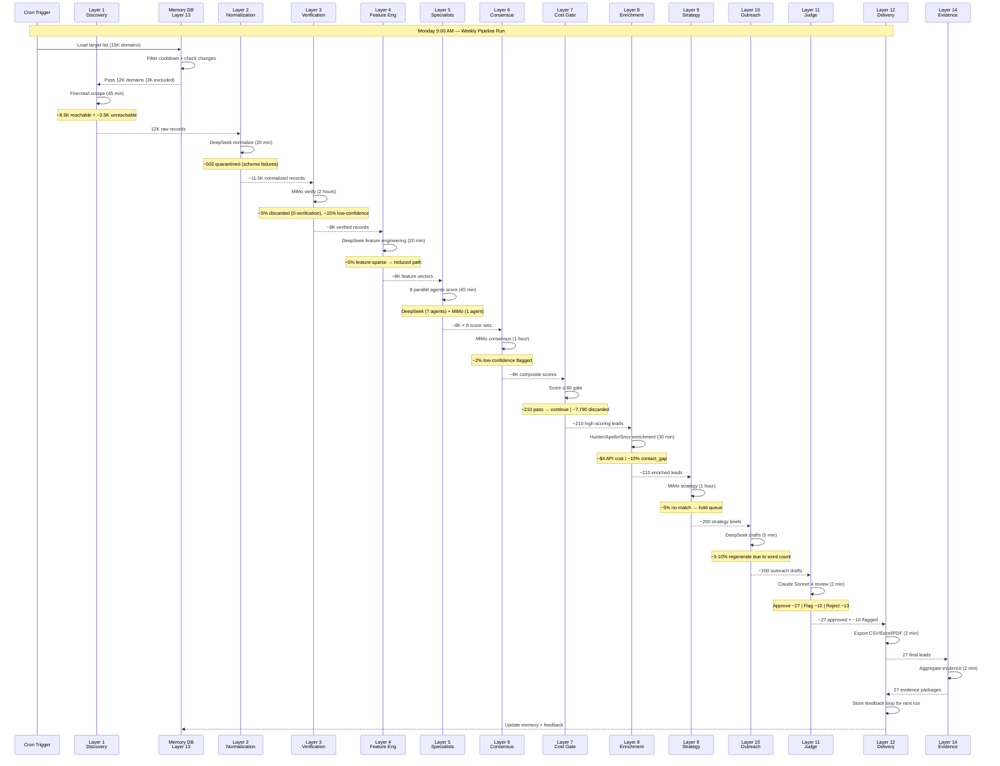

# End-to-End Data Flow

> **Complete data journey through all 14 layers — from raw URL to signed-off lead package.**

## System-Level Sequence

The following sequence diagram shows how data moves between layers, which models process it, and where filtering occurs. Each layer's output is persisted to a staging directory before the next layer reads it, allowing layers to be retried independently if a failure occurs.



## Data at Rest

Each layer writes its output to a staging directory structure:

```
pipeline_runs/
└── 2026-W28/
    ├── layer_01_discovery/
    │   ├── raw_records.jsonl        (12K records)
    │   ├── unreachable_domains.jsonl (3.5K records)
    │   └── run_metadata.json
    ├── layer_02_normalization/
    │   ├── normalized_records.jsonl (11.5K records)
    │   ├── schema_failures.jsonl     (500 records)
    │   └── run_metadata.json
    ├── layer_03_verification/
    │   ├── verified_records.jsonl    (8K records)
    │   ├── discarded_records.jsonl   (600 records)
    │   ├── low_confidence.jsonl      (1.2K records)
    │   └── run_metadata.json
    ├── layer_04_feature_engineering/
    │   ├── feature_vectors.jsonl     (8K records)
    │   ├── sparse_features.jsonl     (400 records)
    │   └── run_metadata.json
    ├── layer_05_specialist_agents/
    │   ├── scores_financial.jsonl
    │   ├── scores_digital.jsonl
    │   ├── scores_growth.jsonl
    │   ├── scores_team.jsonl
    │   ├── scores_market_fit.jsonl
    │   ├── scores_tech.jsonl
    │   ├── scores_regulatory.jsonl
    │   ├── scores_commercial.jsonl
    │   └── run_metadata.json
    ├── layer_06_consensus/
    │   ├── composite_scores.jsonl    (8K records)
    │   ├── low_consensus.jsonl       (160 records)
    │   └── run_metadata.json
    ├── layer_07_cost_gate/
    │   ├── priority_queue.jsonl      (20 leads)
    │   ├── standard_queue.jsonl      (190 leads)
    │   ├── manual_pool.jsonl         (400 leads)
    │   └── run_metadata.json
    ├── layer_08_enrichment/
    │   ├── enriched_leads.jsonl      (210 records)
    │   ├── contact_gaps.jsonl        (21 records)
    │   └── run_metadata.json
    ├── layer_09_strategy/
    │   ├── strategy_briefs.jsonl     (200 records)
    │   ├── hold_queue.jsonl          (10 records)
    │   └── run_metadata.json
    ├── layer_10_outreach/
    │   ├── email_drafts.jsonl        (200 records)
    │   └── run_metadata.json
    ├── layer_11_judge/
    │   ├── approved_leads.jsonl      (27 records)
    │   ├── flagged_leads.jsonl       (10 records)
    │   ├── rejected_leads.jsonl      (13 records)
    │   └── run_metadata.json
    ├── layer_12_delivery/
    │   ├── exports/
    │   │   ├── leads_2026-W28.csv
    │   │   ├── leads_2026-W28.xlsx
    │   │   └── leads_2026-W28.pdf
    │   ├── feedback_log.jsonl
    │   └── run_metadata.json
    ├── layer_14_evidence/
    │   ├── packages/                  (27 evidence bundles)
    │   └── run_metadata.json
    └── pipeline_manifest.json
```

## Data Volume by Layer

| Layer | Input Records | Output Records | Data Size | % of Original |
|-------|---------------|----------------|-----------|---------------|
| 1 | 15,000 (raw list) | 12,000 raw | ~240 MB | 100% |
| 2 | 12,000 | 11,500 | ~115 MB | 96% |
| 3 | 11,500 | 8,000 | ~80 MB | 67% |
| 4 | 8,000 | 8,000 | ~128 MB (features added) | 67% |
| 5 | 8,000 | 8,000 × 8 | ~64 MB | 67% |
| 6 | 8,000 | 8,000 | ~32 MB | 67% |
| 7 | 8,000 | 210 | ~2 MB | 1.8% |
| 8 | 210 | 210 | ~4 MB | 1.8% |
| 9 | 210 | 200 | ~6 MB | 1.7% |
| 10 | 200 | 200 | ~1 MB | 1.7% |
| 11 | 200 | 27 | ~0.3 MB | 0.23% |
| 12 | 27 | 27 (exported) | ~5 MB (PDF) | 0.23% |
| 13 | — | — | ~2 MB (DB) | overhead |
| 14 | 27 | 27 + attachments | ~10 MB | 0.23% |

## Runtime Profile

Total end-to-end runtime: **~7 hours** for a full weekly run. The majority of time is spent in Layer 3 (2 hours for MiMo verification) and Layer 5 + Layer 6 (45 min + 1 hour for scoring and consensus). Layers that use free or cheap models are designed to be the most time-consuming. The paid API layers (8–11) complete in under 90 minutes combined.

The pipeline is designed to start at Monday 9:00 AM and complete by end-of-day Monday. Layers 1–6 run unattended. Layers 7–12 require no manual intervention but the operator may wish to review the cost gate output before enrichment begins. The full timeline is documented in [weekly-workflow.md](./weekly-workflow.md).
