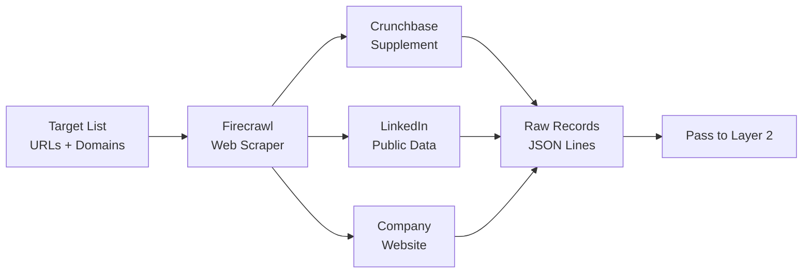

# Layer 1: Discovery

> **Purpose**: Collect 10,000+ raw company data points from public web sources using Firecrawl and free data sources.
>
> **Model**: None (scraper only)
>
> **Input**: Target list (URLs, domains, company names)
>
> **Output**: Raw company records (JSON)

## Overview

Layer 1 is the intake valve of the entire pipeline. It uses [Firecrawl](https://firecrawl.com) as the primary engine to scrape company websites, Crunchbase profiles, LinkedIn company pages, and industry directories. No AI model is involved — this is pure data acquisition. The scraper operates against a curated target list provided by broker or generated from industry-vertical keyword searches.

The scraper collects approximately 25 fields per company record: legal name, website URL, founded year, employee count (raw text), revenue range (raw text), industry keywords, headquarters location, management team names and titles, technology stack signals, social media URLs, recent news headlines, and contact page URLs. Fields are captured as raw strings — no normalization, cleaning, or validation happens at this layer.



## Implementation Details

Firecrawl is configured with a depth-1 crawl strategy per domain: scrape the homepage, about page, team page, and contact page. The scraper uses headless Chrome with a 15-second render timeout. Rate limiting is set to 2 requests per second per domain to avoid blocking. Failed requests are retried twice with exponential backoff (1s, 3s). If all retries fail, the domain is flagged as `unreachable` and passed to Layer 2 with a null-quality marker so it can be replaced by the next best candidate.

The target list typically contains 12,000–15,000 entries to account for 20–30% attrition from unreachable domains, non-commercial entities (government, education), and companies that redirect to a different domain. The scraper logs all HTTP status codes, response times, and redirect chains. Domains returning 4xx or 5xx after retries are marked with the error code. Domains that redirect are followed once and the final URL is stored alongside the original.

## Output Contract

Every record emitted by Layer 1 must include at minimum these fields or null markers:

```json
{
  "input_domain": "acmecorp.com",
  "scraped_urls": ["https://acmecorp.com", "https://acmecorp.com/about"],
  "crawl_timestamp": "2026-07-12T09:00:15Z",
  "raw_name": "Acme Corp | Enterprise Software",
  "raw_description": "Acme Corp provides cloud-based ERP solutions...",
  "raw_employees": "200-500 employees",
  "raw_revenue": "$10M-$50M",
  "raw_founded": "Founded 2012",
  "raw_location": "San Francisco, CA",
  "raw_industry_tags": ["ERP", "Cloud Software", "Manufacturing"],
  "management_raw": ["Jane Doe — CEO", "John Smith — CTO"],
  "tech_signals": ["React", "AWS", "Python"],
  "social_urls": {
    "linkedin": "https://linkedin.com/company/acmecorp",
    "crunchbase": "https://crunchbase.com/organization/acmecorp"
  },
  "contact_page_url": "https://acmecorp.com/contact",
  "reachability": "reachable",
  "error": null
}
```

Records that are unreachable still enter Layer 2 with `reachability: "unreachable"`. The normalization layer may still produce a minimal record from partial data (e.g., Crunchbase fallback) or discard the entry entirely if no signal exists.
