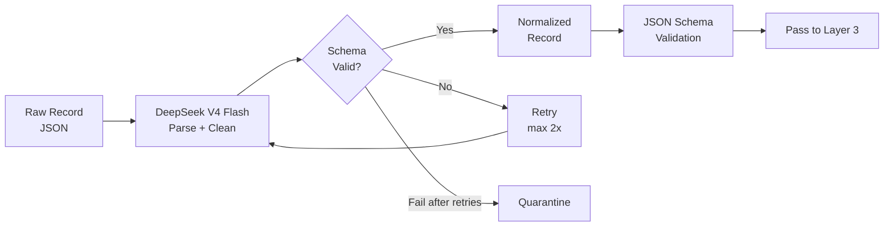

# Layer 2: Normalization

> **Purpose**: Standardize raw scraped data into structured, type-safe JSON with consistent formats for company names, addresses, micromarkets, and size bands.
>
> **Model**: DeepSeek V4 Flash
>
> **Input**: Raw company records (JSON)
>
> **Output**: Normalized company records (validated JSON schema)

## Overview

Raw data from Layer 1 is messy. Company names include taglines ("Acme Corp | Enterprise Software"), employee counts are prose ("200-500 employees"), locations are inconsistent ("San Francisco, CA" vs "San Francisco, California"), and industry tags are unstructured. Layer 2 uses DeepSeek V4 Flash to parse, clean, and standardize every field into a defined schema. The model operates in structured-output mode — every response is validated against a JSON Schema before being accepted.

The normalization prompt instructs DeepSeek to extract individual fields from concatenated raw text, resolve abbreviations ("SF" → "San Francisco"), strip corporate suffixes inconsistently ("Inc." vs "Incorporated" — standardized to `Inc`), classify the company into a micromarket (a narrow 3–5 word industry subcategory like "Mid-market manufacturing ERP"), and assign employee/revenue bands using a predefined lookup. The model never invents data — if a field cannot be extracted with confidence, it is set to `null`.

## Schema & Enumerations

Each normalized record must conform to this schema:

| Field | Type | Example | Validation |
|-------|------|---------|------------|
| `company_name` | string | "Acme Corp" | Max 100 chars, no taglines |
| `legal_suffix` | enum | "Inc", "LLC", "Ltd", "GmbH", null | 15-value enumeration |
| `micromarket` | string | "Cloud ERP for mid-market manufacturing" | 3–7 words, industry-standard taxonomy |
| `employee_band` | enum | "band_50_200", "band_200_1000", "band_1000_plus" | 6-value enumeration |
| `revenue_band` | enum | "rev_5m_20m", "rev_20m_100m" | 6-value enumeration |
| `founded_year` | int | 2012 | 1950–2026, nullable |
| `hq_city` | string | "San Francisco" | Validated against GeoNames index |
| `hq_state` | string | "CA" | 2-letter ISO code, lowercase |
| `hq_country` | string | "US" | ISO 3166-1 alpha-2 |
| `tech_stack` | string[] | ["React", "AWS", "Python"] | Min 0, max 20 items |
| `management_roles` | object[] | `[{"name": "Jane Doe", "title": "CEO"}]` | Min 0, title normalized |
| `social_profiles` | object | `{"linkedin": "...", "crunchbase": "..."}` | Valid URL or null |
| `normalization_confidence` | float | 0.92 | 0.0–1.0 |

DeepSeek processes records in batches of 20 at ~3 seconds per batch. A full run of 8,000 surviving records (after unreachable removal) takes approximately 20 minutes. Schema validation runs on every output; invalid records receive up to 2 retries before being quarantined to a `normalization_failures.jsonl` file for manual review.

## Micromarket Classification

Micromarket classification is the most critical output of this layer. DeepSeek assigns each company to one node in a 200-value hierarchical taxonomy. Examples: "Cloud-based ERP for mid-market manufacturing", "AI-powered customer support for e-commerce", "Compliance training platform for financial services". The micromarket drives later layers: scoring agents use it to assess market fit, and the commercial strategy engine uses it to match company needs to Pune property offerings.

The taxonomy includes a catch-all ("Other — [description]") for companies that fall outside defined categories. These entries are flagged for manual review but still proceed through the pipeline — they receive lower market-fit scores in Layer 5 but are not discarded.
