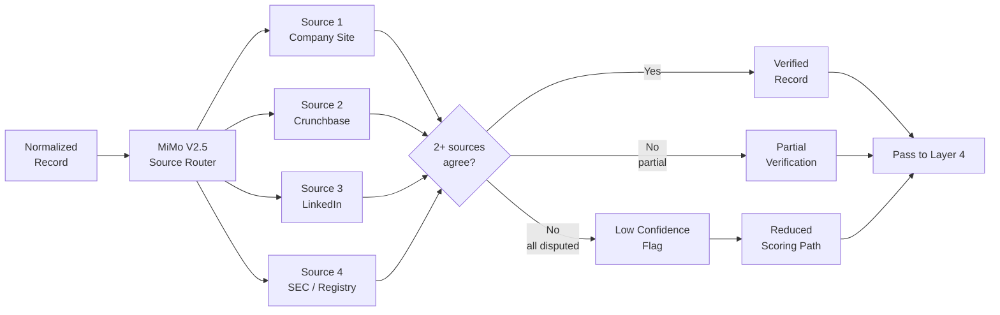

# Layer 3: Verification

> **Purpose**: Cross-reference every data point against 2+ independent sources before accepting it. Discard records that fail verification.
>
> **Model**: MiMo V2.5
>
> **Input**: Normalized company records
>
> **Output**: Cross-verified records (2-source minimum per field)

## Overview

Layer 3 implements the **2-source verification rule**: every critical field in a company record must be confirmed by at least two independent sources before it is considered reliable. MiMo V2.5 (a medium-cost, high-accuracy multimodal model) orchestrates this verification by querying supplementary data sources and comparing the normalized data from Layer 2 against them. Fields that cannot be verified are either nulled (demoted to `unverified`) or, if enough fields fail, the entire record is flagged as `low_confidence` and routed to a reduced scoring path in later layers.

The verification engine maintains a prioritized source list: (1) company website (primary), (2) Crunchbase, (3) LinkedIn public data, (4) SEC filings for US-based companies via EDGAR API, (5) Google Business Profile, (6) industry-specific registries (e.g., G2 for software companies, FDA registrations for medical devices). The system requires at least two corroborating sources from this list per field. MiMo V2.5 evaluates source agreement by comparing extracted values — if two sources report employee count as "200–500" and a third reports "1,000+", the field is flagged as `disputed` and the majority is accepted.

## Verification Rules by Field

| Field | Required Sources | Match Criteria | Failure Action |
|-------|-----------------|----------------|----------------|
| `company_name` | 2 of {website, Crunchbase, LinkedIn} | Fuzzy match ≥90% | Mark `unverified_name` |
| `employee_band` | 2 of {website, LinkedIn, Crunchbase} | Same band or adjacent | Accept adjacent band |
| `revenue_band` | 2 of {Crunchbase, SEC, registry} | Exact band match | Null the field |
| `founded_year` | 2 of {website, Crunchbase, LinkedIn} | ±1 year tolerance | Accept or null |
| `hq_location` | 2 of {website, LinkedIn, Google Business} | City-level match | Null city if 0 sources agree |
| `micromarket` | 1 of {website, Crunchbase} + LLM judgment | Classification match | Accept lower confidence |

## Record-Level Confidence

Every record receives a `verification_score` from 0.0 to 1.0. This is the fraction of critical fields that passed 2-source verification. Records scoring below 0.4 are flagged `low_confidence` and routed to a reduced scoring path in Layers 4–6 where they receive a maximum pillar score of 50 (out of 100) regardless of other indicators. Records scoring 0.0 (no field verified) are discarded entirely — this typically eliminates ~5% of the dataset. The rest proceed to Layer 4 with their verification score carried forward as a weight in all subsequent calculations.

MiMo V2.5 processes each record in approximately 800ms, including API call time. A batch of 8,000 records completes in about 2 hours. The layer is idempotent — rerunning it on the same input produces identical verification results because source queries are deterministic and cached for 24 hours.
