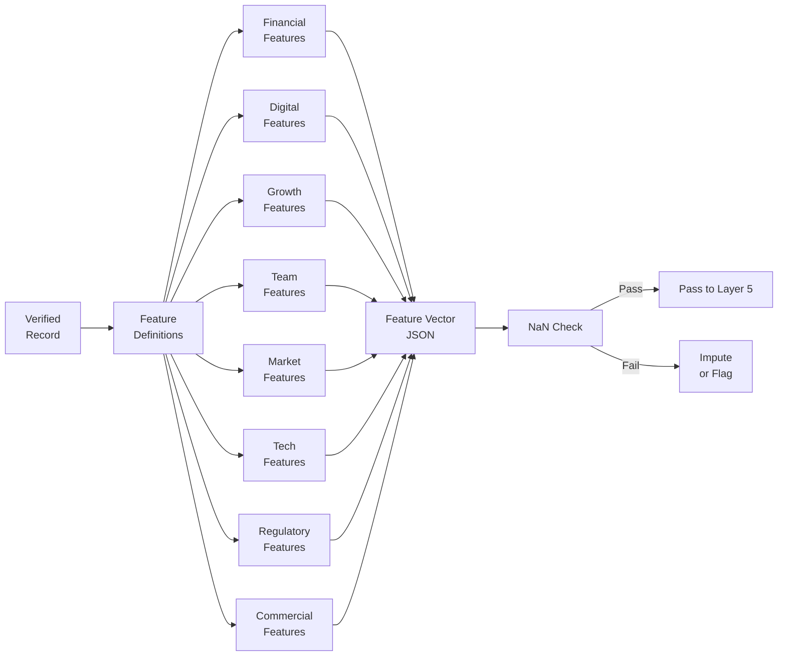

# Layer 4: Feature Engineering

> **Purpose**: Compute derived features from verified raw data — employee growth rates, revenue-per-employee estimates, rent affordability ratios, digital maturity scores.
>
> **Model**: DeepSeek V4 Flash
>
> **Input**: Verified company records
>
> **Output**: Feature vectors (numerical + categorical derived fields)

## Overview

Raw and verified data points are categorical or text-based. Layer 4 transforms them into numerical and ordinal features that the specialist scoring agents (Layer 5) can consume. DeepSeek V4 Flash computes derived metrics using deterministic rules defined in the feature engineering prompt. No ML model training occurs — all features are computed via arithmetic, lookups, and heuristic rules.

The feature engineering pipeline produces 40+ derived features grouped into 8 pillars that mirror the specialist agents in Layer 5. Each pillar receives 3–7 features. For example, the Financial Health pillar derives: `revenue_per_employee` (revenue band midpoint / employee band midpoint), `est_gross_margin` (industry benchmark lookup × company size modifier), `funding_round_count` (from Crunchbase data, null if unavailable), `growth_stage` (startup / scale-up / mature / decline classified from age + employee trend), and `revenue_stability` (based on years in business and industry volatility index).

## Key Derived Features

| Feature | Formula / Rule | Range | Pillar |
|---------|---------------|-------|--------|
| `revenue_per_employee` | rev_midpoint / emp_midpoint | 0–500K | Financial Health |
| `employee_growth_rate` | (current_band_index - prev_band_index) / years | -1.0 to 1.0 | Growth Trajectory |
| `digital_presence_score` | linkedin_followers_zscore + website_traffic_rank + social_activity | 0–100 | Digital Presence |
| `rent_to_revenue_ratio` | est_annual_rent (Pune market) / revenue_midpoint | 0.0–1.0 | Financial Health |
| `management_completeness` | filled_roles / expected_roles | 0.0–1.0 | Team Strength |
| `tech_stack_maturity` | count_of_enterprise_tech / total_tech_signals | 0.0–1.0 | Tech Stack |
| `regulatory_exposure_score` | industry_reg_index × company_size_modifier | 0–100 | Regulatory Exposure |
| `commercial_readiness` | has_recent_funding? + has_dedicated_sales_team? + linkedin_growth | 0–100 | Commercial Readiness |

## Handling Missing Data

Not all features can be computed for every company. Revenue may be unavailable for privately held companies; employee growth rates require multi-year data. Layer 4 applies a three-tier approach:

1. **Impute from industry average**: For common missing fields (revenue, employee count), use the micromarket peer average.
2. **Set to neutral value**: For features where imputation would introduce bias (e.g., tech stack signals), set to 0.5 (mid-range).
3. **Flag as missing**: For critical features that cannot be imputed (e.g., funding data), set to `null` and carry a `missing_feature_mask` that Layer 5 uses to reduce confidence in the affected pillar score.

Records missing more than 60% of features are flagged `feature_sparse` and routed to a reduced scoring path where they receive a maximum composite score of 40. DeepSeek processes each record in ~200ms; a batch of 6,000 records completes in ~20 minutes.
