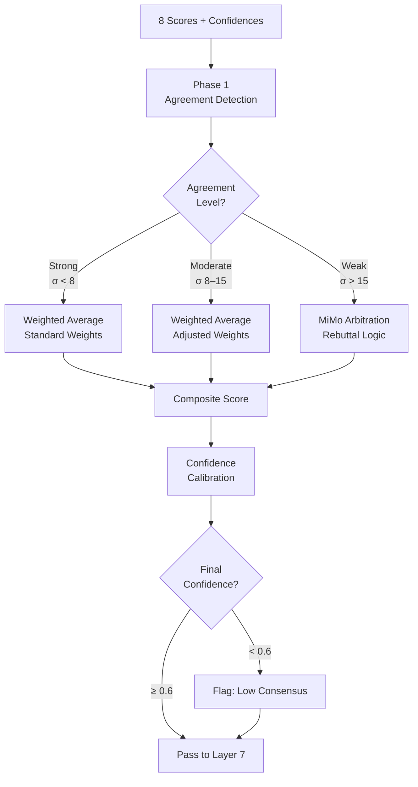

# Layer 6: Consensus Engine

> **Purpose**: Resolve disagreements between the 8 specialist agents. Compute a single weighted composite score with calibrated confidence.
>
> **Model**: MiMo V2.5
>
> **Input**: 8 pillar scores with confidence levels
>
> **Output**: Composite score (0–100), confidence interval, agreement metrics

## Overview

The 8 specialist agents in Layer 5 often disagree. A company may score 92 on Financial Health but 34 on Digital Presence. Layer 6 is the arbitration layer: MiMo V2.5 examines the full score set, evaluates each agent's confidence, checks for cross-pillar patterns (e.g., high Financial Health + low Digital Presence may indicate a cash-rich but outdated company), and produces a single composite score with a defensible confidence interval.

The consensus engine operates in three phases: (1) **agreement detection** — compute pairwise correlations between agents to see if most agree or opinions are split; (2) **weighted voting** — compute composite as weighted average, adjusting initial weights (from Layer 5) based on per-company confidence; (3) **confidence calibration** — the final confidence is a function of inter-agent agreement, average confidence, and data completeness. The output is not just a number — it includes the reasoning path so downstream layers understand why a company scored as it did.



## Confidence Scoring

The final confidence is a blend of three factors:

```
final_confidence = 0.4 × agreement_ratio + 0.4 × avg_agent_confidence + 0.2 × data_completeness
```

Where:
- `agreement_ratio` = fraction of agent pairs whose scores are within 15 points of each other
- `avg_agent_confidence` = mean of the 8 per-agent confidence values from Layer 5
- `data_completeness` = from Layer 4's missing_feature_mask (1.0 if all features present, 0.3 if 60%+ missing)

Companies with `final_confidence < 0.6` are flagged but not discarded — they proceed through the pipeline with a confidence penalty applied to their composite score (comp × confidence). This ensures the system is biased toward inclusion rather than false exclusion, leaving the final human judgment to Layer 11.

## Disagreement Arbitration

When agreement is weak (σ > 15), MiMo V2.5 receives the full score set plus the agent rationales and performs a structured arbitration. The model is prompted to:

1. Identify which agents are outliers and why
2. Check for confounding signals (e.g., a company might score low on Digital Presence simply because its industry doesn't require one)
3. Decide whether to discard outlier scores or adjust weights
4. Produce an adjusted composite

The arbitration prompt includes industry-context examples. A manufacturing company with low Digital Presence gets that score downweighted during arbitration; a SaaS company with low Digital Presence does not. This industry-aware arbitration prevents the system from unfairly penalizing companies in sectors where certain pillars are less relevant.

## Output Contract

```json
{
  "company_id": "uuid",
  "composite_score": 74,
  "score_range": [68, 80],
  "final_confidence": 0.82,
  "agreement_stats": {
    "mean_score": 73.5,
    "std_dev": 6.2,
    "min_score": 34,
    "max_score": 92,
    "agreement_ratio": 0.88
  },
  "per_pillar_scores": [
    {"pillar": "Financial Health", "score": 88, "weight_used": 0.20},
    {"pillar": "Digital Presence", "score": 34, "weight_used": 0.08},
    {"pillar": "Growth Trajectory", "score": 76, "weight_used": 0.15}
  ],
  "consensus_note": "Digital Presence outlier for manufacturing vertical — weight reduced from 0.15 to 0.08"
}
```
