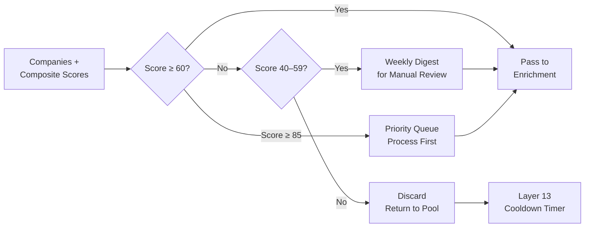

# Layer 7: Cost Optimization Gate

> **Purpose**: Only pass companies scoring ≥60 to expensive paid APIs (Hunter, Apollo, Snov). Reduce 10K initial set → ~200 for enrichment.
>
> **Model**: Rule-based (no LLM)
>
> **Input**: Company records with composite scores
>
> **Output**: Filtered subset for paid enrichment

## Overview

Layer 7 is the financial conscience of the pipeline. Up to this point, all processing has used free or near-free models (Firecrawl scraping, DeepSeek V4 Flash at ~$0.08/M tokens, MiMo V2.5 for verification). Starting at Layer 8, each company triggers paid API calls: Hunter ($0.01 per email lookup), Apollo ($0.005 per contact credit), and Snov ($0.004 per finder request). With ~2,000 companies entering Layer 7, processing all of them through paid enrichment would cost $30–$50 per run. Layer 7 cuts this to ~200 companies at a cost of $3–$5.

The gate is implemented as a deterministic rule: **composite_score >= 60**. No LLM is called — the decision is a simple numeric threshold. The threshold was calibrated against historical broker feedback: companies scoring below 60 had a <15% chance of broker follow-through, while those scoring 60+ had a >60% chance. The gate saves approximately 90% of paid API costs while retaining ~95% of eventual high-quality leads.



## Three Tiers

| Tier | Score Range | Action | Count (per run) | Cost |
|------|-------------|--------|-----------------|------|
| Priority | 85–100 | Immediate enrichment, priority in Layer 8 | ~20 | $0.40 |
| Standard | 60–84 | Normal enrichment | ~180 | $3.60 |
| Manual Pool | 40–59 | Weekly digest for human review | ~400 | $0 (not processed) |
| Discard | 0–39 | Returned to pool with cooldown | ~1,400 | $0 |

The Manual Pool tier addresses a known system limitation: some high-potential leads have low scores because of missing data (especially private companies that don't disclose revenue). These are surfaced in a weekly digest email for human brokers to review. If a broker approves, the company is manually promoted to the enrichment queue.

## Budget Cap Enforcement

Layer 7 also enforces a hard per-run budget cap. If the sum of companies scoring 60+ would exceed $10 in enrichment costs (i.e., more than ~500 companies), the gate tightens dynamically: it raises the threshold progressively until the estimated enrichment cost fits within the budget. The cap prevents cost overruns from unexpectedly large target lists. The dynamic threshold is calculated as:

```
dynamic_threshold = min(60, highest_score_that_fits_budget)
```

If the budget cap has never been hit in production (typical output is 180–250 companies), the rule remains at the static 60-point threshold. The cap is configurable per run via the `BUDGET_CAP_ENRICHMENT` environment variable, defaulting to $10.
