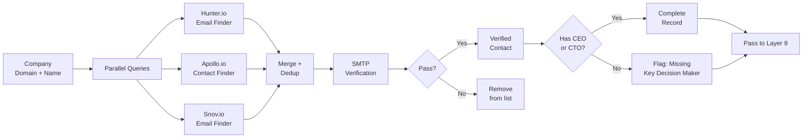

# Layer 8: Contact Enrichment

> **Purpose**: Find decision-maker names, titles, and verified email addresses for the ~200 qualifying companies.
>
> **Model**: DeepSeek V4 Flash (for email drafting inputs only)
>
> **Input**: Company records with score ≥ 60
>
> **Output**: Company records with decision-maker contacts + verified emails

## Overview

Layer 8 is the first paid-enrichment stage. For each qualifying company, it queries Hunter.io, Apollo.io, and Snov.io in parallel to find email addresses for decision-makers. The target roles are: CEO, CTO/VP Engineering, Head of Product, and Director of Sales/Partnerships — roles relevant to the Pune property broker's relationship. Each provider returns candidate emails with confidence scores (Hunter's source confidence, Apollo's contact quality score, Snov's verification status).

The enrichment pipeline runs a three-phase process: (1) **discovery** — query all three providers simultaneously with the company domain; (2) **deduplication** — merge results, removing duplicates by email hash; (3) **verification** — run SMTP-level verification on each candidate email using Hunter's email verifier API. Only emails that pass SMTP verification proceed. Verified emails are scored by provider agreement: emails found by 2+ providers get a "verified" tag; emails found by a single provider get a "single_source" tag.



## Provider Selection Strategy

The three providers have complementary strengths:

| Provider | Strengths | Weaknesses | Priority |
|----------|-----------|------------|----------|
| Hunter.io | Best for generic `@company.com` patterns, SMTP verification built-in | Lower match rate for mid-level roles | Primary |
| Apollo.io | Largest database (275M+ contacts), good for mid-level titles | Data can be stale; requires credit per email | Secondary |
| Snov.io | Good for role-specific searches (e.g., "find CTO at company") | Smaller database | Fallback |

The orchestrator queries Hunter first, then Apollo for companies where Hunter returns <2 contacts, then Snov for companies where both returned <2 contacts. This tiered approach minimizes API costs: Hunter costs ~$0.01/lookup, Apollo ~$0.005/credit, Snov ~$0.004/finder. Average cost per company: ~$0.02. For 200 companies: ~$4.00 per run.

## Email Verification

Every candidate email undergoes SMTP-level verification before entering the pipeline. The verification sends a synthetic connection to the mail server and checks whether the server accepts mail for that address (RCPT TO check) without actually sending a message. Hunter's verification API handles this and returns one of: `deliverable`, `risky`, `undeliverable`, `unknown`. Only `deliverable` emails are accepted. `risky` emails are accepted but tagged for manual review by the broker in Layer 12.

Emails from all providers pass through the same verification. This protects against Apollo's known weakness: it sometimes returns pattern-generated emails that don't actually exist. SMTP verification catches these before they reach the outreach layer, preventing bounce rates that could damage sender reputation.

## Data Enrichment Output

After Layer 8, each company record includes:

```json
{
  "contacts": [
    {
      "name": "Jane Doe",
      "title": "CEO",
      "email": "jane@acmecorp.com",
      "source": "hunter",
      "verification": "deliverable",
      "provider_agreement": 2,
      "phone": null
    }
  ],
  "contact_completeness": "has_decision_maker",
  "total_verified_contacts": 3,
  "enrichment_cost": 0.02
}
```

Companies where no decision-maker email is found (CEO or CTO/VP level) after all three providers are flagged `contact_gap`. These proceed to Layer 9 but receive a "warm intro required" note in the commercial strategy brief. DeepSeek V4 Flash is not used in this layer except to prepare recipient name files for the outreach drafting in Layer 10.
