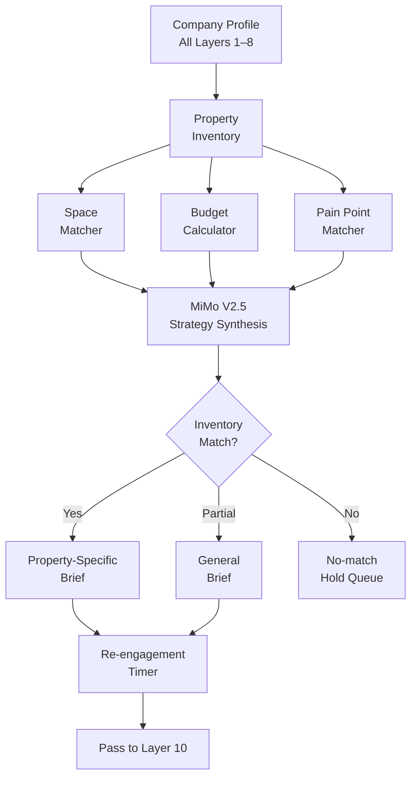

# Layer 9: Commercial Strategy Engine

> **Purpose**: Match each company's needs, budget, and timeline to specific Pune properties. Produce a one-page strategic brief per lead.
>
> **Model**: MiMo V2.5
>
> **Input**: Company profile + contact data (Layers 1–8)
>
> **Output**: Commercial strategy brief per company

## Overview

Layer 9 is the first layer that connects external company data to the broker's internal inventory — Pune commercial properties. MiMo V2.5 receives the full company profile (all layers accumulated so far) plus a current inventory feed of 50–150 available Pune properties. For each company, the engine determines: (1) which property type best fits the company's space needs based on employee count and growth trajectory; (2) the budget range the company can afford, computed from revenue band and industry benchmarks; (3) the most compelling value proposition for that specific company-property pair.

The output is a structured commercial strategy brief (~400 words) that includes: recommended property(s), estimated budget range, key selling points aligned to the company's pain points, likely objections and preemptive responses, and a recommended engagement approach (direct email vs warm intro vs event-based). The brief becomes the input to the outreach layer.



## Property Matching

The matching algorithm considers eight variables:

| Variable | Data Source | Weight |
|----------|-------------|--------|
| Employee count | Layer 2 normalized | 0.25 |
| Growth rate (1yr) | Layer 4 derived | 0.15 |
| Revenue band | Layer 3 verified | 0.20 |
| Industry micromarket | Layer 2 | 0.15 |
| Current location | Layer 3 verified | 0.10 |
| Tech stack | Layer 2 normalized | 0.05 |
| Growth stage | Layer 4 derived | 0.05 |
| Team distribution | Layer 3 verified | 0.05 |

The matcher computes a fit score (0–100) for each property. Properties scoring 80+ are "strong matches" included in the brief. Properties scoring 60–79 are "secondary options." No match below 60 is presented. Companies with no property scoring 60+ are placed in a hold queue and rechecked weekly against new inventory — the system automatically re-evaluates when the inventory feed changes.

## Budget Calculator

The budget estimator computes a defensible monthly rent range:

```
monthly_budget = revenue_midpoint × industry_rent_ratio × pune_market_factor
```

Where `industry_rent_ratio` is the fraction of revenue that companies in that industry typically allocate to real estate (obtained from industry benchmark data: SaaS = 3–5%, manufacturing = 5–8%, logistics = 8–12%), and `pune_market_factor` normalizes for Pune's commercial real estate market relative to national averages (~0.7 for Pune vs Mumbai/Bangalore).

The estimator also accounts for growth: if the company's employee count is projected to grow 20%+ in the next year, the budget includes an expansion contingency that recommends 20% additional space. This future-proofing angle is a key selling point in the outreach.

## Objection Preemption

MiMo V2.5 generates likely objections based on the company profile and inventory gap. Common objections include: "We already have space in Mumbai", "Too expensive", "We're fully remote", "Not expanding now", and "We need a shorter lease." Each objection in the brief includes a preemptive counter-argument grounded in the company's own data. For example: "Your current HQ is in Mumbai but 60% of your team is in Pune" or "Your revenue growth of 30% suggests you'll need expansion space within 18 months."

The objection analysis is based on pattern matching against a library of 40+ known objection templates indexed by company profile type. MiMo V2.5 selects the most relevant objections for each specific company-inventory pair and formulates natural-language responses.

## Output Structure

Each strategy brief includes:

```yaml
recommended_properties:
  - name: "Panchshil Business Park"
    fit_score: 88
    monthly_budget_estimate: "₹4.5L–₹6.5L"
    sqft_suggested: "5,000–8,000"
value_proposition: "Acme Corp's 30% YoY growth requires space that scales..."
likely_objections:
  - "We're remote-first": "Your LinkedIn data shows 85% of new hires are in Pune"
  - "Budget concern": "At ₹6.5L/month, rent is 4.2% of revenue — within industry norm"
engagement_approach: "Warm intro via mutual connection (vendor relationship)"
priority: "high"
```
