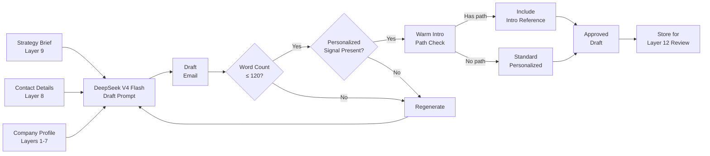

# Layer 10: Outreach

> **Purpose**: Draft personalized outreach emails (≤120 words) that reference a warm intro path. No sending — drafting only.
>
> **Model**: DeepSeek V4 Flash
>
> **Input**: Commercial strategy brief + contact details
>
> **Output**: Draft email text per contact

## Overview

Layer 10 generates the actual outreach message. DeepSeek V4 Flash receives the commercial strategy brief (Layer 9), the verified contact (Layer 8), and the company profile (Layers 1–7). It produces a personalized email draft of no more than 120 words that references a warm introduction path wherever possible. The email is not sent automatically — it is drafted for broker review and approval in Layer 12.

The drafting prompt enforces strict rules: (1) maximum 120 words — measured after generation, drafts exceeding the limit are rejected and regenerated; (2) must reference a personalized signal from the company profile (recent news, funding event, leadership change, technology launch); (3) must mention a warm intro path if one exists (mutual connection, event attended, existing vendor relationship); (4) must connect to Pune property interest naturally, without sounding like a template; (5) no spam indicators — no "just checking in," "I wanted to reach out," or "I came across your profile."

## Email Structure

Every draft follows a three-paragraph structure:

**Paragraph 1 — Signal (2–3 sentences, ~40 words)**
Opens with a specific, relevant signal from the company's recent activity. Examples: "Congratulations on your $12M Series A — impressive traction in the manufacturing ERP space." or "I noticed Acme Corp is hiring aggressively for Pune-based engineering roles." The signal must be fact-based and sourced from the company profile, not generic flattery.

**Paragraph 2 — Connection (2–3 sentences, ~50 words)**
Establishes the warm intro path or relevant context. Examples: "I work closely with your VP of Engineering, Raj, who mentioned you're evaluating expansion options." or "Your team at the Mumbai office has been using our partner's logistics software for two years." If no warm path exists, this paragraph introduces the broker's domain expertise in Pune commercial real estate without sounding like a sales pitch.

**Paragraph 3 — Value Proposition (1–2 sentences, ~30 words)**
Connects the company's trajectory to Pune property. Example: "With your Pune team growing 40% YoY, I'd love to show you a few spaces that fit your budget and culture — no obligation."

## Personalization Rules

The prompt enforces these personalization checks during generation:

1. **Company signal required**: Every draft must reference at least one specific fact from the company profile (recent funding, hiring spree, product launch, website redesign, award). Generic statements like "I like what your company does" trigger rejection.
2. **Role-aware tone**: CEO drafts are concise and strategic; CTO drafts are more technical; Head of Sales drafts focus on growth and partnership potential. The tone adjustment is driven by the contact's title field.
3. **Warm intro priority**: If a mutual connection exists, it must be mentioned in paragraph 2. The system checks a preconfigured relationship map (managed outside the pipeline) for overlapping connections between the broker network and the target company. If found, the connection name and context are injected.
4. **Property specificity**: The email mentions the property type, not the address (unless the company is already in Pune). "SEZ office space with 24/7 power backup" not "Panchshil Business Park, Wing B, 4th Floor."

## Cost & Performance

DeepSeek V4 Flash processes each email draft in ~300ms at ~$0.0001 per draft. For 300 contacts across 200 companies: ~$0.03 total for this layer. The word-count check and personalization verification run as a lightweight post-processing script — no LLM needed — ensuring the 120-word limit is enforced deterministically. Rejected drafts (typically 5–10% of initial generations) are regenerated with a stronger prompt emphasizing the missing element.
