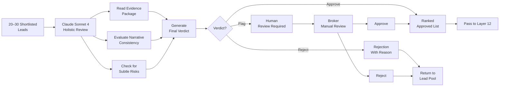

# Layer 11: Premium Judge

> **Purpose**: Final human-quality review of the 20–30 best leads by Claude Sonnet 4. Expensive model — used only on the final shortlist.
>
> **Model**: Claude Sonnet 4
>
> **Input**: 20–30 shortlisted company records (all prior layers)
>
> **Output**: Final approval/rejection + ranking + actionable notes

## Overview

Layer 11 is the most expensive model call in the entire pipeline — and by design, it touches only the smallest dataset. After Layers 1–10 have eliminated 9,970+ companies from the original 10,000, Claude Sonnet 4 receives the top 20–30 leads and performs a final judgement. This is where the system's cost-aware design pays off: Claude's high per-token cost ($15/M input tokens) is incurred only on the highest-value leads, making the total per-run cost for this layer approximately $0.20–$0.50.

Claude Sonnet 4 performs a holistic assessment that goes beyond what the specialist agents can do. It reads the entire evidence package (Layer 14 output available in-progress), evaluates narrative consistency, spots subtle risks (e.g., a company that scores well but is in an industry downturn), and applies nuanced judgement that rule-based systems miss. It produces a final ranking, a binary approval/rejection per lead, and actionable notes for the broker.



## Evaluation Criteria

Claude Sonnet 4 assesses each lead against five holistic criteria not fully captured by earlier layers:

| Criterion | Weight | What It Checks |
|-----------|--------|----------------|
| Opportunity Fit | 30% | Does this company genuinely need Pune commercial space, or are we forcing a fit? |
| Signal Authenticity | 25% | Are the positive signals genuine and recent, or could they be stale or misinterpreted? |
| Contact Accessibility | 20% | Can the broker realistically reach this decision-maker? Warm path plausible? |
| Timing | 15% | Is the company at a decision point (lease expiry, hiring surge, funding)? |
| Risk Flags | 10% | Any red flags the pipeline missed? Industry headwinds, leadership turmoil, legal issues? |

The model scores each criterion on a 1–5 scale, multiplies by weight, and produces a final judgement score (0–100). Leads scoring 80+ are approved. Leads scoring 50–79 are flagged for human review. Leads below 50 are rejected with a specific reason.

## Quality Assurance

Claude Sonnet 4 is prompted with a detailed review template that includes guardrails against common failure modes:

- **False positive detection**: "Review this lead critically. The pipeline scores it highly. What might it have missed?" — This reduces confirmation bias.
- **Contrarian check**: "Argue against this lead being a good opportunity before arguing for it." — The model must generate a rejection case first, then evaluate both sides.
- **Freshness check**: "Are any data points older than 6 months? Flag them." — Ensures stale data doesn't drive decisions.
- **Contact sanity check**: "Email the CEO? LinkedIn shows they've been in role only 2 months. Adjust approach." — Catches leadership changes the enrichment layer missed.

## Cost Optimization

Claude Sonnet 4 processes up to 30 leads per run with a carefully sized context window. Each lead's cumulative data (all layers) is condensed to ~2,000 tokens by a pre-processing step that strips verbose fields and keeps only: composite score, score rationale, top 3 signals, bottom 3 signals, strategy brief key points, verified contact, and evidence package summary. This keeps the total context under 70K tokens for 30 leads (~2,000 per lead × 30 + system prompt).

At $15/M input tokens, 70K tokens costs ~$1.05. Output of ~500 tokens per lead (15K total) costs ~$0.45. Total per run: **~$1.50**. Compared to running Claude on all 10,000 companies (~$2,100), the cost gate in Layer 7 saves approximately **99.93%** of Claude costs.

## Output

```json
{
  "lead_id": "uuid",
  "claude_verdict": "approve",
  "final_rank": 3,
  "judgement_score": 87,
  "criterion_scores": {
    "opportunity_fit": 5,
    "signal_authenticity": 4,
    "contact_accessibility": 5,
    "timing": 4,
    "risk_flags": 4
  },
  "approval_note": "Strong fit — growing Pune team, recent Series A, CEO is reachable via Raj. Minor risk: industry headwinds in manufacturing ERP but company is well-capitalized.",
  "rejection_reason": null,
  "broker_note": "Warm intro via Raj (VP Eng) is the play. Mention the Series A in the subject line."
}
```
