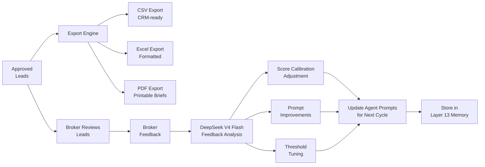

# Layer 12: Delivery & Learning

> **Purpose**: Export final approved leads to broker-facing formats. Collect broker feedback. Improve prompts for the next cycle.
>
> **Model**: None (export) — feedback analysis uses DeepSeek V4 Flash
>
> **Input**: Approved leads from Layer 11 + broker feedback
>
> **Output**: CSV/Excel/PDF exports + prompt improvement recommendations

## Overview

Layer 12 serves two functions: (1) package the final 20–30 leads into formats the broker can immediately use, and (2) collect feedback that improves future runs. The delivery pipeline exports to three formats simultaneously — CSV for CRM import, Excel for formatted review with conditional formatting, and PDF for printable briefs. Each format is generated from the same intermediate JSON and populated with lead data from all prior layers.

The learning pipeline runs after the broker has reviewed and acted on the leads (typically 1–3 days after delivery). Brokers provide structured feedback on each lead: contacted (yes/no), response received (yes/no), meeting booked (yes/no), deal closed (yes/no/value), and a free-text note. This feedback is stored and analyzed after each cycle to identify which pipeline layers need tuning.



## Export Formats

**CSV** — Flat file with one row per contact. Columns: company name, domain, micromarket, composite score, contact name, contact title, contact email, email verification status, recommended property, budget estimate, approach recommendation, signal used, warm path (if any), broker note from Claude. Designed for direct import into HubSpot, Salesforce, or Pipedrive.

**Excel** — Multi-sheet workbook. Sheet 1: lead summary with conditional formatting (green = approve, yellow = flag, red = reject). Sheet 2: full evidence package per lead. Sheet 3: commercial strategy briefs. Sheet 4: contact details. Formatting uses the XLWT/XLSXWriter libraries with frozen header rows, auto-sized columns, and color-coded score columns.

**PDF** — One-page brief per lead. Includes: company name, score, contact method, recommended property, budget range, key signals, and broker notes. Generated via a lightweight HTML-to-PDF pipeline using WeasyPrint with a professional template. Each PDF is named `{company_name}_{lead_id}.pdf` and stored in a dated output folder.

## Feedback Collection

Broker feedback is collected through a simple web form (or emailed JSON if the broker prefers). The form captures per-lead:

```json
{
  "lead_id": "uuid",
  "action_taken": "email_sent",
  "response": "positive",
  "meeting_booked": true,
  "deal_value": null,
  "feedback_text": "CEO was interested but wants to wait until their lease expires in March. Follow up in Feb.",
  "rating": 4,
  "timestamp": "2026-07-14T15:30:00Z"
}
```

Feedback is appended to a running log stored alongside Layer 13's memory. After each cycle, the system computes aggregate metrics: contact rate, response rate, meeting rate, deal rate, average deal value, and average score of contacted vs unconverted leads.

## Learning Loop

DeepSeek V4 Flash analyzes feedback after each cycle and produces prompt adjustment recommendations:

1. **Score calibration**: If many high-scoring leads received negative feedback, the relevant specialist agent's weights are reduced. If many low-scoring manual pool leads received positive feedback, the threshold or scoring rubric may need adjustment.
2. **Prompt refinement**: If agents consistently miss signals that brokers notice, their prompts are updated with the new pattern. For example, "Flag companies where the CEO just joined — may indicate instability" was added after feedback revealed this blind spot.
3. **Threshold tuning**: If the approval rate from Layer 11 is >90%, the cost gate threshold (Layer 7) may be too conservative — high-quality leads are being filtered out. If the approval rate is <40%, the threshold may be too generous.

These recommendations are reviewed by the system operator before being applied. The prompt adjustment process is semi-automated: recommendations are generated by DeepSeek but applied by a human after review. A full feedback analysis takes ~5 minutes and costs ~$0.02.
