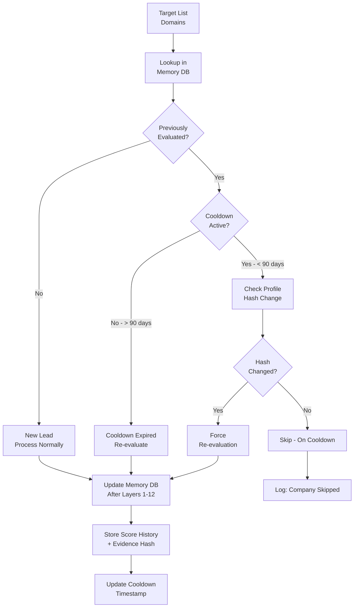

# Layer 13: Lead Memory & Change Detection

> **Purpose**: Never recommend the same company twice. Track cooldown periods, detect meaningful changes, and maintain a complete lead history.
>
> **Model**: Hash comparison (no LLM)
>
> **Input**: All company records from current run + historical memory store
>
> **Output**: Filtered target list (cooldown-active companies removed) + change alerts

## Overview

Layer 13 is the system's persistent memory. It maintains a local SQLite database of every company ever evaluated by the pipeline, keyed by domain hash. For each company, it stores: all prior evaluation timestamps, scores from every run, contact outreach history, broker feedback, and a hash of the company profile at each evaluation. Before a new target list enters Layer 1, Layer 13 checks every domain against the memory store and filters out companies that are in cooldown or have been contacted within the last 90 days.

The change detection subsystem computes a hash of each company's current profile and compares it against the most recent stored hash. If the hash differs significantly (meaning the company's website, Crunchbase, or LinkedIn data has changed), the company is re-evaluated even if within the cooldown period. This prevents missed opportunities from companies that have had meaningful changes — new funding, new leadership, new office openings.



## Memory Database Schema

```sql
CREATE TABLE leads (
    domain_hash TEXT PRIMARY KEY,
    domain TEXT NOT NULL,
    company_name TEXT,
    first_seen TIMESTAMP,
    last_evaluated TIMESTAMP,
    last_contacted TIMESTAMP,
    evaluation_count INTEGER DEFAULT 1,
    cooldown_until TIMESTAMP,
    status TEXT DEFAULT 'active'
);

CREATE TABLE evaluation_history (
    id INTEGER PRIMARY KEY AUTOINCREMENT,
    domain_hash TEXT NOT NULL,
    run_id TEXT NOT NULL,
    evaluated_at TIMESTAMP NOT NULL,
    composite_score REAL,
    pillar_scores TEXT,        -- JSON
    claude_verdict TEXT,
    broker_feedback TEXT,      -- JSON, nullable
    profile_hash TEXT,
    evidence_package_ref TEXT, -- file path
    FOREIGN KEY (domain_hash) REFERENCES leads(domain_hash)
);

CREATE TABLE change_events (
    id INTEGER PRIMARY KEY AUTOINCREMENT,
    domain_hash TEXT NOT NULL,
    detected_at TIMESTAMP NOT NULL,
    change_type TEXT NOT NULL,   -- 'funding', 'leadership', 'growth', 'website', 'other'
    old_value TEXT,
    new_value TEXT,
    triggered_revaluation BOOLEAN DEFAULT 0,
    FOREIGN KEY (domain_hash) REFERENCES leads(domain_hash)
);
```

## Cooldown Logic

The default cooldown period is 90 days from the last contact attempt. The cooldown is configurable per lead status:

| Lead Status | Cooldown | Rationale |
|------------|----------|-----------|
| Never contacted | 90 days | Standard cycle |
| Contacted — no response | 120 days | Avoid spamming |
| Contacted — negative response | 180 days | Respect explicit disinterest |
| Contacted — meetings booked | 365 days | Active deal in progress |
| Deal closed | Lifetime | Never re-target |
| Deal lost to competitor | 365 days | Revisit after competitive cycle ends |

Companies on cooldown are excluded from Layer 1's target list. The exclusion is logged so the operator knows how many companies were skipped and why. If a company on cooldown has a change event (see below), the cooldown is overridden and the company enters the pipeline with a `force_revaluation` flag.

## Change Detection

Every company's profile at evaluation time produces a `profile_hash` — a SHA-256 hash of the concatenated normalized company name, micromarket, employee band, revenue band, tech stack (sorted), and management team list. On subsequent evaluation cycles, Layer 13 recomputes the hash from the current Layer 2 normalized data and compares it against the stored hash.

A different hash triggers change classification: the system compares the new and old profiles field-by-field to determine the change type. Funding changes, headcount growth > 20%, or C-suite changes are classified as `high_impact` and force re-evaluation regardless of cooldown. Minor changes (website redesign, new blog posts) are logged but do not override cooldown. The classification logic is deterministic — no LLM required.

The change detection runs as a pre-filter before Layer 1. It typically processes 15,000 domains in under 30 seconds (SQLite indexed lookups + SHA-256 computation). Companies with forced re-evaluation enter the pipeline at Layer 1 like new leads but carry a `change_event_id` that propagates through all layers so the evidence package (Layer 14) includes the change history.

## Maintenance

The memory database is compacted monthly: evaluation_history rows older than 2 years are archived to cold storage (compressed JSONL), keeping only the most recent evaluation per company. The leads table retains all rows — no company is ever deleted, only status-updated to `archived` after 5 years of inactivity. Database size is approximately 500MB per 100,000 companies evaluated.
