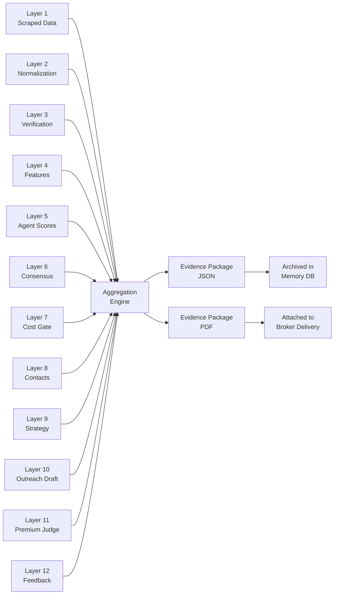

# Layer 14: Evidence Package

> **Purpose**: Bundle every piece of evidence for each lead into a single, auditable package. Source URLs, confidence scores, verification results, and timestamps.
>
> **Model**: Aggregation engine (no LLM)
>
> **Input**: Outputs from all prior layers
>
> **Output**: Per-lead evidence package (JSON + PDF)

## Overview

Layer 14 is the system's audit trail. It collects the output from every prior layer for each lead and bundles them into a structured, timestamped evidence package. The package includes: the original scraped data, normalization decisions with confidence, verification sources and outcomes, all 8 pillar scores with rationales, the consensus engine's reasoning, contact enrichment sources and verification results, the commercial strategy brief, the outreach draft, Claude Sonnet 4's judgement, and a complete chain-of-custody log.

No LLM is involved in Layer 14. It is a pure aggregation and formatting engine that reads from the intermediate output files produced by each layer. The evidence package serves two purposes: (1) it allows brokers to verify any claim before acting on a lead, and (2) it provides the data needed for post-hoc analysis and audit. Every claim in the outreach email can be traced back to its source URL.



## Package Structure

Each evidence package is a JSON document with the following top-level sections:

```yaml
package_metadata:
  lead_id: "uuid"
  company_name: "Acme Corp"
  domain: "acmecorp.com"
  run_id: "2026-W28"
  created_at: "2026-07-12T09:00:00Z"
  layers_completed: 14
  evidence_count: 47

discovery_evidence:
  - layer: 1
    source_url: "https://acmecorp.com"
    crawl_timestamp: "2026-07-12T09:00:15Z"
    extracted_fields: ["name", "employees", "description"]
    raw_content_snippet: "Acme Corp provides cloud-based ERP..."
    screenshot_ref: "acmecorp_com_homepage.png"

  - layer: 2
    field: "company_name"
    raw_value: "Acme Corp | Enterprise Software"
    normalized_value: "Acme Corp"
    confidence: 0.98

verification_evidence:
  - field: "employee_band"
    sources:
      - source: "company_website"
        value: "200-500 employees"
        match: true
      - source: "linkedin"
        value: "201-500 employees"
        match: true
      - source: "crunchbase"
        value: "100-250 employees"
        match: false
    verdict: "verified"
    resolution: "majority_rule"

scoring_evidence:
  - pillar: "Financial Health"
    score: 88
    agent_confidence: 0.85
    rationale: "Revenue-per-employee $180K, well above industry median."
    key_features: {"revenue_per_employee": 180000, "rent_to_revenue": 0.03}

consensus_evidence: { ... }

contact_evidence:
  - contact_name: "Jane Doe"
    title: "CEO"
    email: "jane@acmecorp.com"
    source: "hunter"
    verification_method: "smtp"
    verification_result: "deliverable"
    provider_agreement: 2  # found by 2 providers
    discovered_at: "2026-07-13T10:00:00Z"

judgement_evidence:
  model: "claude-sonnet-4"
  verdict: "approve"
  criterion_scores: { ... }
  broker_note: "Warm intro via Raj (VP Eng)."

chain_of_custody:
  - event: "pipeline_start"
    timestamp: "2026-07-12T09:00:00Z"
  - event: "layer_1_complete"
    timestamp: "2026-07-12T09:45:00Z"
    records_out: 8423
  - event: "layer_7_gate"
    timestamp: "2026-07-12T14:20:00Z"
    companies_passed: 214
  - event: "layer_11_complete"
    timestamp: "2026-07-14T11:00:00Z"
    leads_approved: 27
```

## Completeness Check

Before a package is finalized, Layer 14 runs a completeness check that verifies every required field is present:

- Each of the 8 specialist agents contributed a score and rationale
- At least 2 sources verified each critical field
- At least 1 decision-maker email is present and verified
- The commercial strategy brief includes a property recommendation
- Claude Sonnet 4 produced a verdict
- The chain-of-custody log has an entry for every layer

If any check fails, the package is flagged as `incomplete` and the missing data is noted in the broker delivery. Incomplete packages are rare (<1% of leads) and typically result from a layer failure that was not caught earlier. The broker receives a notification about the incomplete package along with a summary of what is missing.

## Evidence Attachments

Evidence packages include file attachments for verifiable artifacts:

- **Screenshots**: Homepage screenshot from Layer 1 (PNG, compressed)
- **Webpage snapshots**: Key pages (about, team, contact) as HTML snapshots
- **Social media snippets**: LinkedIn company page snippet with follower count (JSON)
- **Email verification proof**: SMTP verification result (log snippet)
- **Source images**: Crunchbase profile screenshot, if available

Total attachment size per lead is typically 200–500KB. Packages are stored alongside the memory database (Layer 13) in a dated directory structure: `evidence/{run_id}/{lead_id}/`. Retention is 2 years for active leads, reduced to 1 year for leads that received negative broker feedback.

## Cost

Layer 14 costs approximately $0.0005 per lead (storage + formatting). For 30 leads per weekly run: ~$0.015. The aggregation engine processes leads in parallel batches of 10, completing all packages in under 2 minutes.
