# Weekly Workflow — Monday 9:00 AM

> **The 14-layer pipeline executes weekly on a Monday 9:00 AM cron trigger. This document details the timeline, expected durations, dependencies, and failure points.**

## Overview

The pipeline is designed to complete within a single business day (Monday 9:00 AM — Monday ~6:00 PM). All layers are automated with no manual steps required between layers 1–8. The operator reviews the cost gate output before enrichment begins (Layer 8) and reviews Claude's final judgement before delivery (Layer 12). Broker review happens Tuesday–Wednesday, and feedback analysis runs Thursday morning.

```mermaid
gantt
    title Weekly Pipeline — Monday Timeline
    dateFormat  HH:mm
    axisFormat %H:%M

    section Discovery & Filter
    Layer 1 - Discovery        :l1, 09:00, 45m
    Layer 2 - Normalization    :l2, after l1, 20m
    Layer 3 - Verification     :l3, after l2, 120m
    Layer 4 - Feature Eng      :l4, after l3, 20m

    section Scoring
    Layer 5 - Specialist Agents :l5, after l4, 45m
    Layer 6 - Consensus Engine  :l6, after l5, 60m
    Layer 7 - Cost Gate         :l7, after l6, 5m

    section Enrichment
    Gate Review (Operator)      :gate_review, after l7, 30m
    Layer 8 - Contact Enrich    :l8, after gate_review, 30m
    Layer 9 - Commercial Strat  :l9, after l8, 60m
    Layer 10 - Outreach Draft   :l10, after l9, 5m

    section Final Review
    Layer 11 - Premium Judge    :l11, after l10, 5m
    Judge Review (Operator)     :judge_review, after l11, 30m
    Layer 12 - Delivery & Learn :l12, after judge_review, 10m
    Layer 14 - Evidence Pkg     :l14, after l12, 2m
```



## Cron Configuration

The pipeline is triggered by a cron expression: `0 9 * * 1` (Monday 9:00 AM). The trigger is configured in the system's orchestrator (Apache Airflow DAG or equivalent). The DAG defines each layer as a task with explicit dependencies — no layer starts until its upstream dependencies are complete.

```yaml
pipeline:
  name: "jasfo_weekly_lead_gen"
  cron: "0 9 * * 1"
  timezone: "Asia/Kolkata"
  retry_on_failure: true
  max_retries: 2
  notification_email: "ops@jasfo.com"
  budget_caps:
    enrichment: 10.00   # dollars
    total: 20.00        # dollars
  steps:
    - layer: 1
      skippable: false
    - layer: 2
      depends_on: [1]
    - layer: 3
      depends_on: [2]
    - layer: 4
      depends_on: [3]
    - layer: 5
      depends_on: [4]
    - layer: 6
      depends_on: [5]
    - layer: 7
      depends_on: [6]
    - layer: 8
      depends_on: [7]
      manual_gate: true  # operator must approve
    - layer: 9
      depends_on: [8]
    - layer: 10
      depends_on: [9]
    - layer: 11
      depends_on: [10]
    - layer: 12
      depends_on: [11]
      manual_gate: true
    - layer: 14
      depends_on: [12]
```

## Weekly Schedule

| Time | Layer | Activity | Duration | Owner |
|------|-------|----------|----------|-------|
| Mon 09:00 | 1 | Discovery — Firecrawl scrape | 45 min | Auto |
| Mon 09:45 | 2 | Normalization — DeepSeek | 20 min | Auto |
| Mon 10:05 | 3 | Verification — MiMo | 2 hr | Auto |
| Mon 12:05 | 4 | Feature Engineering — DeepSeek | 20 min | Auto |
| Mon 12:25 | 5 | Specialist Agents — 8× parallel | 45 min | Auto |
| Mon 13:10 | 6 | Consensus — MiMo | 1 hr | Auto |
| Mon 14:10 | 7 | Cost Gate — rule-based | 5 min | Auto |
| Mon 14:15 | **Gate Review** | Operator reviews cost gate output | 30 min | Operator |
| Mon 14:45 | 8 | Contact Enrichment — APIs | 30 min | Auto |
| Mon 15:15 | 9 | Commercial Strategy — MiMo | 1 hr | Auto |
| Mon 16:15 | 10 | Outreach Draft — DeepSeek | 5 min | Auto |
| Mon 16:20 | 11 | Premium Judge — Claude | 5 min | Auto |
| Mon 16:25 | **Judge Review** | Operator reviews Claude output | 30 min | Operator |
| Mon 16:55 | 12 | Delivery & Export | 10 min | Auto |
| Mon 17:05 | 14 | Evidence Packages | 2 min | Auto |
| Mon 17:07 | — | Pipeline complete | — | — |
| Tue 09:00 | — | Broker reviews leads | Variable | Broker |
| Wed 17:00 | — | Broker feedback collected | — | Broker |
| Thu 09:00 | 12 (learning) | Feedback analysis + prompt tuning | 10 min | Auto |

## Operator Gate Reviews

Two manual gates require operator approval:

**Gate 1 — Cost Gate Review (Mon 14:15, ~30 min)**
The operator receives a notification with the cost gate summary: number of companies passing, estimated enrichment cost, companies in the manual pool. The operator can:
- Approve — proceed with enrichment
- Adjust budget cap — raise/lower the enrichment spend limit
- Manual promote — move companies from the manual pool into the enrichment queue
- Cancel run — if the target list quality is clearly insufficient

**Gate 2 — Judge Review (Mon 16:25, ~30 min)**
The operator receives Claude's output: approved leads, flagged leads, rejected leads. The operator can:
- Approve all — export everything as-is
- Edit — change verdicts on specific leads
- Request regeneration — if Claude's output seems systematically biased
- Cancel — if the run produced no usable leads

## Failure Points & Recovery

| Time | Layer | Failure Mode | Detection | Recovery |
|------|-------|-------------|-----------|----------|
| 09:00 | 1 | Firecrawl API unavailable | Timeout after 60s, 0 records emitted | Retry 2× with 5min backoff. If still down, use cached data from last run (stale up to 2 weeks) |
| 09:45 | 2 | DeepSeek rate limit | HTTP 429, partial batch failures | Automatic exponential backoff (1s, 3s, 9s). Slows but doesn't stop. |
| 10:05 | 3 | MiMo timeout on large batch | Job exceeds 4-hour timeout | Split batch into 2 parallel workers. Re-run failed half. |
| 12:25 | 5 | One agent API failure | Agent returns no scores | Isolate failed agent, re-run single agent. Other 7 proceed. |
| 14:15 | G1 | Operator doesn't review gate | No action within 1 hour | Email + SMS escalation. If no response by 16:00, use default: approve with standard budget. |
| 14:45 | 8 | Hunter/Apollo/Snov API failure | All 3 providers fail | Retry 2×. If all remain down, cache enrichment data from last run (companies only, stale contacts flagged). |
| 16:20 | 11 | Claude rate limit | HTTP 429 | Automatic retry with 30s backoff. Claude batches are small — unlikely but handled. |
| 16:25 | G2 | Operator doesn't review | No action within 1 hour | Email escalation. Default: approve all Claude-approved leads, hold flagged. |
| 17:00+ | — | Pipeline overrun | Runs past 18:00 | Partial delivery: deliver completed leads, hold incomplete. Resume next morning. |

## Notifications

The pipeline sends notifications at key milestones:

- **09:00** — Pipeline started (Slack + email)
- **12:05** — Cost gate ready for review (Slack + email)
- **14:15** — Gate 1 requires approval (Slack + email + SMS if >30min delay)
- **16:20** — Judge ready for review (Slack + email)
- **16:25** — Gate 2 requires approval (Slack + email + SMS if >30min delay)
- **17:07** — Pipeline complete (Slack + email + summary statistics)
- **Any failure** — Immediate alert (Slack + SMS)

## Estimated Runtime

**Total automated runtime**: ~7 hours (9:00 – 16:05, including 3h of parallel execution)
**With operator gates**: ~8 hours (9:00 – 17:07)
**Maximum (with retries + delays)** : ~10 hours (9:00 – 19:00)
