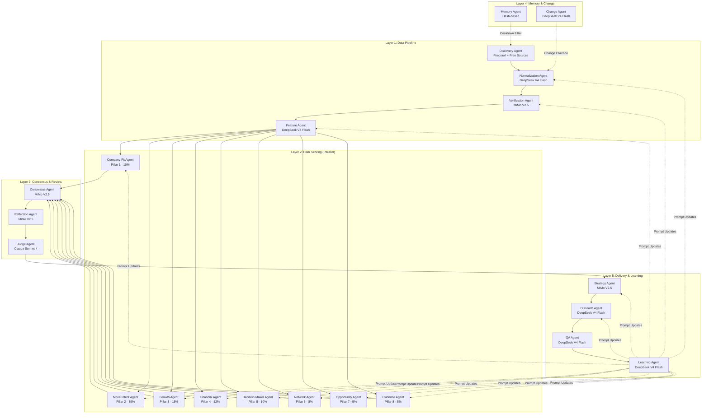

# Agent System Overview

> **21 AI agents organized across 5 layers** that transform 10,000 raw company records into 20–30 evidence-backed commercial real estate leads every week.

---

## Architecture Layers

The agent system is organized into five sequential layers, each responsible for a distinct phase of the lead intelligence pipeline:

| Layer | Phase | Agents | Cost Tier |
|-------|-------|--------|-----------|
| **1 — Data Pipeline** | Collect, normalize, verify, feature-engineer | 4 agents | Free (Firecrawl + DeepSeek V4 Flash) |
| **2 — Pillar Scoring** | Score 8 dimensions per company | 8 agents | Free (DeepSeek V4 Flash + MiMo V2.5) |
| **3 — Consensus & Review** | Aggregate, reflect, judge | 3 agents | Mixed (MiMo + Claude Sonnet 4) |
| **4 — Memory & Change** | Track history, detect changes | 2 agents | Free (hash-based) |
| **5 — Delivery & Learning** | Strategize, outreach, QA, learn | 4 agents | Paid (enrichment APIs + MiMo) |

```
                    ┌─────────────────────────────────────┐
                    │        10,000 Companies             │
                    └─────────────────────────────────────┘
                                      │
                    ┌─────────────────▼─────────────────┐
                    │     LAYER 1: DATA PIPELINE         │
                    │  Discovery → Normalization →       │
                    │  Verification → Feature Engineering│
                    └─────────────────┬─────────────────┘
                                      │
                    ┌─────────────────▼─────────────────┐
                    │     LAYER 2: PILLAR SCORING        │
                    │  Company Fit (1)   │  Move Intent (2)│
                    │  Growth (3)        │  Financial (4)  │
                    │  Decision Maker (5)│  Network (6)    │
                    │  Opportunity (7)   │  Evidence (8)   │
                    └─────────────────┬─────────────────┘
                                      │
                    ┌─────────────────▼─────────────────┐
                    │     LAYER 3: CONSENSUS & REVIEW    │
                    │  Consensus → Reflection → Judge    │
                    └─────────────────┬─────────────────┘
                                      │
                    ┌─────────────────▼─────────────────┐
                    │     LAYER 4: MEMORY & CHANGE       │
                    │  Memory → Change Detection         │
                    └─────────────────┬─────────────────┘
                                      │
                    ┌─────────────────▼─────────────────┐
                    │     LAYER 5: DELIVERY & LEARNING   │
                    │  Strategy → Outreach → QA → Learn  │
                    └─────────────────┬─────────────────┘
                                      │
                    ┌─────────────────▼─────────────────┐
                    │      20–30 Broker-Ready Leads     │
                    └─────────────────────────────────────┘
```

---

## Agent Inventory

### Layer 1 — Data Pipeline (4 agents)

| # | Agent | Model | Input | Output | Cost/Lead |
|---|-------|-------|-------|--------|-----------|
| 1 | **Discovery Agent** | Firecrawl (no LLM) | Target URLs, industry keywords | Raw company records (JSON) | ~$0.0001 |
| 2 | **Normalization Agent** | DeepSeek V4 Flash | Raw scraped text | Structured, schema-validated records | ~$0.0003 |
| 3 | **Verification Agent** | MiMo V2.5 | Normalized records | Cross-verified claims with confidence | ~$0.0056 |
| 4 | **Feature Agent** | DeepSeek V4 Flash | Verified records | 40+ derived numeric features | ~$0.0005 |

### Layer 2 — Pillar Scoring (8 parallel agents)

| # | Agent | Model | Weight | Input | Output |
|---|-------|-------|--------|-------|--------|
| 5 | **Company Fit Agent** | DeepSeek V4 Flash | 10% | Feature vector | Score 0–100 |
| 6 | **Move Intent Agent** | DeepSeek V4 Flash | 35% | Feature vector | Score 0–100 |
| 7 | **Growth Agent** | DeepSeek V4 Flash | 15% | Feature vector | Score 0–100 |
| 8 | **Financial Agent** | DeepSeek V4 Flash | 12% | Feature vector + Zauba Corp | Score 0–100 |
| 9 | **Decision Maker Agent** | DeepSeek V4 Flash | 10% | Feature vector + LinkedIn | Score 0–100 |
| 10 | **Network Agent** | DeepSeek V4 Flash | 8% | Feature vector + broker graph | Score 0–100 |
| 11 | **Opportunity Agent** | DeepSeek V4 Flash | 5% | Feature vector + property inventory | Score 0–100 |
| 12 | **Evidence Agent** | DeepSeek V4 Flash | 5% | All agent outputs | Score 0–100 |

### Layer 3 — Consensus & Review (3 agents)

| # | Agent | Model | Input | Output | Cost/Lead |
|---|-------|-------|-------|--------|-----------|
| 13 | **Consensus Agent** | MiMo V2.5 | 8 pillar scores | Weighted total score 0–100 | ~$0.0108 |
| 14 | **Reflection Agent** | MiMo V2.5 | Consensus output | Adjusted scores with critique | ~$0.0076 |
| 15 | **Judge Agent** | Claude Sonnet 4 | Top 20–30 leads | Approve/reject + ranking | ~$0.0520 |

### Layer 4 — Memory & Change (2 agents)

| # | Agent | Model | Input | Output | Cost/Lead |
|---|-------|-------|-------|--------|-----------|
| 16 | **Memory Agent** | Hash-based (no LLM) | All company records | Cooldown-filtered target list | ~$0.00001 |
| 17 | **Change Agent** | DeepSeek V4 Flash | Old + new profile hashes | Change classification delta | ~$0.0003 |

### Layer 5 — Delivery & Learning (4 agents)

| # | Agent | Model | Input | Output | Cost/Lead |
|---|-------|-------|-------|--------|-----------|
| 18 | **Strategy Agent** | MiMo V2.5 | Company profile + property inventory | Commercial strategy brief | ~$0.0048 |
| 19 | **Outreach Agent** | DeepSeek V4 Flash | Strategy brief + contact | Email draft ≤120 words | ~$0.0001 |
| 20 | **QA Agent** | DeepSeek V4 Flash | Full lead packet | Validation report + anomaly flags | ~$0.0005 |
| 21 | **Learning Agent** | DeepSeek V4 Flash | Broker feedback + accuracy logs | Prompt update recommendations | ~$0.0005 |

---

## Communication Patterns

The agent system uses three communication patterns depending on the layer:

### 1. Sequential Pipeline (Layer 1)

Agents execute one after another. Each agent's output becomes the next agent's input. This pattern is used for the data pipeline where each step depends on the previous.

```
Discovery → Normalization → Verification → Feature Engineering
```

### 2. Parallel Fan-Out (Layer 2)

All 8 pillar-scoring agents run simultaneously against the same feature vector. They operate independently with no shared state. Results are collected and passed as a batch to Layer 3.

```
                ┌── Company Fit Agent
                ├── Move Intent Agent
Feature Vector ─┼── Growth Agent
                ├── Financial Agent
                ├── Decision Maker Agent
                ├── Network Agent
                ├── Opportunity Agent
                └── Evidence Agent
```

### 3. Weighted Voting with Disagreement Detection (Layer 3)

The Consensus, Reflection, and Judge agents form a review chain. Consensus applies weighted voting. Reflection performs self-critique. Judge acts as a binary gate with contrarian checks. This pattern catches individual agent biases before final approval.

```
Scored Vectors → Consensus (weighted vote) → Reflection (self-critique) → Judge (approve/reject)
```

---

## Shared Memory Architecture

All agents read from and write to a shared Supabase-backed memory store. The memory holds:

- **Lead records**: Full company profiles with all scores and evidence
- **Evaluation history**: Timestamped records of every scoring run per company
- **Broker feedback**: Post-delivery outcomes (contacted, responded, met, closed)
- **Change events**: Delta records when company data changes between runs
- **Prompt templates**: Versioned agent prompts updated by the Learning Agent

Agents do not communicate directly. They communicate through the data store. This decoupling ensures that any agent can be upgraded, replaced, or tested independently without affecting the others.

---

## Cost Per Agent

| Agent | Model | Avg Tokens/Lead | Cost/Lead | Annual Cost (52 wks × 10K leads) |
|-------|-------|-----------------|-----------|----------------------------------|
| Discovery | Firecrawl | 0 (scraper) | $0.00010 | $52.00 |
| Normalization | DeepSeek V4 Flash | 300 | $0.00030 | $156.00 |
| Verification | MiMo V2.5 | 1,600 | $0.00560 | $2,912.00 |
| Feature Agent | DeepSeek V4 Flash | 600 | $0.00050 | $260.00 |
| 8 Pillar Agents | DeepSeek V4 Flash | 800 each | $0.00068 each | $2,828.80 |
| Consensus | MiMo V2.5 | 3,600 | $0.01080 | $5,616.00 |
| Reflection | MiMo V2.5 | 2,300 | $0.00760 | $3,952.00 |
| Judge (top 30 only) | Claude Sonnet 4 | 8,500 | $0.05200 | $811.20 |
| Memory | Hash | 0 | ~$0.00001 | $5.20 |
| Change | DeepSeek V4 Flash | 300 | $0.00030 | $156.00 |
| Strategy | MiMo V2.5 | 1,200 | $0.00480 | $2,496.00 |
| Outreach | DeepSeek V4 Flash | 100 | $0.00010 | $52.00 |
| QA | DeepSeek V4 Flash | 500 | $0.00050 | $260.00 |
| Learning | DeepSeek V4 Flash | 400 | $0.00050 | $260.00 |

**Total estimated annual cost**: ~$19,817 (at full scale of 10K leads/week). In practice, the cost gate filters 80% of leads before reaching paid layers, keeping monthly spend under $50.

---

## Key Design Decisions

1. **Cheap models first, premium last**: DeepSeek V4 Flash handles 70% of tasks. MiMo V2.5 handles 20% (verification, consensus, strategy). Claude Sonnet 4 handles 10% (final judge review only on top 20–30 leads).

2. **Parallel pillar scoring**: All 8 dimension agents run simultaneously, reducing wall-clock time for Layer 2 to a single API call latency window.

3. **No direct agent-to-agent communication**: All state passes through Supabase. Agents are stateless and independently deployable.

4. **Evidence quality as a score, not a flag**: The Evidence Agent (Pillar 8) treats source quality as a continuous variable (1–5 stars), which modulates the confidence of all other scores.

5. **Change detection overrides cooldown**: If the Change Agent detects meaningful delta in a previously scored company, it forces re-evaluation even within the 90-day cooldown window.

---

## Pipeline Flow Diagram


