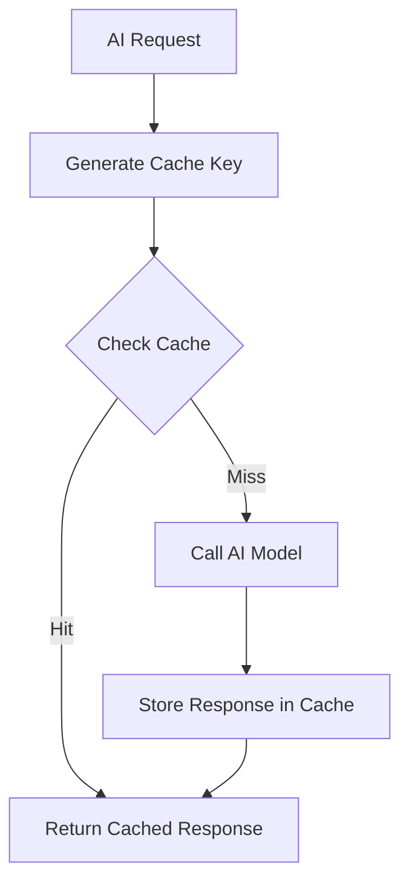

# AI Response Caching

The caching system reduces AI API costs by storing and reusing previous responses. When the same prompt and input data produce the same expected output, the cache returns the stored result instead of calling the AI model.

## Architecture



## Cache Key Generation

Every cache entry is keyed by a **SHA-256 hash** of:

```
cache_key = SHA256(prompt_template_hash + input_data_hash + model_name + model_version)
```

| Component | Description | Example |
|-----------|-------------|---------|
| `prompt_template_hash` | Hash of the system prompt + task instruction | `a1b2c3d4...` |
| `input_data_hash` | Hash of the normalised input data | `e5f6g7h8...` |
| `model_name` | Identifier for the AI model | `deepseek-v4-flash` |
| `model_version` | Specific model version | `v4.0-20260501` |

The hash is deterministic: identical prompts with identical inputs always produce the same key. Even a single character change in the input produces a completely different hash, ensuring cache correctness.

## Cache Storage

Cached responses are stored in a **Make.com data store** with the following schema:

| Field | Type | Description |
|-------|------|-------------|
| `cache_key` | String (64 chars) | SHA-256 hash — primary key |
| `response` | JSON | Full AI response (parsed JSON output) |
| `created_at` | Timestamp | When the entry was created |
| `ttl_seconds` | Integer | Time-to-live in seconds |
| `hit_count` | Integer | Number of times this entry has been served |
| `last_accessed` | Timestamp | Last read time |
| `prompt_template_hash` | String | For diagnostic queries |

## TTL Per Entry

Different types of data have different freshness requirements:

| Data Type | TTL | Rationale |
|-----------|-----|-----------|
| Company profile (name, location, industry) | 30 days | Changes infrequently |
| Tech stack detection | 14 days | Technology changes at moderate pace |
| Funding information | 7 days | New rounds happen frequently |
| Employee counts | 14 days | Monthly/quarterly changes |
| Market relevance scoring | 7 days | Market conditions shift |
| Intent signals | 1 day | Buying intent is time-sensitive |
| News/social media analysis | 0 days (no cache) | Always needs fresh data |
| Normalised fields (revenue format, etc.) | 60 days | Transformations are stable |

## Cost Savings

Cache hit rate averages **30%** across all layers:

| Layer | Cache Hit Rate | Monthly Savings |
|-------|---------------|-----------------|
| Discovery | 25% | ~$12 |
| Normalisation | 60% | ~$8 |
| Verification | 15% | ~$15 |
| Consensus | 5% | ~$5 |
| Reflection | 0% | $0 (unique per run) |
| Scoring | 40% | ~$6 |
| Intent Prediction | 10% | ~$4 |

**Total estimated monthly savings**: ~$50 (approximately 30% reduction in AI API costs).

## Cache Invalidation

Cache entries are invalidated under three conditions:

### 1. TTL Expiry

When `ttl_seconds` has elapsed since `created_at`, the entry is considered stale and will be skipped on the next lookup. A background Make.com scenario runs daily to purge expired entries.

### 2. Manual Invalidation

Cache entries can be manually invalidated by:

- **Source re-verification**: When a data source is re-scraped and produces different content, all cache entries referencing that source are invalidated
- **Prompt update**: When a prompt template is modified, all entries with the old prompt hash are invalidated
- **Model upgrade**: When a model version changes, old cache entries are invalidated to ensure consistency

### 3. LRU Eviction

The data store has a maximum size of **100,000 entries**. When the limit is reached, the **least recently accessed** entries are evicted first.

## Monitoring

| Metric | Description | Alert Threshold |
|--------|-------------|-----------------|
| Cache hit rate | Percentage of lookups that hit | < 20% |
| Cache size | Total entries in store | > 90,000 |
| Stale ratio | Percentage of entries past TTL | > 15% |
| Eviction rate | Entries evicted per day | > 1,000 |

## Trade-offs

- **Cache correctness**: The system prioritises correctness over cache hit rate. Input hashing is strict — any variation produces a miss
- **Storage cost**: Make.com data store costs are negligible (~$2/month for 100K entries) compared to the $50/month AI cost savings
- **Latency**: Cache lookup adds ~50ms per request, but AI calls that are avoided save 2–10 seconds each — net positive
