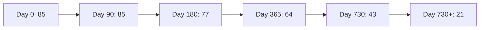
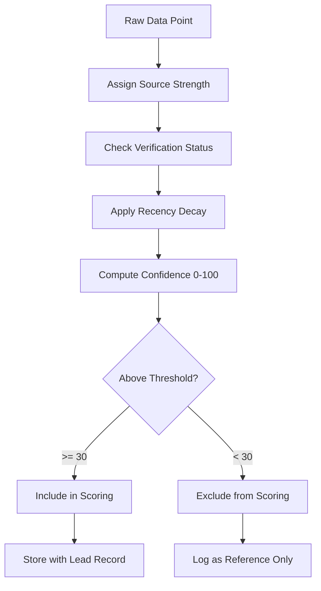

# Confidence Scoring System

Every data point in the Jasfo Lead Intelligence Platform carries a **confidence score** between 0 and 100. This score represents the system's certainty that the data point is accurate. Confidence is not binary — it reflects source quality, verification status, age, and consistency.

## Purpose

Confidence scores serve three critical functions:

1. **Downstream weighting**: Low-confidence data points contribute less to aggregate scores
2. **User trust**: Users can see exactly how reliable each data point is
3. **Audit trail**: Confidence changes over time track data degradation and re-verification

## Score Components

A confidence score is computed from three factors:

```
confidence = source_strength × verification_multiplier × recency_decay
```

### 1. Source Strength (0–100)

| Score | Source Type | Examples |
|-------|-------------|----------|
| 95–100 | Official primary | SEC filing, government database, official company document |
| 80–94 | Verified primary | LinkedIn profile, company website, official press release |
| 60–79 | Reliable secondary | Crunchbase, PitchBook, credible news outlet |
| 40–59 | Unverified secondary | User-submitted data, anonymous sources |
| 20–39 | Aggregated/inferred | Industry averages, statistical inference |
| 0–19 | Unknown/untrusted | No source, known unreliable source |

### 2. Verification Multiplier

| Status | Multiplier | Description |
|--------|-----------|-------------|
| Cross-verified | 1.0 | 2+ independent primary sources agree |
| Self-verified | 0.9 | 1 primary source, no corroboration |
| Single source | 0.75 | Only 1 source of any type |
| Contradicted | 0.5 | Conflicting evidence exists |
| Unverified | 0.3 | No verification possible |

### 3. Recency Decay

Data freshness is measured in days since the source was published or last updated:

```python
def recency_decay(days_old):
    if days_old <= 90:    return 1.0
    if days_old <= 180:   return 0.9
    if days_old <= 365:   return 0.75
    if days_old <= 730:   return 0.5
    return 0.25
```

| Age | Multiplier | Example |
|-----|-----------|---------|
| < 3 months | 1.0 | Current |
| 3–6 months | 0.9 | Slightly stale |
| 6–12 months | 0.75 | Moderately stale |
| 1–2 years | 0.5 | Stale — use with caution |
| > 2 years | 0.25 | Very stale — consider re-verifying |

### Worked Example

A LinkedIn profile (source strength: 85) showing "Head of Sales at Acme Corp" that was updated 4 months ago:

```
source_strength = 85
verification_multiplier = 0.9 (single primary source)
recency_decay = 0.9 (120 days old)

confidence = 85 × 0.9 × 0.9 = 68.85 → rounded to 69
```

## Confidence Thresholds

| Confidence Range | Label | Behaviour |
|-----------------|-------|-----------|
| 85–100 | Verified | Used in scoring without restriction |
| 60–84 | Plausible | Used in scoring with moderate weight |
| 30–59 | Uncertain | Used in scoring with reduced weight, flagged in output |
| 0–29 | Unreliable | Excluded from scoring, shown as reference only |

## Confidence Decay Over Time

Data points that are not re-verified lose confidence over time:



The platform tracks the **last verification date** for every data point. After 6 months without re-verification, the point is flagged as "aging" in the lead record. After 12 months, it is marked "stale" and given reduced weight.

## Per-Lead Aggregate Confidence

For an entire lead, the aggregate confidence is the **weighted mean** of all data point confidences:

```
lead_confidence = Σ(point_confidence × point_importance) / Σ(point_importance)
```

Where `point_importance` is a predefined weight for each data field:

| Field | Importance Weight |
|-------|------------------|
| Company legal name | 5 |
| Revenue | 5 |
| Employee count | 3 |
| Funding info | 4 |
| Tech stack | 2 |
| Headcount changes | 2 |
| Decision maker names | 4 |
| Contact info | 3 |

## Confidence in the Pipeline



## Monitoring

Confidence scores are monitored per source type and per agent:

| Metric | Purpose | Action if Degraded |
|--------|---------|-------------------|
| Mean confidence per source type | Detect low-quality sources | Re-classify or blacklist source |
| Confidence variance across agents | Detect inconsistent scoring | Review agent prompts |
| Confidence deterioration rate | Track data aging | Schedule re-verification run |
| False high-confidence rate | Overconfidence detection | Tighten calibration |

Weekly reports are generated showing confidence distribution across all active leads, enabling proactive data quality management.
