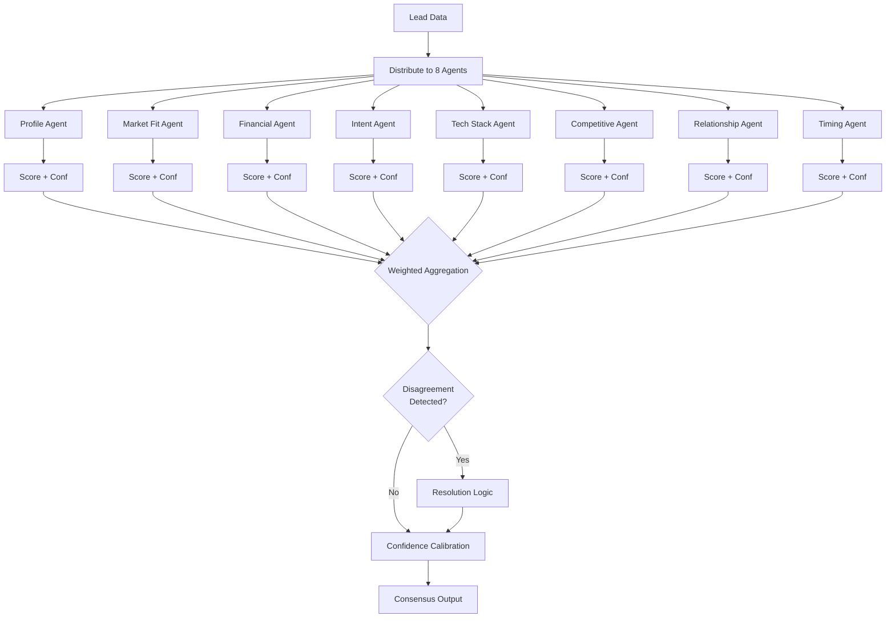

# Consensus Engine

The Consensus Engine is the core decision-making component of the Jasfo Lead Intelligence Platform. It aggregates independent assessments from **8 specialist agents**, applies weighted scoring, resolves disagreements, and produces a calibrated confidence score for each lead dimension.

## Overview

After each of the 8 specialist agents scores a lead across their respective dimensions, the consensus engine combines these scores into a single unified assessment. The process accounts for:

- **Agent expertise weighting** — Some agents have higher authority on specific dimensions
- **Confidence weighting** — An agent's own confidence in its score modulates its influence
- **Disagreement resolution** — When agents strongly disagree, the engine identifies the cause and may trigger reflection
- **Calibration** — Final scores are calibrated against historical accuracy data

## The 8 Specialist Agents

| Agent | Role | Dimensions | Weight |
|-------|------|------------|--------|
| Profile Agent | Company identity, location, size, industry | Identity, Size, Stage | 1.0 |
| Market Fit Agent | Product-market alignment, differentiation | Market Relevance, Differentiation | 1.2 |
| Financial Health Agent | Revenue signals, funding, burn rate | Financial Health, Funding Stage | 1.3 |
| Intent Agent | Buying signals, hiring patterns, tech adoption | Purchase Intent, Timeline | 1.1 |
| Tech Stack Agent | Technology usage, compatibility, gaps | Tech Fit, Integration Complexity | 0.9 |
| Competitive Position Agent | Market position, competitors, moat | Competitive Standing, Risk | 1.0 |
| Relationship Agent | Network connections, warm intros, history | Relationship Strength, Access | 0.8 |
| Timing Agent | Urgency signals, seasonality, market timing | Opportunity Window, Urgency | 1.1 |

## Consensus Workflow



## Weighted Aggregation

The consensus score for each dimension is computed as:

```
consensus_score = Σ(agent_score × agent_weight × confidence_modifier) / Σ(agent_weight × confidence_modifier)
```

Where:

- `agent_score` = the agent's score for this dimension (0–100)
- `agent_weight` = the static weight of the agent (0.8–1.3)
- `confidence_modifier` = the agent's self-reported confidence (0.0–1.0)

### Example Calculation

| Agent | Score | Weight | Confidence | Weighted Contribution |
|-------|-------|--------|------------|----------------------|
| Profile Agent | 85 | 1.0 | 0.9 | 76.5 |
| Market Fit Agent | 72 | 1.2 | 0.8 | 69.1 |
| Financial Agent | 60 | 1.3 | 0.7 | 54.6 |
| Intent Agent | 78 | 1.1 | 0.6 | 51.5 |
| Tech Stack Agent | 90 | 0.9 | 0.9 | 72.9 |
| Competitive Agent | 65 | 1.0 | 0.7 | 45.5 |
| Relationship Agent | 40 | 0.8 | 0.5 | 16.0 |
| Timing Agent | 82 | 1.1 | 0.8 | 72.2 |

**Weighted sum**: 458.3  **Sum of weights**: 7.5  **Consensus score**: 61.1

## Disagreement Detection

Disagreement is detected using two metrics:

### 1. Standard Deviation Threshold

If the standard deviation of scores across agents for a single dimension exceeds **15 points**, a disagreement is flagged.

```
σ = sqrt(Σ(score_i - mean)² / n)
Flag if σ > 15
```

### 2. Outlier Detection

Any agent whose score deviates from the weighted mean by more than **25 points** is flagged as an outlier. The outlier's score is down-weighted by 50% in the final aggregation, and the system logs the disagreement for the Reflection phase.

## Disagreement Resolution

When disagreement is detected:

1. **Identify the outlier(s)** — Which agents are far from the consensus?
2. **Examine evidence** — Are the outlier agents basing scores on stronger or weaker evidence?
3. **Apply resolution rule**:
   - If the outlier is based on stronger evidence (verified sources), shift consensus toward the outlier
   - If the outlier is based on weaker evidence (unverified, inferred), discard or down-weight
4. **Log the resolution** — Record the nature of the disagreement and how it was resolved for audit

## Confidence Calibration

After aggregation, the consensus confidence is calibrated against historical accuracy:

```
calibrated_confidence = raw_confidence × historical_accuracy_factor
```

- `raw_confidence` = mean confidence across all agents after disagreement resolution
- `historical_accuracy_factor` = running accuracy of this agent set on similar leads (e.g., 0.85 means 85% of previous consensus scores were within 10 points of verified outcome)

Calibration is updated weekly based on human-reviewed leads.

## Output

The consensus engine produces:

```json
{
  "lead_id": "lead-1234",
  "consensus_score": 61.1,
  "confidence": 74.2,
  "dimension_scores": {
    "identity": { "score": 92, "confidence": 88 },
    "market_relevance": { "score": 68, "confidence": 72 },
    "financial_health": { "score": 55, "confidence": 60 }
  },
  "disagreement_log": [
    {
      "dimension": "financial_health",
      "std_dev": 18.2,
      "outliers": ["financial_agent"],
      "resolution": "financial_agent score down-weighted by 50% — based on unverified source"
    }
  ],
  "post_reflection_score": 58.3
}
```

This output feeds into the [Reflection](reflection.md) system and then to the [Judge](judge.md) for final review.
