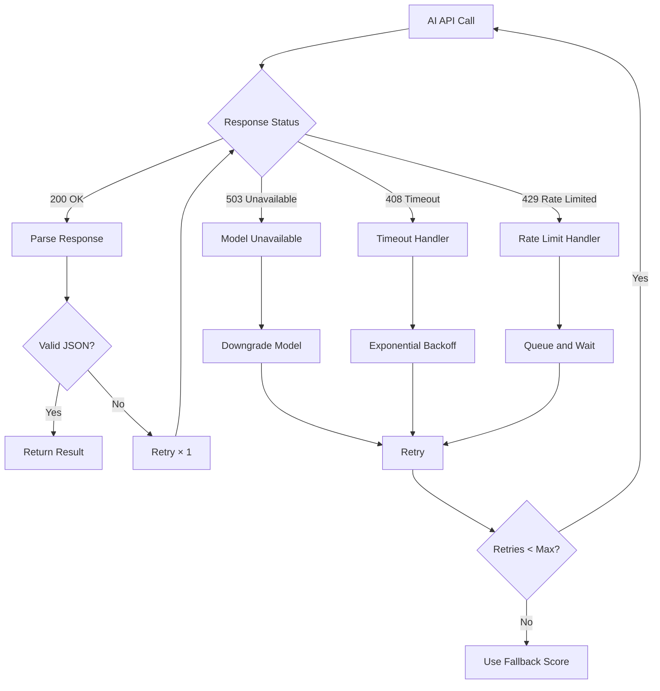
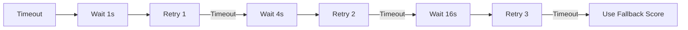
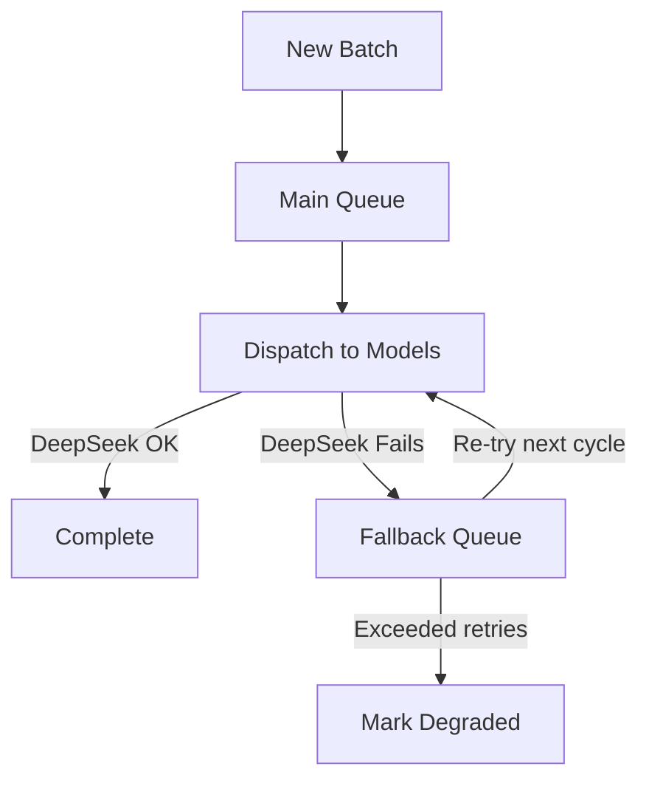

# Fallback Logic

The AI pipeline must continue producing results even when individual model calls fail. The fallback system handles three failure modes: **model unavailability**, **API timeouts**, and **empty or invalid responses**.

## Failure Mode Handling

## Fallback by Failure Type

### 1. Model Unavailable (503, connection error)

When a model endpoint returns 503 or is unreachable:

| Step | Action | Latency |
|------|--------|---------|
| 1 | Retry same model | +0s (immediate) |
| 2 | Downgrade to next available model | +2s |
| 3 | Queue for next batch | +5min |

**Downgrade chain by layer:**

| Original Model | Fallback 1 | Fallback 2 |
|---------------|-----------|------------|
| Claude Sonnet 4 (Judge) | MiMo V2.5 | — (will not downgrade below MiMo) |
| MiMo V2.5 | DeepSeek V4 Flash | Queue |
| DeepSeek V4 Flash | Queue | — |

When a model is downgraded, the output is tagged with `model: "deepseek-v4-flash (fallback)"` and confidence is automatically reduced by **10 points** to account for the lower-capability model.

### 2. API Timeout (408, 30s+)

When an API call exceeds the 30-second timeout:

The exponential backoff sequence is: **1s → 4s → 16s** (3 retries total). Each retry uses a fresh connection to avoid connection pool exhaustion.

### 3. Empty or Invalid Response

When the model returns a 200 OK but the body is empty, truncated, or not valid JSON:

| Condition | Action |
|-----------|--------|
| Empty body | Regenerate with strict "complete only" instruction |
| Truncated body | Re-request with increased `max_tokens` |
| Invalid JSON | Reparse with lenient JSON parser; if still fails, regenerate |
| Gibberish response | Regenerate, logged as "low quality" for model monitoring |

## Degraded Mode

When all retries are exhausted, the lead enters **degraded mode** for that layer:

| Field | Behaviour in Degraded Mode |
|-------|---------------------------|
| Score | Set to neutral (50) |
| Confidence | Set to very low (10) |
| Evidence array | Empty |
| Model tag | Set to "degraded" |
| Error reason | Stored in lead record for audit |

The lead continues through remaining layers — a failed verification does not block scoring or output assembly. Degraded leads are clearly labelled in the final output and ranked lower than fully processed leads.

## Queue Management for Fallbacks

The fallback queue holds leads whose primary model was unavailable. These leads are retried on the **next batch cycle** (typically 5–10 minutes later) rather than holding up the current batch. If a lead is still failing after 3 batch cycles, it is permanently marked as degraded.

## Monitoring and Alerting

| Metric | Alert Threshold | Action |
|--------|----------------|--------|
| Model error rate | > 5% per model | Check API status, rotate key |
| Degraded leads per batch | > 10% | Review OpenRouter availability |
| Average retry count | > 1.5 | Check model performance |
| Queue backlog | > 100 leads | Scale up concurrency or reduce batch size |

## Recovery

When a previously unavailable model comes back online, the system:

1. **Re-processes degraded leads** from the last 24 hours (capped at 500 leads)
2. **Overwrites degraded scores** with the new model's scores
3. **Resets the "degraded" flag** if the re-processing succeeds
4. **Logs the recovery** in the lead audit trail

This recovery run happens every 6 hours as a background Make.com scenario.
