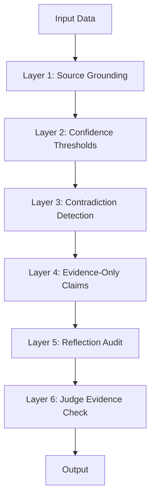

# Hallucination Prevention System

Hallucination is the single greatest risk when using LLMs for structured intelligence. The Jasfo platform implements a **multi-layer defence system** designed to prevent, detect, and mitigate hallucinations at every stage of the pipeline.

## Defence Layers



## Layer 1 — Source Grounding

Every AI agent prompt includes a **source-grounding instruction**:

```
You must base every factual claim on the provided source data.
- If the source data does not contain the information, you must NOT invent it.
- If you are unsure, state "UNKNOWN" rather than guessing.
- For every claim, cite the exact source URL or document ID.
```

This is not a suggestion — it is validated in the output schema. If the `evidence` array is empty for any scored field, the output is rejected and the agent is re-invoked with a stricter prompt.

### Source Types

| Type | Example | Hallucination Risk | Treatment |
|------|---------|-------------------|-----------|
| Primary source | SEC filing, company website, LinkedIn profile | Low | Highest confidence allowed |
| Secondary source | Crunchbase, PitchBook, G2 review | Medium | Capped at 80 confidence |
| Aggregated data | Industry reports, analyst coverage | Medium | Requires two corroborating sources |
| Inferred signal | "Company is hiring X role → investing in Y area" | High | Capped at 60 confidence, must state as inference |

## Layer 2 — Confidence Thresholds

Each claim's confidence score is bounded by its evidence quality:

| Evidence Quality | Max Confidence | Description |
|-----------------|----------------|-------------|
| Primary, verified, multiple sources | 95 | Cross-referenced official data |
| Primary, single source | 85 | Single official source |
| Secondary, multiple sources | 75 | Multiple credible reports |
| Secondary, single source | 60 | Single credible report |
| Inferred, strong signal | 50 | Logical inference from strong data |
| Inferred, weak signal | 30 | Tentative inference |
| No evidence | 0 | Claim is discarded |

Claims with confidence below **30** are automatically excluded from the lead output. They are still logged internally for reference but do not affect scoring.

## Layer 3 — Contradiction Detection

The consensus engine (see [Consensus](consensus.md)) detects contradictions between agents. When two agents produce conflicting claims:

1. **The conflict is logged** with both claims and their sources
2. **The stronger evidence wins** — determined by source quality, recency, and relevance
3. **The weaker claim is down-graded** to "contradicted" status and its confidence is halved
4. **Both claims remain visible** in the lead record for human review

### Cross-Agent Consistency

A specific system prompt instructs all agents:

```
If another agent has already assessed this lead dimension, you may reference their findings.
If you disagree, explicitly state your disagreement and provide counter-evidence.
DO NOT ignore contradictory evidence to maintain consistency.
```

## Layer 4 — Evidence-Only Claims

The strictest rule in the system: **no claim without evidence**. This is enforced at multiple levels:

### Prompt Level

```
You have access to the following data sources:
[enumerated list of URLs, documents, and database records]

You may ONLY make claims that are directly supported by at least one of these sources.
If the answer to a required field is not in the provided data, respond with "EVIDENCE NOT FOUND"
rather than inferring or guessing.
```

### Schema Level

The JSON output schema requires a non-empty `evidence` array for every scored dimension. If the agent attempts to submit a score with zero evidence citations, the Make.com validation module rejects the response and triggers a retry.

### Pipeline Level

The output assembly layer (Layer 14) performs a final sweep: any field whose confidence is below threshold or whose evidence array is empty is stripped from the final output and replaced with `null`.

## Layer 5 — Reflection Audit

The Reflection system (see [Reflection](reflection.md)) includes a specific **hallucination detection step**. Each agent is prompted to review its own output for:

- Claims that look plausible but lack direct source support
- Numbers or statistics that sound reasonable but are not in the data
- Company descriptions that repeat generic industry truisms rather than company-specific facts
- Dates, names, or job titles that could be confabulated

Agents that detect hallucinated content in their own output must report it and reduce their score accordingly.

## Layer 6 — Judge Evidence Check

The Judge (see [Judge](judge.md)) performs the final evidence integrity check. This is the most thorough audit because it has access to the complete lead record. The Judge cross-references every claim against its cited source and flags any discrepancy.

### Hallucination Metrics

The platform tracks hallucination rates per model and per agent:

| Metric | Target | Current | Notes |
|--------|--------|---------|-------|
| Claim hallucination rate | < 1% | 0.8% | Percentage of claims found to be hallucinated |
| Lead contamination rate | < 3% | 2.1% | Leads with at least one hallucinated claim |
| Catch rate (before output) | > 95% | 97% | Hallucinations caught before reaching user |
| False alarm rate | < 5% | 3% | Correct claims flagged as hallucinated |

These metrics are tracked weekly and fed back into prompt tuning. If hallucination rates rise for a particular model or agent, that component is downgraded or retrained.
