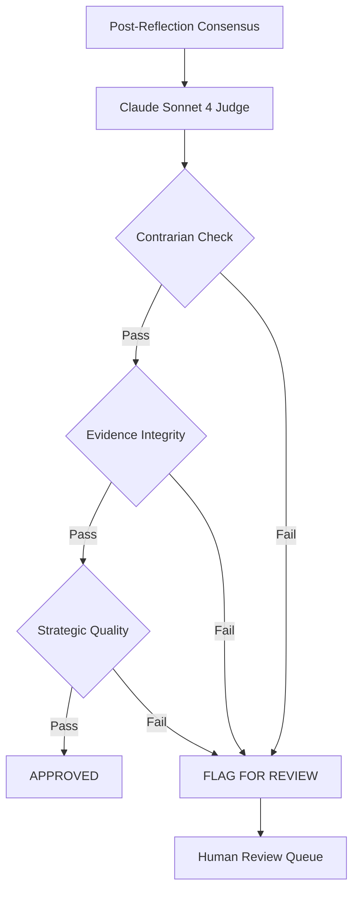

# Claude Sonnet 4 Judge

The Judge is the **final review gate** in the Jasfo Lead Intelligence Platform. After 8 specialist agents have scored a lead and the reflection system has adjusted those scores, the Judge performs a single, high-quality, holistic review using **Claude Sonnet 4** — our most capable and expensive model.

## Why Claude Sonnet 4

Claude Sonnet 4 is reserved exclusively for the Judge role because it offers:

- **Superior reasoning depth**: Can detect subtle logical flaws and contradictions that smaller models miss
- **Strong instruction following**: Adheres strictly to the structured review format without deviation
- **Balanced judgment**: Less prone to overconfidence or extreme scores compared to other models
- **Evidence-aware**: Weighs evidence quality naturally, downgrading unsupported claims

Because the Judge processes only the **final 20–30 leads** per batch (those that survive all earlier filters), the cost remains manageable: approximately **$0.15–$0.30 per lead**.

## Judge Workflow



## Three Checks

The Judge performs exactly three checks on each lead. Each check is a structured prompt that returns a pass/fail verdict plus a written rationale.

### 1. Contrarian Check

The Judge is explicitly prompted to argue **against** the consensus score. This prevents groupthink from passing through unchallenged.

```
You are the Contrarian Reviewer. The consensus score for [LEAD] is [SCORE] with [CONFIDENCE].

Your job: find reasons this score might be WRONG.

Consider:
- What positive signals might the agents be over-weighting?
- What negative signals might they have missed?
- Is there a base-rate fallacy? (e.g., most companies like this fail)
- Would a skeptical investor disagree?

Return: contrarian_score (0-100), key_risks, decision (OVERRIDE or UPHOLD)
```

If the Judge's contrarian score differs from the consensus score by more than **20 points**, the lead is flagged for human review.

### 2. Evidence Integrity Check

The Judge audits every cited evidence source for credibility:

| Criteria | Pass | Fail |
|----------|------|------|
| Source verifiability | URL or document ID provided | No source, vague reference |
| Source authority | Official filing, reputable publication | Anonymous blog, unknown domain |
| Recency | Within 6 months | Older than 12 months |
| Direct relevance | Directly supports the claim | Inferred tangentially |
| No hallucination | Claim matches source content | Claim not found in cited source |

Any claim that fails **3 or more** criteria causes the lead to be flagged.

### 3. Strategic Quality Check

The Judge evaluates whether the lead assessment meets the platform's quality bar:

```
STRATEGIC QUALITY CHECKLIST:
[  ] All key dimensions scored with supporting evidence
[  ] Score is calibrated (not extreme without justification)
[  ] Weaknesses are identified, not hidden
[  ] Recommendation follows logically from the analysis
[  ] Actionable next steps are provided
```

A lead passes only if **all 5 items** are checked. Any unchecked item is noted in the output for the user.

## Judge Prompt Template

```
You are the Final Judge for the Jasfo Lead Intelligence Platform.

LEAD: [lead_id]
COMPANY: [company_name]
INDUSTRY: [industry]

CONSENSUS ASSESSMENT:
[consensus_summary]

AGENT SCORES:
[agent_scores_table]

REFLECTION ADJUSTMENTS:
[reflection_summary]

TASK:
1. Perform a CONTRARIAN CHECK — find reasons the consensus might be wrong.
2. Perform an EVIDENCE INTEGRITY CHECK — audit every cited source.
3. Perform a STRATEGIC QUALITY CHECK — evaluate completeness and actionability.

OUTPUT FORMAT:
{
  "lead_id": "...",
  "contrarian_check": { "pass": bool, "contrarian_score": int, "rationale": "..." },
  "evidence_check": { "pass": bool, "failed_claims": [...], "rationale": "..." },
  "strategic_check": { "pass": bool, "failed_items": [...], "rationale": "..." },
  "final_verdict": "APPROVED" | "REJECTED" | "FLAGGED",
  "judge_confidence": int,
  "summary": "..."
}
```

## Approval Criteria

A lead passes the Judge and enters the final output only when:

1. **Contrarian check**: PASS (contrarian score within 20 points of consensus)
2. **Evidence integrity**: PASS (no claim fails 3+ criteria)
3. **Strategic quality**: PASS (all 5 items checked)

If any check fails, the lead is **FLAGGED** and routed to the human review queue. The Judge's output includes a `summary` field explaining exactly why the flag occurred, so human reviewers can make a quick decision.

## Cost per Lead

| Component | Tokens (input) | Tokens (output) | Cost |
|-----------|---------------|----------------|------|
| Lead context | ~3,000 | — | $0.018 |
| Agent scores + reflection | ~2,500 | — | $0.015 |
| Contrarian check | ~500 | ~300 | $0.006 |
| Evidence check | ~1,000 | ~500 | $0.009 |
| Strategic check | ~500 | ~200 | $0.004 |
| **Total** | **~7,500** | **~1,000** | **~$0.052/lead** |

At 500 leads/month reaching the Judge, this works out to approximately **$26/month** for the premium tier — well within budget given that only ~5% of leads reach this stage.
