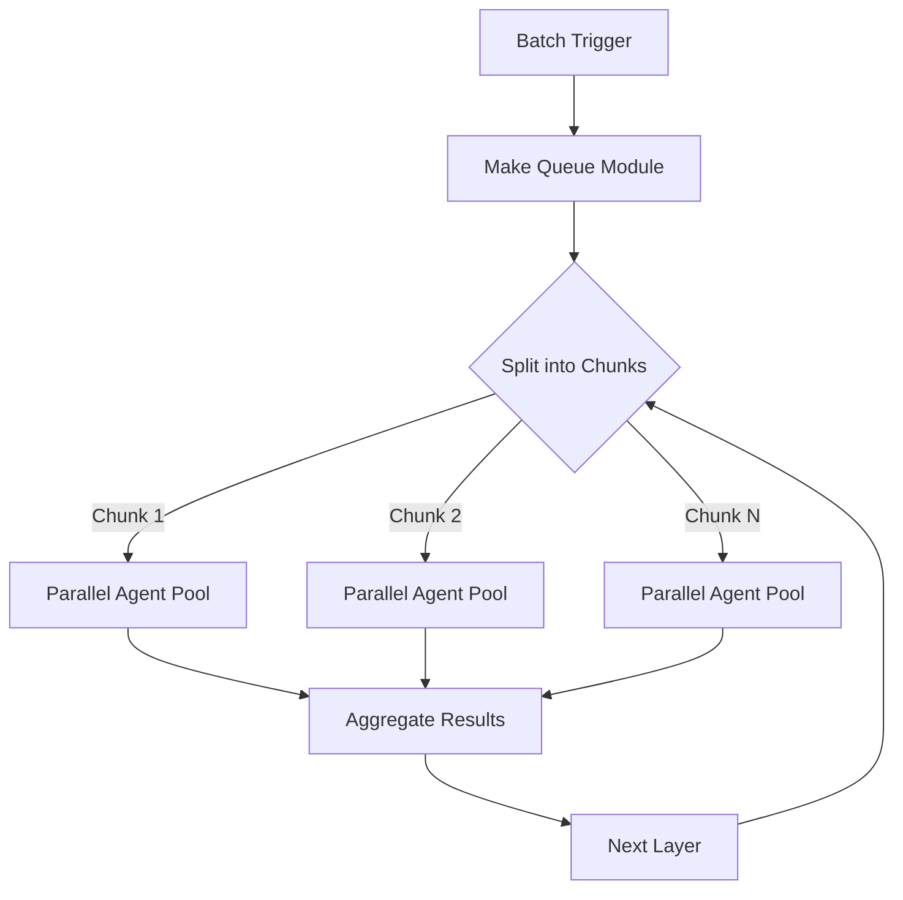
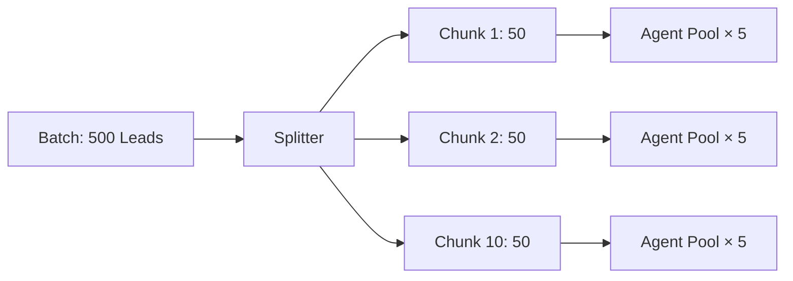
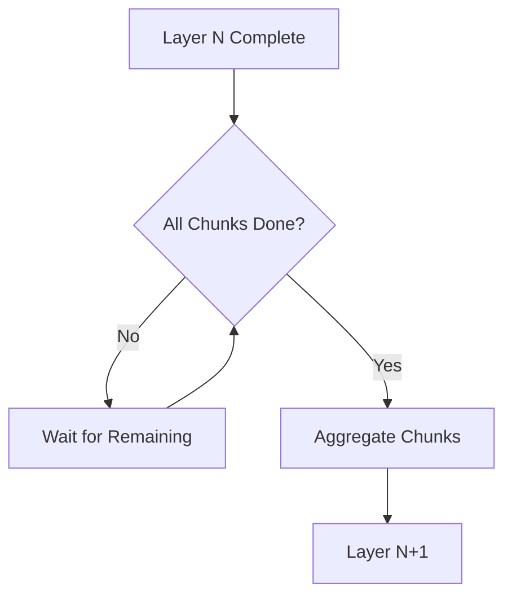
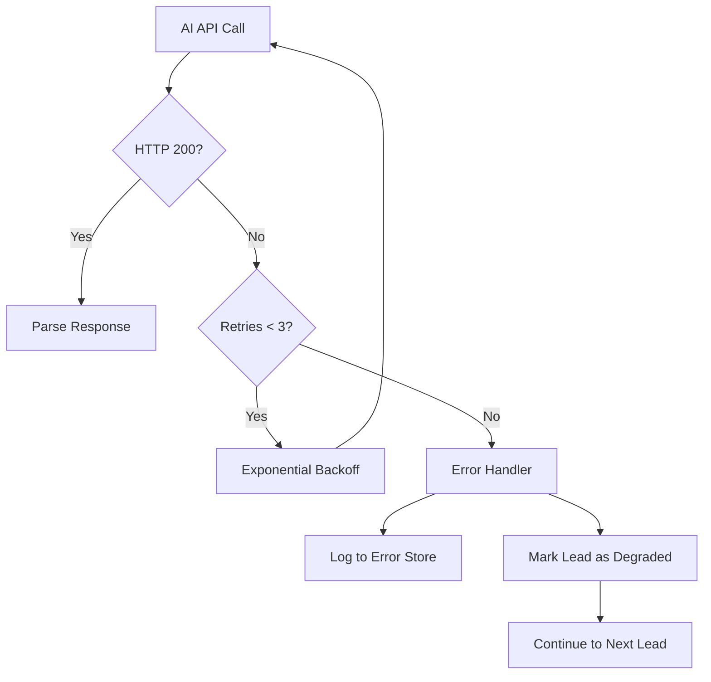
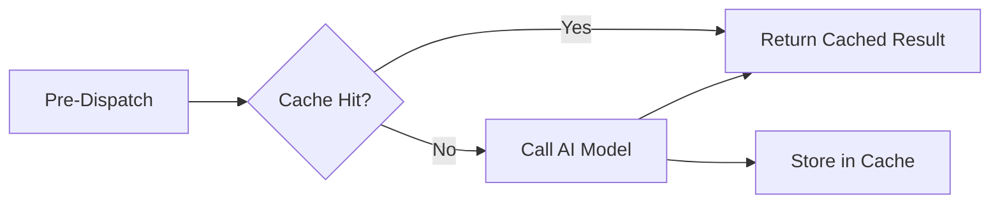

# Make.com Orchestration

All AI pipeline orchestration runs on **Make.com** (formerly Integromat). Each of the 14 architecture layers maps to one or more Make scenarios that handle sequencing, parallel dispatch, error recovery, and cache integration.

## Orchestration Architecture

## Batch Processing

Leads are processed in batches of **500–1,000**. Each batch is split into chunks of 50 leads for parallel processing:

Each chunk is dispatched to an **agent pool** that runs up to 5 parallel AI calls. The Make.com HTTP module sends prompts to OpenRouter concurrently, with each call using a separate connection.

## Parallel Agent Execution

Within a chunk, agents execute in parallel where possible:

| Layer | Parallelism | Workers | Notes |
|-------|-------------|---------|-------|
| Discovery | 5× | 50 per chunk | Independent URL fetches + AI extraction |
| Normalisation | 5× | 50 per chunk | Stateless transforms |
| Verification | 3× | 30 per chunk | Requires some context |
| Consensus | 1× | 8 agents per lead | All 8 specialists vote simultaneously |
| Reflection | 1× | 1 per consensus round | Sequential — depends on consensus output |
| Judge | 1× | 1 per lead | Final gate — must be sequential |
| Enrichment | 5× | 50 per chunk | Independent lookups |
| Scoring | 5× | 50 per chunk | Stateless calculations |
| Prioritisation | 1× | 1 per batch | Cross-lead comparison |
| Intent Prediction | 3× | 30 per chunk | Context-dependent |
| Engagement Strategy | 3× | 30 per chunk | Depends on intent |
| Summary | 5× | 50 per chunk | Stateless generation |
| Confidence Calibration | 1× | 1 per lead | Sequential refinement |
| Output Assembly | 1× | 1 per batch | Final aggregation |

## Sequencing

Make.com's **router modules** enforce dependency ordering:

Each scenario uses Make.com's **data store** to track per-lead progress across chunks. When all chunks complete, the aggregation router fires to merge results and advance to the next layer.

## Failure Handling

Each AI call has:
- **Max 3 retries** with exponential backoff (1s, 4s, 16s)
- **30-second timeout** per call
- **Degraded mode**: when a lead fails at any layer, it continues through remaining layers with a confidence penalty rather than being discarded
- **Error store**: all failures are logged to a Make.com data store for post-batch analysis

## Queue Management

Make.com uses its built-in **queue module** to manage concurrent API calls:

- **Max concurrency**: 25 simultaneous OpenRouter calls
- **Queue per model**: Separate queues for DeepSeek V4 Flash, MiMo V2.5, and Claude Sonnet 4
- **Priority**: Judge calls (Claude Sonnet 4) are queued with highest priority — they are the final gate and block pipeline completion
- **Rate limit handling**: When OpenRouter returns 429 (rate limited), the queue pauses for `Retry-After` seconds

## Cache Integration

Before dispatching any AI call, the orchestrator checks the **cache** (see [Caching](caching.md)):

Cache hits skip the AI call entirely, saving both cost and latency. Current cache hit rate averages **30%** across all layers.
