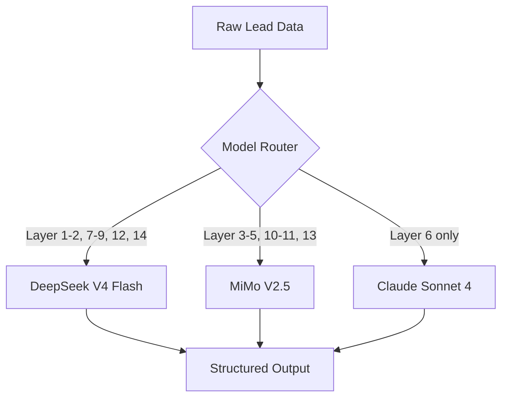

# AI System Overview

The Jasfo Lead Intelligence Platform employs a **14-layer AI architecture** that progressively enriches raw company data into actionable lead intelligence. The system is designed for cost efficiency: approximately **95% of AI processing runs on cheap, high-throughput models** (DeepSeek V4 Flash), while the remaining **5% — the most critical judgment calls — uses premium models** (Claude Sonnet 4 via OpenRouter).

## Architecture Principles

- **Progressive model routing**: Simple tasks stay on cheap models. Complex reasoning, verification, and final judgment escalate to premium models only when necessary.
- **Source grounding**: Every AI claim is anchored to a verifiable source. Unsupported statements are discarded.
- **Confidence-first design**: No binary pass/fail. Every data point carries a 0–100 confidence score that propagates upward through the pipeline.
- **Cost-conscious orchestration**: The system tracks per-task token spend and routes to minimise cost while meeting accuracy thresholds.

## 14-Layer Pipeline

```mermaid
flowchart LR
    L0[1: Discovery] --> L1[2: Normalisation]
    L1 --> L2[3: Verification]
    L2 --> L3[4: Consensus]
    L3 --> L4[5: Reflection]
    L4 --> L5[6: Judge Review]
    L5 --> L6[7: Enrichment]
    L6 --> L7[8: Scoring]
    L7 --> L8[9: Prioritisation]
    L8 --> L9[10: Intent Prediction]
    L9 --> L10[11: Engagement Strategy]
    L10 --> L11[12: Summary Generation]
    L11 --> L12[13: Confidence Calibration]
    L12 --> L13[14: Output Assembly]
```

| Layer | Name | Model | Cost Tier |
|-------|------|-------|-----------|
| 1 | Discovery | DeepSeek V4 Flash | Cheap |
| 2 | Normalisation | DeepSeek V4 Flash | Cheap |
| 3 | Verification | MiMo V2.5 | Medium |
| 4 | Consensus | MiMo V2.5 | Medium |
| 5 | Reflection | MiMo V2.5 | Medium |
| 6 | Judge Review | Claude Sonnet 4 | Premium |
| 7 | Enrichment | DeepSeek V4 Flash | Cheap |
| 8 | Scoring | DeepSeek V4 Flash | Cheap |
| 9 | Prioritisation | DeepSeek V4 Flash | Cheap |
| 10 | Intent Prediction | MiMo V2.5 | Medium |
| 11 | Engagement Strategy | MiMo V2.5 | Medium |
| 12 | Summary Generation | DeepSeek V4 Flash | Cheap |
| 13 | Confidence Calibration | MiMo V2.5 | Medium |
| 14 | Output Assembly | DeepSeek V4 Flash | Cheap |

## Model Routing Flow

## Cost Distribution

Of the total monthly AI spend:
- **DeepSeek V4 Flash**: ~55% of spend, ~70% of tasks
- **MiMo V2.5**: ~25% of spend, ~20% of tasks
- **Claude Sonnet 4**: ~20% of spend, ~10% of tasks (final review only)

The 95/5 rule (95% cheap, 5% premium) refers to **task volume**, not token spend. Because premium models consume more tokens per task, the actual cost split is closer to 70/30 — but the design goal remains: keep the vast majority of processing on cost-effective models and reserve expensive inference exclusively for high-value decisions.

## Orchestration

All 14 layers are orchestrated by **Make.com scenarios**, which handle sequencing, parallel execution, error recovery, and cache lookups. OpenCode GO acts as the AI coding agent that maintains and evolves the orchestration logic. See the [Orchestration](orchestration.md) document for details.

The system processes **500–1,000 leads per batch** and completes a full batch in approximately 4–8 minutes depending on model availability and cache hit rate.
