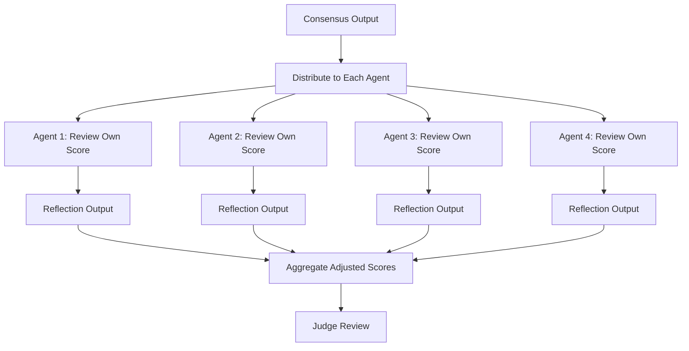

# Reflection System

After the consensus engine produces an aggregate score, the **Reflection System** performs a structured self-critique. Each of the 8 specialist agents reviews its own contribution, identifies weak evidence, and adjusts its position before the final Judge review.

## Purpose

The reflection step exists to catch and correct errors that consensus alone cannot detect. Consensus aggregates independent votes — but if all agents share the same blind spot or training-data bias, the aggregate will be confidently wrong. Reflection forces each agent to:

1. **Re-examine its evidence** — Was the source reliable? Was the inference justified?
2. **Identify weak signals** — Was any claim based on hearsay, outdated data, or correlation mistaken for causation?
3. **Adjust its score** — Apply a delta based on the self-critique.

## Reflection Workflow



## Reflection Prompt Structure

Each agent receives a structured reflection prompt:

```
You previously scored [LEAD_ID] on dimension [DIMENSION] with score [SCORE].
Your evidence was: [EVIDENCE_SUMMARY]

Reflect on your assessment:

1. EVIDENCE QUALITY: Was the source authoritative, current, and directly relevant?
   - If not, how much should the score be reduced?

2. REASONING GAPS: Did you make any unsupported leaps?
   - Identify each inference that lacked direct evidence.

3. CONTRADICTIONS: Does any other agent's evidence contradict yours?
   - If so, which is more reliable and why?

4. CONFIDENCE: What is your adjusted confidence (0-100) in your score after reflection?

5. SCORE DELTA: By how many points should your score change? (Negative, zero, or positive)
```

## Self-Critique Categories

| Category | Trigger | Action |
|----------|---------|--------|
| Weak source | Single source, unknown domain, no date | Reduce confidence by 20–40 points |
| Outdated data | Source older than 6 months | Reduce weight by 50% |
| Correlation error | Claim implies causation without evidence | Flag in output, reduce score by 15 points |
| Missing context | Agent lacked industry/market context | Reduce confidence, add uncertainty note |
| Conflicting evidence | Another agent has stronger counter-evidence | Reconcile or reduce score |
| Strong confirmation | Multiple high-quality sources agree | Increase confidence by 5–10 points |

## Adjustment Rules

Score adjustments follow deterministic rules:

| Condition | Adjustment |
|-----------|------------|
| All sources are primary (e.g., official filings, direct statements) | No adjustment |
| Mix of primary and secondary sources | −5 to −10 confidence |
| Secondary sources only | −15 to −25 confidence |
| Single source of any type | −20 confidence |
| Source date > 6 months old | Additional −10 confidence |
| Contradiction with stronger evidence | Adopt stronger position |
| Contradiction with equal evidence | Split the difference |

## Output Format

Each agent's reflection produces a JSON object:

```json
{
  "agent_id": "market_fit_agent",
  "original_score": 72,
  "original_confidence": 65,
  "weak_evidence_found": [
    {
      "claim": "Company raised $10M Series A",
      "source": "crunchbase.com/profile/company",
      "issue": "no date found",
      "severity": "medium"
    }
  ],
  "reasoning_gaps": [
    "Inferred market traction from employee count alone"
  ],
  "adjusted_score": 65,
  "adjusted_confidence": 50,
  "delta": -7,
  "reflection_summary": "Score reduced due to unverified funding date and weak market traction signal"
}
```

## Integration with Consensus

The reflection system runs **once** per lead, after consensus aggregation. The adjusted scores from all 8 agents are then re-aggregated using the same weighted method (see [Consensus](consensus.md)) to produce a **post-reflection score**. This post-reflection score is what gets sent to the Judge for final review.

If the total adjustment across all agents exceeds 30 points (i.e., the average agent changed its score by more than ~4 points), the reflection is considered "high flux" and is flagged in the lead record for human review.
