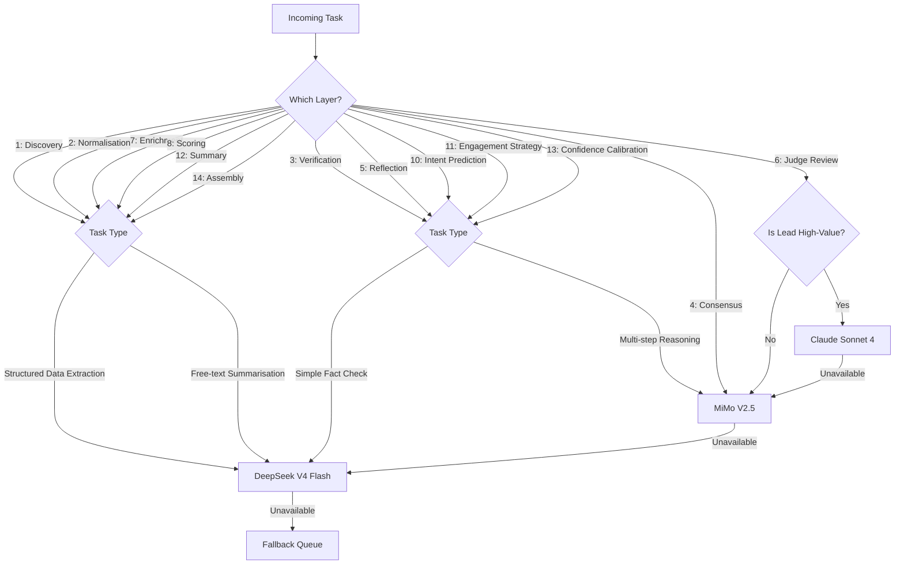
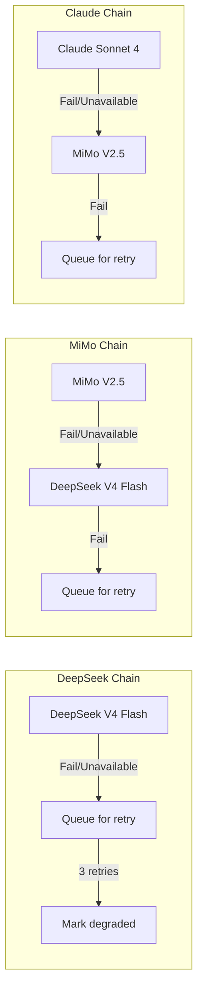

# Model Routing

The model routing system determines which AI model processes each task. Routing decisions balance **cost**, **accuracy requirements**, **latency constraints**, and **current model availability** to optimise the overall pipeline.

## Routing Decision Tree



## Routing Rules by Layer

| Layer | Primary | When to Downgrade | When to Upgrade |
|-------|---------|-------------------|-----------------|
| 1 — Discovery | DeepSeek V4 Flash | Never | Complex extraction → MiMo |
| 2 — Normalisation | DeepSeek V4 Flash | Never | Never needed |
| 3 — Verification | MiMo V2.5 | Simple single-source check → DeepSeek | Never |
| 4 — Consensus | MiMo V2.5 | Never | High disagreement → Claude Sonnet 4 |
| 5 — Reflection | MiMo V2.5 | Lead confidence > 80 → DeepSeek | High flux → Claude Sonnet 4 |
| 6 — Judge | Claude Sonnet 4 | Unavailable → MiMo | Never |
| 7 — Enrichment | DeepSeek V4 Flash | Never | Deep research → MiMo |
| 8 — Scoring | DeepSeek V4 Flash | Never | Complex rubric → MiMo |
| 9 — Prioritisation | DeepSeek V4 Flash | Never | Never |
| 10 — Intent | MiMo V2.5 | Clear signal → DeepSeek | Never |
| 11 — Strategy | MiMo V2.5 | Low confidence → DeepSeek | Never |
| 12 — Summary | DeepSeek V4 Flash | Never | High-value lead → MiMo |
| 13 — Calibration | MiMo V2.5 | Never | Never |
| 14 — Assembly | DeepSeek V4 Flash | Never | Never |

## Cost Thresholds

The router tracks cumulative cost per lead and adjusts routing decisions dynamically:

| Per-Lead Budget | Routing Behaviour |
|----------------|-------------------|
| < $0.05 | All layers on DeepSeek V4 Flash |
| $0.05–$0.15 | Mixed: MiMo where needed, DeepSeek where possible |
| $0.15–$0.30 | Full pipeline including Claude Sonnet 4 Judge |
| > $0.30 | Flagged for review (excessive spend) |

The default per-lead budget is **$0.15**. The Judge layer (Claude Sonnet 4) is only invoked when there is remaining budget after earlier layers run efficiently.

## Model Fallback Chains



## Queue Management

Each model has a dedicated queue in Make.com:

| Queue | Max Concurrency | Priority | Backlog Limit |
|-------|----------------|----------|---------------|
| DeepSeek V4 Flash | 15 | Normal | 500 |
| MiMo V2.5 | 8 | High | 200 |
| Claude Sonnet 4 | 2 | Critical | 50 |

When a queue exceeds its backlog limit, the router scales up by processing additional chunks in parallel (up to 2× normal concurrency).

## Routing Diagnostics

Each routing decision is logged with:

```json
{
  "lead_id": "lead-1234",
  "layer": 4,
  "task": "consensus",
  "primary_model": "mimo-v2.5",
  "selected_model": "mimo-v2.5",
  "reason": "standard routing",
  "cost_so_far": 0.042,
  "budget_remaining": 0.108,
  "duration_ms": 3200,
  "fallback_chain": []
}
```

Daily reports show routing distribution, downgrade rates, and cost per layer to inform budget planning and model selection tuning.
