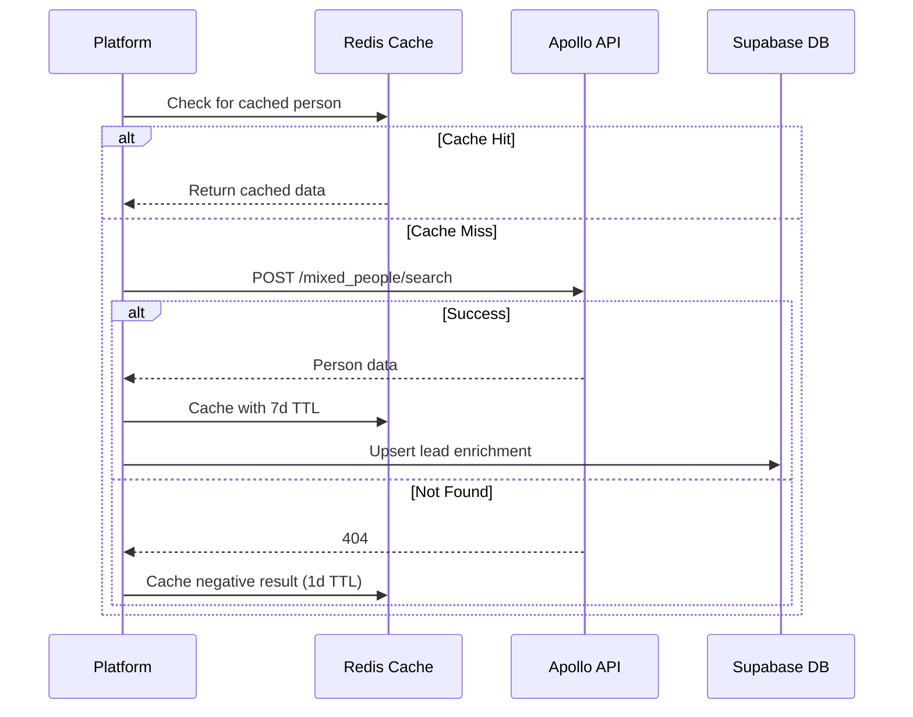

# Apollo.io API Integration

## Overview

The Apollo.io API integration provides person and company enrichment data. Apollo is the platform's primary source for identity fields (name, title, location) and company data (industry, size, revenue, technologies). The free tier supports up to 1,000 API calls per month, which covers the platform's lead intake for small-to-mid-scale operations.

The integration uses Apollo's REST API v1 with a personal API key. All requests are authenticated via a Bearer token in the `X-API-Key` header. Responses are cached in Redis with a 7-day TTL to minimize quota consumption.

---

## Authentication

### API Key Setup

```
GET https://api.apollo.io/api/v1/auth/health
X-API-Key: abc123...
```

1. Log in to [Apollo.io](https://apollo.io)
2. Go to Settings → API & Data → API Key
3. Generate a new API key
4. Store in Supabase Vault as `apollo.api_key`

### Environment

| Variable | Description |
|----------|-------------|
| `APOLLO_API_KEY` | API key (Vault) |
| `APOLLO_BASE_URL` | `https://api.apollo.io/api/v1` |
| `APOLLO_CACHE_TTL` | Cache TTL in seconds (default: 604800 / 7 days) |

---

## Endpoints

### People Search

```
POST /api/v1/mixed_people/search
```

Search for people with optional company and location filters. This is the primary endpoint for lead discovery and enrichment.

**Request**

```json
{
  "q_organization_domains": ["acmecorp.com"],
  "person_titles": ["CTO", "VP Engineering", "Head of Product"],
  "person_seniorities": ["director", "vp", "c_suite"],
  "page": 1,
  "per_page": 25
}
```

**Response (Free Tier)**

```json
{
  "status": "success",
  "total_entries": 12,
  "page": 1,
  "per_page": 25,
  "people": [{
    "id": "abc123",
    "first_name": "John",
    "last_name": "Smith",
    "name": "John Smith",
    "linkedin_url": "https://www.linkedin.com/in/johnsmith",
    "title": "CTO",
    "email": "john@acmecorp.com",
    "phone": "+14155551234",
    "city": "San Francisco",
    "state": "California",
    "country": "US",
    "organization": {
      "name": "Acme Corp",
      "domain": "acmecorp.com",
      "industry": "software",
      "estimated_num_employees": 450,
      "estimated_revenue": "50000000",
      "technology_names": ["React", "AWS", "Python"]
    }
  }]
}
```

**Fields Returned on Free Tier**: The free tier returns a limited set of fields. Email and phone are not guaranteed on every response.

### Person Enrichment

```
POST /api/v1/people/match
```

Enrich a single person by email, LinkedIn URL, or domain + name combination.

**Request**

```json
{
  "email": "john@acmecorp.com"
}
```

**Response**

```json
{
  "status": "success",
  "person": {
    "id": "abc123",
    "first_name": "John",
    "last_name": "Smith",
    "title": "CTO",
    "email": "john@acmecorp.com",
    "phone": "+14155551234",
    ...
  }
}
```

### Organization Enrichment

```
POST /api/v1/organizations/enrich
```

Enrich company data by domain.

**Request**

```json
{
  "domain": "acmecorp.com"
}
```

**Response**

```json
{
  "organization": {
    "id": "org_xyz",
    "name": "Acme Corp",
    "domain": "acmecorp.com",
    "industry": "Software",
    "estimated_num_employees": 450,
    "estimated_revenue": "50000000",
    "founded_year": 2015,
    "technology_names": ["React", "Node.js", "AWS"],
    "linkedin_url": "https://linkedin.com/company/acme",
    "twitter_url": "https://twitter.com/acme",
    "facebook_url": "https://facebook.com/acme",
    "city": "San Francisco",
    "state": "California",
    "country": "US",
    "phone": "+14155550000"
  }
}
```

---

## Rate Limits

| Tier | Monthly Credits | Rate Limit |
|------|----------------|------------|
| Free | 1,000 | 10 req/min |
| Basic | 5,000 | 20 req/min |
| Professional | 20,000 | 50 req/min |
| Organization | Custom | Custom |

The platform consumes 1 credit per person search or organization enrich request. People search returns consume 1 credit per page.

---

## Error Codes

| Code | Meaning | Handling |
|------|---------|----------|
| `400` | Invalid parameters | Log and skip lead |
| `401` | Invalid API key | Alert admin, pause enrichment |
| `402` | Out of credits | Switch to next source |
| `404` | Person/organization not found | Mark as not found, continue |
| `429` | Rate limited | Exponential backoff, retry |

---

## Response Schema (Person Object)

| Field | Type | Example |
|-------|------|---------|
| `id` | string | `"abc123"` |
| `first_name` | string | `"John"` |
| `last_name` | string | `"Smith"` |
| `name` | string | `"John Smith"` |
| `title` | string | `"CTO"` |
| `email` | string | `"john@acmecorp.com"` |
| `phone` | string | `"+14155551234"` |
| `city` | string | `"San Francisco"` |
| `state` | string | `"California"` |
| `country` | string | `"US"` |
| `linkedin_url` | string | `"https://..."` |

---

## Implementation



### Apollo.io Scoring

Apollo data confidence is calculated as:

- Email present and verified: **0.95**
- Email present but unverified: **0.75**
- Phone present: **0.85**
- Job title matched from LinkedIn: **0.90**
- Company data matched from Crunchbase: **0.85**
- No email, no phone: **0.40**
