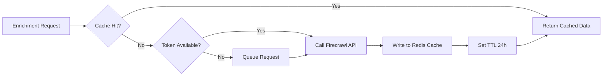

# Firecrawl API Integration

## Overview

Firecrawl is the platform's web scraping and data extraction engine. It transforms URLs into structured markdown, extracts specific data fields using LLM-powered extraction, searches the web, and maps site architectures. The Jasfo platform uses Firecrawl as the primary source for company enrichment, intent signal detection, and content analysis from public web pages.

The integration uses Firecrawl's v1 REST API. All requests are authenticated via a Bearer token stored in Supabase Vault. The platform maintains a cache layer to avoid redundant crawling and to stay within rate limits.

---

## Authentication

### API Key Setup

```
X-API-KEY: fc-xxxxxxxxxxxxxxxxxxxxxxxxxxxxxxxx
```

1. Sign up at [firecrawl.dev](https://firecrawl.dev)
2. Navigate to API Keys section
3. Generate a new API key
4. Store in Supabase Vault as `firecrawl.api_key`

### Environment

| Variable | Description |
|----------|-------------|
| `FIRECRAWL_API_KEY` | API key (Vault) |
| `FIRECRAWL_BASE_URL` | `https://api.firecrawl.dev/v1` |
| `FIRECRAWL_CACHE_TTL` | Cache duration in seconds (default: 86400) |

---

## Endpoints

### Crawl Endpoint

```
POST /v1/crawl
```

Crawl a website starting from a given URL, following links up to a specified depth.

**Request**

```json
{
  "url": "https://acmecorp.com",
  "maxPages": 50,
  "ignoreSitemap": false,
  "allowBackwardLinks": false,
  "allowExternalLinks": false,
  "scrapeOptions": {
    "formats": ["markdown", "links", "screenshot"]
  }
}
```

**Response**

```json
{
  "success": true,
  "id": "crawl-abc123",
  "url": "https://api.firecrawl.dev/v1/crawl/abc123"
}
```

The crawl runs asynchronously. Poll the returned URL for status.

**Usage in Jasfo**: Company website crawling for tech stack detection, content analysis, and intent signal discovery.

### Crawl Status (Async)

```
GET /v1/crawl/{id}
```

**Response**

```json
{
  "status": "completed",
  "total": 35,
  "completed": 35,
  "creditsUsed": 35,
  "expiresAt": "2026-07-13T10:30:00Z",
  "data": [...]
}
```

### Extract Endpoint

```
POST /v1/extract
```

LLM-powered extraction of structured data from URLs.

**Request**

```json
{
  "urls": ["https://acmecorp.com/about", "https://acmecorp.com/team"],
  "prompt": "Extract the company name, industry, employee count, revenue range, key technologies, and executive team members",
  "schema": {
    "type": "object",
    "properties": {
      "company_name": { "type": "string" },
      "industry": { "type": "string" },
      "employee_count": { "type": "integer" },
      "technologies": { "type": "array", "items": { "type": "string" } },
      "executives": {
        "type": "array",
        "items": {
          "type": "object",
          "properties": {
            "name": { "type": "string" },
            "title": { "type": "string" }
          }
        }
      }
    }
  }
}
```

**Response**

```json
{
  "success": true,
  "data": {
    "company_name": "Acme Corp",
    "industry": "Enterprise Software",
    "employee_count": 450,
    "technologies": ["React", "AWS", "PostgreSQL"],
    "executives": [{ "name": "Jane Doe", "title": "CEO" }]
  }
}
```

**Usage in Jasfo**: Primary endpoint for company enrichment. Used to extract structured data from company websites, about pages, and team pages.

### Search Endpoint

```
POST /v1/search
```

Search the web for lead intelligence signals.

**Request**

```json
{
  "query": "Acme Corp funding round 2026",
  "scrapeOptions": {
    "formats": ["markdown"]
  }
}
```

**Response**

```json
{
  "success": true,
  "data": [{
    "url": "https://techcrunch.com/...",
    "markdown": "...",
    "metadata": {
      "title": "Acme Corp Raises $50M Series B",
      "description": "...",
      "language": "en",
      "sourceURL": "..."
    }
  }]
}
```

**Usage in Jasfo**: Intent signal detection — searches for news, funding announcements, leadership changes, and job postings.

### Map Endpoint

```
POST /v1/map
```

Discover the URL structure of a website.

**Request**

```json
{
  "url": "https://acmecorp.com",
  "search": "blog",
  "ignoreSitemap": false,
  "sitemapOnly": false,
  "limit": 100
}
```

**Response**

```json
{
  "status": "completed",
  "total": 85,
  "links": [
    "https://acmecorp.com",
    "https://acmecorp.com/about",
    "https://acmecorp.com/blog/...",
    "..."
  ]
}
```

**Usage in Jasfo**: Site discovery before crawling. Identifies the pages worth scraping for enrichment.

---

## Rate Limits

| Plan | Requests/Second | Daily Credits | Concurrent |
|------|----------------|---------------|------------|
| Free | 10 | 500 | 1 |
| Starter | 50 | 10,000 | 3 |
| Standard | 100 | 50,000 | 10 |
| Growth | 200 | 200,000 | 20 |

The platform respects rate limits via a token bucket algorithm. Requests are queued when the bucket is empty.

---

## Error Codes

| Code | Meaning | Handling |
|------|---------|----------|
| `400` | Bad request — invalid URL or parameters | Log and skip |
| `401` | Unauthorized — invalid or missing API key | Alert admin |
| `429` | Rate limited — too many requests | Backoff and retry |
| `500` | Internal server error | Retry with backoff |
| `502` | Upstream error (Firecrawl provider) | Retry with backoff |

---

## Caching Strategy



- Cache key format: `firecrawl:{md5(url)}:{prompt_hash}`
- Default TTL: 24 hours
- Cache backend: Redis (ElastiCache)
- Cache invalidation: Manual refresh via API
