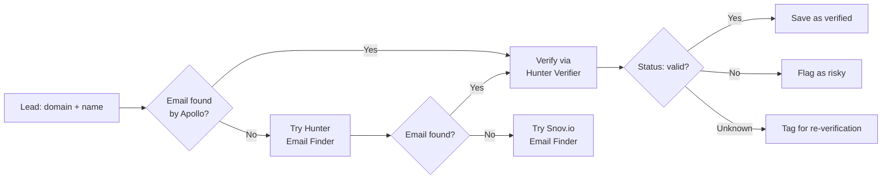

# Hunter.io API Integration

## Overview

Hunter.io provides email finding and verification services. The Jasfo platform uses Hunter as a secondary email source (corroborating Apollo data) and as the primary email verification engine. The free tier offers 25 monthly requests and 50 verifications. This is sufficient for small-scale operations; the platform queues requests and prioritizes high-intent leads when quota is limited.

Hunter's strength is its domain-level email pattern detection. It can infer email addresses from common patterns (first@domain, first.last@domain) even when direct lookup returns no result. The platform uses this pattern detection as a fallback when primary email search fails.

---

## Authentication

### API Key Setup

```
GET https://api.hunter.io/v2/email-finder?domain=acme.com&first_name=John&last_name=Smith&api_key=abc123
```

1. Log in to [Hunter.io](https://hunter.io)
2. Go to Account → API & Data → API Key
3. Copy your API key
4. Store in Supabase Vault as `hunter.api_key`

### Environment

| Variable | Description |
|----------|-------------|
| `HUNTER_API_KEY` | API key (Vault) |
| `HUNTER_BASE_URL` | `https://api.hunter.io/v2` |
| `HUNTER_CACHE_TTL` | Cache TTL in seconds (default: 604800 / 7 days) |

---

## Endpoints

### Email Finder

```
GET /v2/email-finder
```

Find the most likely email address for a person given their domain and name.

**Request**

```
GET https://api.hunter.io/v2/email-finder?domain=acmecorp.com&first_name=John&last_name=Smith&api_key=abc123
```

**Response**

```json
{
  "data": {
    "email": "john@acmecorp.com",
    "first_name": "John",
    "last_name": "Smith",
    "score": 95,
    "domain": "acmecorp.com",
    "sources": [
      {
        "domain": "acmecorp.com",
        "uri": "https://acmecorp.com/about",
        "extracted_on": "2026-07-10"
      }
    ]
  }
}
```

| Field | Description |
|-------|-------------|
| `email` | Found email address |
| `score` | Confidence score (0–100) |
| `sources` | URLs where the email was found |
| `first_name` | Matched first name |
| `last_name` | Matched last name |

**Usage in Jasfo**: Secondary email source. Called when Apollo returns no email or low-confidence email.

### Email Verifier

```
GET /v2/email-verifier
```

Verify the deliverability of an email address using SMTP checks.

**Request**

```
GET https://api.hunter.io/v2/email-verifier?email=john@acmecorp.com&api_key=abc123
```

**Response**

```json
{
  "data": {
    "email": "john@acmecorp.com",
    "status": "valid",
    "score": 92,
    "smtp_check": true,
    "mx_found": true,
    "disposable": false,
    "role": false,
    "accept_all": false,
    "webmail": false,
    "smtp_log": ">>> STARTTLS\n<<< 220 Ready\n>>> MAIL FROM:<verify@hunter.io>\n<<< 250 OK\n>>> RCPT TO:<john@acmecorp.com>\n<<< 250 OK"
  }
}
```

| Field | Description |
|-------|-------------|
| `status` | `valid` / `invalid` / `unknown` / `risky` |
| `score` | 0–100 deliverability likelihood |
| `smtp_check` | SMTP RCPT TO result |
| `disposable` | Known disposable domain |
| `role` | Role-based account (info@, sales@) |
| `accept_all` | Server accepts all addresses |

**Usage in Jasfo**: Primary email verification. Called after email is obtained from any source.

### Email Count

```
GET /v2/email-count
```

Get the total number of email addresses found for a domain.

**Request**

```
GET https://api.hunter.io/v2/email-count?domain=acmecorp.com&api_key=abc123
```

**Response**

```json
{
  "data": {
    "domain": "acmecorp.com",
    "total": 47,
    "pattern": "{first}.{last}"
  }
}
```

**Usage in Jasfo**: Pattern detection. Used to infer email pattern for the domain and apply it across multiple leads.

### Domain Search

```
GET /v2/domain-search
```

Get all email addresses found for a domain.

**Request**

```
GET https://api.hunter.io/v2/domain-search?domain=acmecorp.com&limit=10&api_key=abc123
```

---

## Rate Limits

| Tier | Monthly Requests | Monthly Verifications | Rate Limit |
|------|-----------------|----------------------|------------|
| Free | 25 | 50 | 10 req/min |
| Starter | 500 | 1,000 | 30 req/min |
| Growth | 5,000 | 10,000 | 60 req/min |
| Business | 50,000 | 100,000 | 120 req/min |

---

## Error Codes

| Code | Meaning | Handling |
|------|---------|----------|
| `401` | Unauthorized — invalid API key | Alert admin |
| `404` | No email found for query | Try Snov.io as fallback |
| `422` | Missing required parameters | Log error, skip lead |
| `429` | Too many requests | Exponential backoff |

---

## Implementation



### Hunter Confidence Scoring

- `score >= 90`: **0.95** — High confidence, verified via SMTP
- `score 70–89`: **0.80** — Good confidence, accept-all domain possible
- `score < 70`: **0.50** — Low confidence, needs corroboration
- Pattern-derived (no direct find): **0.40** — Weakest, may be wrong
