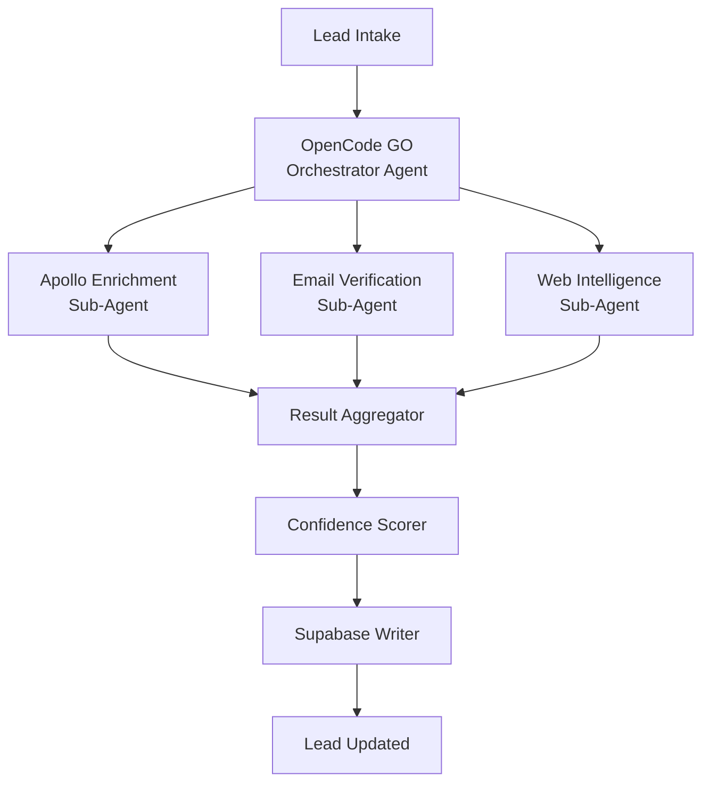

# OpenCode GO API Integration

## Overview

OpenCode GO is the agent orchestration framework that powers the Jasfo platform's autonomous lead enrichment pipeline. It manages the lifecycle of enrichment agents — dispatching tasks to the appropriate data source APIs (Apollo, Hunter, Snov, Firecrawl), collecting results, resolving conflicts, and writing structured data to Supabase. OpenCode GO agents operate as autonomous sub-systems that can be triggered on lead intake, on a schedule, or on demand.

The integration uses OpenCode GO's REST API for agent control and the WebSocket API for real-time task streaming. The platform defines custom tool definitions for each enrichment step, with context injection patterns that pass lead data through the agent pipeline.

---

## Architecture



---

## Authentication

### API Key Setup

The platform authenticates to OpenCode GO using a pre-configured API key set during deployment.

```
Authorization: Bearer oc-go-abc123...
```

### Environment

| Variable | Description |
|----------|-------------|
| `OPENCODE_API_KEY` | OpenCode GO API key |
| `OPENCODE_BASE_URL` | `http://localhost:8080/api` |
| `OPENCODE_MAX_AGENTS` | Max concurrent agents (default: 3) |

---

## Agent Orchestration

### Create Enrichment Job

```
POST /api/jobs
Content-Type: application/json
Authorization: Bearer oc-go-abc123...

{
  "type": "lead_enrichment",
  "lead_id": "0194f1c0-...",
  "data": {
    "first_name": "John",
    "last_name": "Smith",
    "domain": "acmecorp.com",
    "title": "CTO",
    "linkedin_url": "https://linkedin.com/in/johnsmith"
  },
  "tools": ["apollo_search", "hunter_find", "snov_find", "firecrawl_extract"],
  "max_concurrency": 3,
  "timeout": 120
}
```

**Response**

```json
{
  "job_id": "job-123456",
  "status": "running",
  "created_at": "2026-07-12T10:30:00Z"
}
```

---

## Tool Definitions

Each data source is defined as a tool that the orchestrator agent can invoke.

### Tool: Apollo Search

```json
{
  "name": "apollo_search",
  "description": "Search Apollo.io for person and company data",
  "parameters": {
    "type": "object",
    "properties": {
      "domain": { "type": "string", "description": "Company domain" },
      "first_name": { "type": "string" },
      "last_name": { "type": "string" }
    },
    "required": ["domain"]
  }
}
```

### Tool: Hunter Find

```json
{
  "name": "hunter_find",
  "description": "Find email via Hunter.io",
  "parameters": {
    "type": "object",
    "properties": {
      "domain": { "type": "string" },
      "first_name": { "type": "string" },
      "last_name": { "type": "string" }
    },
    "required": ["domain", "first_name", "last_name"]
  }
}
```

### Tool: Snov Find

```json
{
  "name": "snov_find",
  "description": "Find email via Snov.io",
  "parameters": {
    "type": "object",
    "properties": {
      "domain": { "type": "string" },
      "first_name": { "type": "string" },
      "last_name": { "type": "string" }
    },
    "required": ["domain", "first_name", "last_name"]
  }
}
```

### Tool: Firecrawl Extract

```json
{
  "name": "firecrawl_extract",
  "description": "Extract structured data from company website",
  "parameters": {
    "type": "object",
    "properties": {
      "url": { "type": "string" },
      "prompt": { "type": "string" }
    },
    "required": ["url"]
  }
}
```

---

## Context Injection

The orchestrator injects lead context into each sub-agent's execution environment:

```json
{
  "context": {
    "lead_id": "0194f1c0-...",
    "lead_data": {
      "email": "john@acmecorp.com",
      "domain": "acmecorp.com",
      "first_name": "John",
      "last_name": "Smith"
    },
    "environment": {
      "apollo_api_key": "***",
      "hunter_api_key": "***",
      "firecrawl_api_key": "***"
    },
    "instructions": "Enrich this lead using available tools. Prioritize Apollo for identity data, Hunter/Snov for email verification, Firecrawl for company intelligence. Resolve conflicts by keeping the highest confidence value. Return structured enrichment result."
  }
}
```

---

## Result Parsing

Sub-agents return structured results that the aggregator parses and merges:

```json
{
  "lead_id": "0194f1c0-...",
  "enrichment": {
    "email": {
      "value": "john@acmecorp.com",
      "confidence": 0.95,
      "primary_source": "Apollo.io",
      "secondary_source": "Hunter.io",
      "source_url": "https://apollo.io/people/...",
      "verification_url": "https://hunter.io/verify/...",
      "verified_at": "2026-07-12T10:30:00Z"
    },
    "phone": { ... },
    "company": { ... }
  },
  "verification": {
    "email_verified": true,
    "email_quality_score": 0.92
  },
  "intelligence": {
    "intent_score": 0.82,
    "pain_points": ["Scaling outbound", "Low reply rates"]
  },
  "processing": {
    "duration_ms": 45200,
    "tools_used": ["apollo_search", "hunter_find", "firecrawl_extract"],
    "total_cost": 0.042
  }
}
```

---

## Job Status & Monitoring

### Get Job Status

```
GET /api/jobs/{job_id}
```

**Response**

```json
{
  "job_id": "job-123456",
  "status": "completed",
  "progress": {
    "completed_tools": 3,
    "total_tools": 3,
    "errors": []
  },
  "result": { ... enrichment result ... },
  "timing": {
    "created_at": "2026-07-12T10:30:00Z",
    "completed_at": "2026-07-12T10:30:45Z",
    "duration_ms": 45200
  }
}
```

### List Jobs

```
GET /api/jobs?status=running&limit=10
```

---

## Error Handling

| Error | Handling |
|-------|----------|
| Tool timeout | Mark tool as failed, continue with remaining |
| Agent crash | Restart agent with same context (max 2 retries) |
| API key error | Pause enrichment, alert admin |
| All tools fail | Mark lead as enrichment failed, notify |
| Rate limit hit | Queue delay, retry with backoff |

---

## Rate Limits

| Limit | Value |
|-------|-------|
| Max concurrent agents | 3 |
| Max tools per job | 10 |
| Job timeout | 300 seconds |
| Max retries per tool | 2 |
| Queue depth | 100 |
