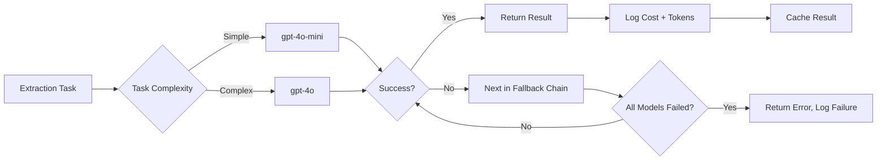

# OpenRouter API Integration

## Overview

OpenRouter provides unified access to multiple large language models through a single API. The Jasfo platform uses OpenRouter for LLM-powered intelligence features: intent signal classification, company description generation, pain point extraction from web content, and natural language search queries. OpenRouter's fallback chain capability ensures high availability by automatically routing to alternative models when the primary model is unavailable or rate-limited.

The platform uses a cost-aware routing strategy: simple tasks (classification, extraction) use cheaper models, complex tasks (content generation, analysis) use premium models. All costs are tracked per-lead for audit and budgeting purposes.

---

## Authentication

### API Key Setup

```
Authorization: Bearer sk-or-v1-abc123...
```

1. Sign up at [openrouter.ai](https://openrouter.ai)
2. Generate an API key from the dashboard
3. Add payment method (API keys work with $0 balance but are limited)
4. Store in Supabase Vault as `openrouter.api_key`

### Environment

| Variable | Description |
|----------|-------------|
| `OPENROUTER_API_KEY` | API key (Vault) |
| `OPENROUTER_BASE_URL` | `https://openrouter.ai/api/v1` |
| `OPENROUTER_DEFAULT_MODEL` | Fallback chain definition |
| `OPENROUTER_REFERRER` | `https://jasfo.com` (for rankings) |

---

## Endpoints

### Chat Completion

```
POST /api/v1/chat/completions
```

**Request**

```json
{
  "model": "openai/gpt-4o-mini",
  "messages": [
    {
      "role": "system",
      "content": "You are a lead intelligence analyst. Extract intent signals from the following company news article."
    },
    {
      "role": "user",
      "content": "Acme Corp announced a $50M Series B round led by Sequoia to expand their sales team..."
    }
  ],
  "temperature": 0.1,
  "max_tokens": 500
}
```

**Response**

```json
{
  "id": "chatcmpl-abc123",
  "model": "openai/gpt-4o-mini",
  "choices": [{
    "message": {
      "role": "assistant",
      "content": "{\n  \"intent_signals\": [\"funding_raised\", \"team_expansion\"],\n  \"signal_confidence\": 0.85,\n  \"budget_implication\": \"high\",\n  \"timeframe\": \"next 6 months\"\n}"
    }
  }],
  "usage": {
    "prompt_tokens": 85,
    "completion_tokens": 42,
    "total_tokens": 127
  }
}
```

---

## Fallback Chains

OpenRouter supports fallback models via the `model` parameter using a comma-separated chain:

```json
{
  "model": "openai/gpt-4o-mini,anthropic/claude-3-5-sonnet,google/gemini-2.0-flash-lite"
}
```

If `gpt-4o-mini` returns an error, OpenRouter automatically tries `claude-3-5-sonnet`, then `gemini-2.0-flash-lite`.

### Jasfo Default Fallback Chains

| Task | Primary | Fallback 1 | Fallback 2 |
|------|---------|-----------|------------|
| Intent classification | `gpt-4o-mini` | `gemini-2.0-flash-lite` | `mistralai/mistral-7b-instruct` |
| Content extraction | `gpt-4o-mini` | `claude-3-5-haiku` | `gemini-2.0-flash-lite` |
| Company description gen | `gpt-4o` | `claude-3-5-sonnet` | — |
| Natural language search | `gpt-4o-mini` | `gemini-2.0-flash-lite` | — |

---

## Cost Tracking

The platform logs every LLM call with its cost for per-lead auditing.

```json
{
  "model": "openai/gpt-4o-mini",
  "tokens_in": 85,
  "tokens_out": 42,
  "cost": 0.000084,
  "task": "intent_classification",
  "lead_id": "0194f1c0..."
}
```

### Model Pricing

| Model | Input / 1M tokens | Output / 1M tokens |
|-------|-------------------|--------------------|
| `gpt-4o-mini` | $0.15 | $0.60 |
| `gpt-4o` | $5.00 | $15.00 |
| `claude-3-5-sonnet` | $3.00 | $15.00 |
| `claude-3-5-haiku` | $0.80 | $4.00 |
| `gemini-2.0-flash-lite` | $0.075 | $0.30 |
| `mistralai/mistral-7b-instruct` | $0.07 | $0.07 |

### Monthly Cost Estimate (10,000 leads)

| Task | Calls/Lead | Model | Cost/Lead | Monthly |
|------|-----------|-------|-----------|---------|
| Intent classification | 3 | gpt-4o-mini | $0.0005 | $5.00 |
| Content extraction | 5 | gpt-4o-mini | $0.0010 | $10.00 |
| Company description | 1 | gpt-4o | $0.0150 | $150.00 |
| NL search queries | 2 | gpt-4o-mini | $0.0003 | $3.00 |

---

## Rate Limits

| Plan | Requests/min | Tokens/min |
|------|-------------|------------|
| Free | 20 | 40,000 |
| Tier 1 ($1 paid) | 60 | 100,000 |
| Tier 2 ($10 paid) | 120 | 200,000 |
| Tier 3 ($50 paid) | 300 | 500,000 |

---

## Error Codes

| Code | Meaning | Handling |
|------|---------|----------|
| `400` | Bad request | Check message format |
| `401` | Invalid API key | Alert admin |
| `402` | Insufficient credits | Fall back to cheaper model |
| `429` | Rate limited | Use fallback chain |
| `500` | Model error | Try next model in chain |
| `503` | Model overloaded | Fallback automatically via chain |

---

## Implementation Flow


