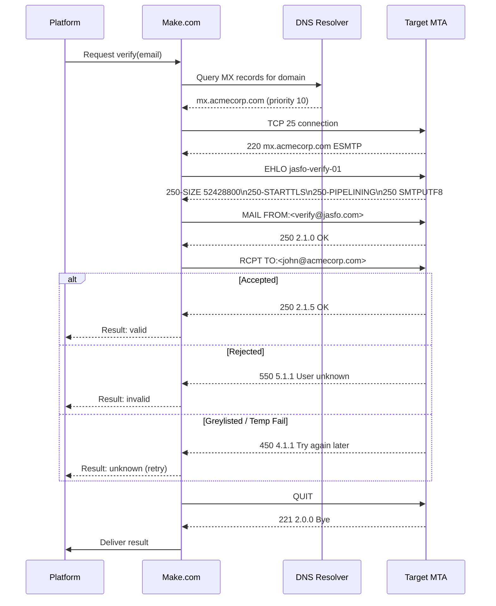
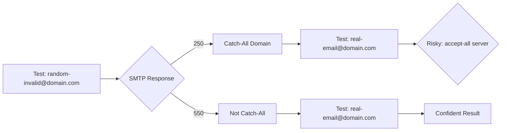

# SMTP Email Verification

## Overview

SMTP verification is the most reliable method for determining whether an email address is deliverable without sending an actual message. The process connects to the target domain's mail server, initiates an SMTP conversation, and uses the `RCPT TO` command to check whether the server accepts mail for the given address. The Jasfo platform performs SMTP verification through a Make.com implementation backed by a shared SMTP relay pool.

Unlike API-based verification services (Hunter, Snov.io), direct SMTP verification has no per-check cost and no monthly quota. It requires careful implementation to avoid being blacklisted: connection throttling, proper EHLO/HELO identification, and immediate QUIT after the RCPT TO response. The platform maintains a pool of verified sender identities to distribute the verification load.

---

## How It Works

### SMTP Response Classification

| Response Code | Classification | Description |
|-------------|----------------|-------------|
| `250` | **Valid** | Address accepted by server |
| `450` | **Unknown** | Temporary failure — greylisting or server load |
| `451` | **Unknown** | Server resource issue — retry later |
| `452` | **Unknown** | Server cannot process — retry later |
| `550` | **Invalid** | User unknown (most reliable rejection) |
| `551` | **Invalid** | User not local |
| `552` | **Invalid** | Mailbox full (also flagged as risky) |
| `553` | **Invalid** | Mailbox name not allowed |
| `554` | **Invalid** | Transaction failed (catch-all rejection) |

---

## Implementation in Make.com

### Module Chain

| Module | Purpose |
|--------|---------|
| **HTTP Request** | DNS MX lookup via REST API |
| **Iterator** | Iterate over MX records (sorted by priority) |
| **TCP Connection** | Open socket to SMTP server (port 25) |
| **SEND COMMAND** | Send `EHLO jasfo-verify-01` |
| **SEND COMMAND** | Send `MAIL FROM:<verify@jasfo.com>` |
| **SEND COMMAND** | Send `RCPT TO:<target@domain.com>` |
| **PARSE RESPONSE** | Extract status code and message |
| **ROUTER** | Branch based on `2xx`, `4xx`, `5xx` |
| **SEND COMMAND** | Send `QUIT` |
| **SLEEP** | Throttle (100ms minimum between connections) |

### Make.com Configuration

**Connection Settings**

| Parameter | Value |
|-----------|-------|
| Host | From MX record |
| Port | 25 |
| Timeout | 10 seconds per connection |
| TLS | Opportunistic STARTTLS |

**Sender Identity**

| Parameter | Value |
|-----------|-------|
| HELO/EHLO | `jasfo-verify-{id}.jasfo.com` |
| MAIL FROM | `verify@{random}.jasfo.com` |
| Randomization | New sender per 10 verifications |

---

## False Positive Handling

SMTP verification is not perfect. Several factors can produce false results:

| Scenario | Result | Mitigation |
|----------|--------|------------|
| Greylisting | `450` — looks invalid but would accept later | Retry 3 times with 15-min spacing |
| Catch-all domain | `250` for any address | Detect via test on non-existent address |
| Rate limiting | `450` — temporary block | Backoff, reduce concurrency |
| MX backup server | Inconsistent results | Connect to primary MX (lowest priority number) |
| SMTP banner filtering | `550` for valid addresses | Cross-reference with sender domain reputation |

### Catch-All Detection

### Confidence Scoring

| Scenario | Score | Label |
|----------|-------|-------|
| SMTP `250`, not catch-all | 0.95 | Verified |
| SMTP `250`, catch-all domain | 0.50 | Risky |
| SMTP `550`, confirmed | 0.99 | Invalid |
| SMTP `450` after 3 retries | 0.10 | Unknown |
| Timeout / connection failed | 0.00 | Unknown |

---

## Rate Limiting & Throttling

| Constraint | Value |
|-----------|-------|
| Max connections per MX | 2 concurrent |
| Min delay between connections | 100ms |
| Max verifications per sender identity | 50 |
| Sender identity rotation interval | Every 10 verifications |
| Max retries per address | 3 |
| Retry spacing | 15 minutes |
| Daily limit (per platform instance) | 5,000 |

---

## Security Considerations

| Concern | Mitigation |
|---------|------------|
| Blacklisting | Rotate sender identities, throttle connections |
| Rate limit by ISP | Distributed verification pool |
| TLS interception | Validate STARTTLS certificates |
| Data leakage | Never send actual email; MAIL FROM uses unique tokens |
| Logging | SMTP responses are sanitized; full SMTP logs kept 7 days |

---

## Error Handling

| Error | Handling |
|-------|----------|
| Connection refused (port 25 blocked) | Fall back to API verification |
| DNS resolution failure | Retry 2 times; fall back to API |
| Timeout | Reduce timeout to 10s; retry once |
| Blacklisted sender | Rotate to next sender identity |
| All senders exhausted | Flag as unverifiable, alert admin |
