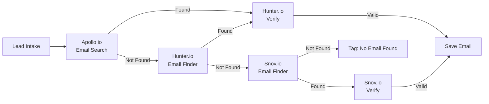

# Snov.io API Integration

## Overview

Snov.io provides email finding and verification services as a secondary/tertiary source in the platform's enrichment pipeline. It is used when Apollo and Hunter both return no result, or to corroborate low-confidence email addresses. The free tier offers 50 credits per month, which covers fallback enrichment for approximately 25 leads (find + verify each).

Snov.io's email finder works from a domain and full name, similar to Hunter, but uses a different data corpus. Running both in sequence maximizes coverage. The email verifier performs SMTP checks and returns a deliverability status.

---

## Authentication

### API Key Setup

Snov.io uses a two-key authentication system (ID + Secret) to obtain an access token.

1. Log in to [Snov.io](https://snov.io)
2. Go to Account → API → API Key
3. Copy your User ID and Secret
4. Store both in Supabase Vault as `snov.client_id` and `snov.client_secret`

### Authentication Flow

```
POST https://api.snov.io/v1/oauth/access_token
Content-Type: application/json

{
  "grant_type": "client_credentials",
  "client_id": "your_user_id",
  "client_secret": "your_secret"
}
```

**Response**

```json
{
  "access_token": "eyJhbGciOiJIUzI1NiIs...",
  "expires_in": 3600,
  "token_type": "Bearer"
}
```

The access token expires in 1 hour. The platform caches the token and refreshes it automatically.

### Environment

| Variable | Description |
|----------|-------------|
| `SNOV_CLIENT_ID` | Snov.io User ID (Vault) |
| `SNOV_CLIENT_SECRET` | Snov.io Secret (Vault) |
| `SNOV_BASE_URL` | `https://api.snov.io/v1` |
| `SNOV_CACHE_TTL` | Cache TTL in seconds (default: 604800) |

---

## Endpoints

### Email Finder

```
POST /v2/domain-emails-with-name
```

Find email address by domain and name.

**Request**

```json
{
  "domain": "acmecorp.com",
  "firstName": "John",
  "lastName": "Smith"
}
```

**Response**

```json
{
  "success": true,
  "emails": [
    {
      "email": "john@acmecorp.com",
      "firstName": "John",
      "lastName": "Smith",
      "status": "valid"
    }
  ]
}
```

**Usage in Jasfo**: Tertiary email source. Called after Apollo and Hunter fail.

### Email Verifier

```
POST /v1/email-verifier/by-email
```

Verify a single email address.

**Request**

```json
{
  "email": "john@acmecorp.com"
}
```

**Response**

```json
{
  "success": true,
  "data": {
    "email": "john@acmecorp.com",
    "status": "valid",
    "mxRecords": true,
    "smtpStatus": "235",
    "smtpResponse": "250 OK",
    "catchAll": false,
    "role": false,
    "disposable": false
  }
}
```

| Field | Description |
|-------|-------------|
| `status` | `valid` / `invalid` / `catch-all` / `unknown` |
| `smtpStatus` | SMTP response code |
| `mxRecords` | Whether MX records exist |
| `catchAll` | Domain uses catch-all |
| `disposable` | Known disposable provider |

### Free Email Check

```
POST /v1/email-verifier/check-free-email
```

Check if an email domain is a free email provider (Gmail, Yahoo, etc.).

**Request**

```json
{
  "email": "john@gmail.com"
}
```

---

## Rate Limits

| Tier | Monthly Credits | Rate Limit |
|------|----------------|------------|
| Free | 50 | 100 req/day |
| Starter | 1,000 | 1,000 req/day |
| Growth | 5,000 | 5,000 req/day |

1 credit = 1 email find or 1 verification.

---

## Error Codes

| Code | Meaning | Handling |
|------|---------|----------|
| `401` | Invalid or expired token | Refresh token, retry |
| `402` | Insufficient credits | Skip, log quota exhausted |
| `422` | Invalid input | Log error, skip lead |
| `429` | Rate limit exceeded | Backoff, retry |

---

## Pipeline Position



### When Snov.io Is Called

| Condition | Priority |
|-----------|----------|
| Apollo returned no email | High |
| Hunter returned no email | High |
| Both returned low confidence (< 0.6) | Medium |
| Corroborating existing high-confidence email | Low (skipped if credits low) |
