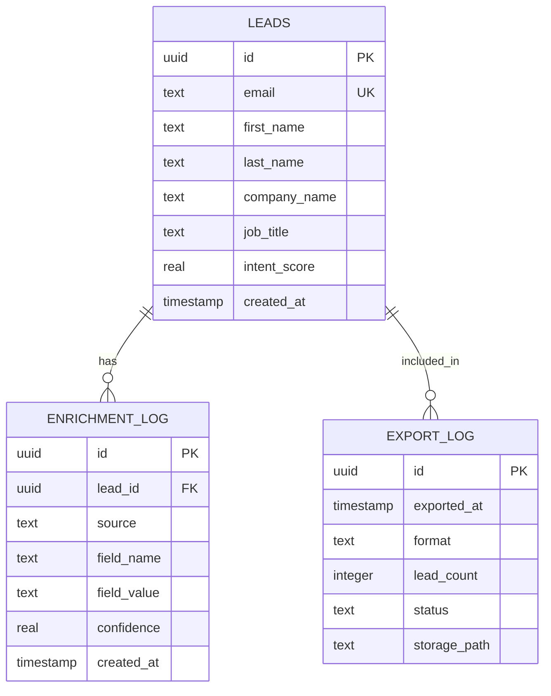

# Supabase API Integration

## Overview

Supabase is the primary backend platform for the Jasfo Lead Intelligence Platform. It provides PostgreSQL database, authentication, real-time subscriptions, file storage, and edge functions. The platform uses the Supabase JS client for frontend-to-backend communication, the REST API for server-to-server integration, and the Admin API for schema management and migrations.

This document covers all Supabase API surface areas used by the platform. Authentication is handled via service role key (server-side) and anon key with RLS (client-side). All secrets are stored in Supabase Vault.

---

## Authentication

### Client-Side (Anon Key)

```js
import { createClient } from '@supabase/supabase-js'

const supabase = createClient(
  process.env.SUPABASE_URL,
  process.env.SUPABASE_ANON_KEY
)

// User login
const { data, error } = await supabase.auth.signInWithPassword({
  email: 'user@jasfo.com',
  password: '***'
})
```

### Server-Side (Service Role)

```js
const supabaseAdmin = createClient(
  process.env.SUPABASE_URL,
  process.env.SUPABASE_SERVICE_ROLE_KEY
)

// Admin operations bypass RLS
const { data } = await supabaseAdmin
  .from('leads')
  .select('*')
  .limit(100)
```

---

## REST API

Supabase auto-generates a RESTful API for each table. The base URL is:

```
https://<project>.supabase.co/rest/v1/
```

### Authentication Header

```
GET /rest/v1/leads
apikey: <anon_key or service_role_key>
Authorization: Bearer <anon_key or service_role_key>
```

### Query Examples

**Filtered query**

```
GET /rest/v1/leads?intent_score=gte.0.8&select=first_name,last_name,email
```

**Pagination**

```
GET /rest/v1/leads?limit=100&offset=0
```

**Related data**

```
GET /rest/v1/leads?select=*,company:company_id(name,domain)
```

---

## JS Client

### Select

```js
const { data, error } = await supabase
  .from('leads')
  .select('*, company:company_id(*)')
  .gte('intent_score', 0.8)
  .order('created_at', { ascending: false })
  .limit(100)
```

### Insert

```js
const { data, error } = await supabase
  .from('leads')
  .insert({
    first_name: 'John',
    last_name: 'Smith',
    email: 'john@acmecorp.com',
    intent_score: 0.82
  })
  .select()
```

### Upsert (with conflict resolution)

```js
const { data, error } = await supabase
  .from('leads')
  .upsert(
    { email: 'john@acmecorp.com', intent_score: 0.85 },
    { onConflict: 'email', ignoreDuplicates: false }
  )
  .select()
```

---

## Real-Time Subscriptions

The platform uses real-time subscriptions for live lead feed updates on the dashboard.

```js
const channel = supabase
  .channel('leads-feed')
  .on(
    'postgres_changes',
    { event: 'INSERT', schema: 'public', table: 'leads' },
    (payload) => {
      console.log('New lead:', payload.new)
      updateDashboard(payload.new)
    }
  )
  .subscribe()

// Cleanup
channel.unsubscribe()
```

### Replication Setup

Enable replication in Supabase Dashboard → Database → Replication:

- Source: `public`
- Tables: `leads`, `enrichment_log`, `export_log`
- Event types: INSERT, UPDATE, DELETE

---

## Storage API

### Upload File

```js
const { data, error } = await supabase.storage
  .from('exports')
  .upload(`csv/2026/07/12/batch-0194.csv`, fileBuffer, {
    contentType: 'text/csv',
    upsert: false
  })
```

### Get Signed URL

```js
const { data, error } = await supabase.storage
  .from('exports')
  .createSignedUrl(`csv/2026/07/12/batch-0194.csv`, 3600)
// URL expires in 1 hour
```

### Storage Buckets

| Bucket | Purpose | Public | Retention |
|--------|---------|--------|-----------|
| `exports` | Export files | Signed URLs only | 30 days |
| `reports` | PDF reports | Signed URLs only | 90 days |
| `assets` | Platform assets | Public | Permanent |

---

## Admin API

### Schema Management

```sql
-- Managed via Supabase Dashboard or migrations
CREATE TABLE leads (
  id UUID PRIMARY KEY DEFAULT gen_random_uuid(),
  email TEXT UNIQUE,
  first_name TEXT,
  last_name TEXT,
  intent_score REAL DEFAULT 0.0,
  created_at TIMESTAMPTZ DEFAULT now()
);

-- Enable RLS
ALTER TABLE leads ENABLE ROW LEVEL SECURITY;
```

### Vault Secrets

```sql
-- Insert a secret
SELECT vault.create_secret(
  'fc-api-key-12345',
  'firecrawl.api_key',
  'Firecrawl API key for web scraping'
);

-- Read a secret (requires vault access role)
SELECT * FROM vault.decrypted_secrets
WHERE name = 'firecrawl.api_key';
```

### Row Level Security Policies

```sql
-- Example: single-user access policy
CREATE POLICY "single_user_access"
ON leads
FOR ALL
USING (
  auth.role() = 'service_role'
);
```

---

## Database Schema (Core Tables)



---

## Rate Limits

| Plan | API Requests | Storage | Database |
|------|-------------|---------|----------|
| Free | 50,000/month | 500 MB | 500 MB |
| Pro | 500,000/month | 100 GB | 8 GB |
| Team | 1,000,000/month | 200 GB | 16 GB |
| Enterprise | Custom | Custom | Custom |

---

## Error Codes

| Code | Meaning | Handling |
|------|---------|----------|
| `400` | Bad request | Validate payload before retry |
| `401` | Unauthenticated | Check API keys |
| `403` | RLS policy violation | Check row-level security |
| `404` | Resource not found | Check URL path |
| `406` | Not acceptable | Check Accept header |
| `429` | Rate limited | Backoff and retry |
| `5xx` | Server error | Retry with backoff |
