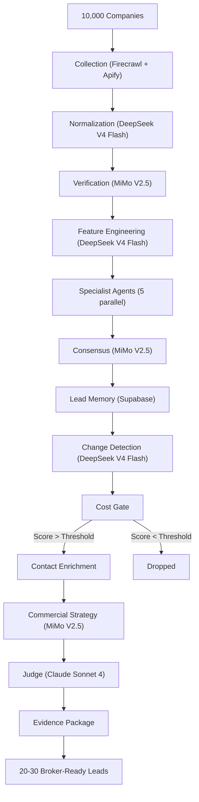

# Architecture Summary

This document is a concise one-page reference for the Jasfo platform architecture. It summarizes the 14-layer pipeline, data flow, key decisions, and critical numbers. For detailed information on any layer, refer to the dedicated documentation.

## The 14-Layer Pipeline

| # | Layer | Model | Cost Gate | Input → Output |
|---|-------|-------|-----------|----------------|
| 1 | **Collection** | — | Free | Company list → Raw scraped data |
| 2 | **Normalization** | DeepSeek V4 Flash | Free | Raw data → Structured records |
| 3 | **Verification** | MiMo V2.5 | Free | Records → Verified claims |
| 4 | **Feature Engineering** | DeepSeek V4 Flash | Free | Claims → Feature vectors |
| 5-9 | **Specialist Agents** | DeepSeek + MiMo | Free | Vectors → Multi-dimensional analysis |
| 10 | **Consensus** | MiMo V2.5 | Free | Agent outputs → Unified scores |
| 11 | **Lead Memory** | — | Free | Scores → Historical comparison |
| 12 | **Change Detection** | DeepSeek V4 Flash | Free | Current vs. historical delta |
| 13 | **Cost Gate** | — | Gate | Score check → Qualified candidates |
| 14 | **Contact Enrichment** | DeepSeek V4 Flash | Paid | Candidates → Decision-maker contacts |
| 15 | **Commercial Strategy** | MiMo V2.5 | Paid | Contacts → Outreach strategy |
| 16 | **Judge** | Claude Sonnet 4 | Paid | Strategy + Evidence → Final scores |

## Data Flow

```
10,000 → 9,500 → 8,000 → 8,000 → 5,000 → 2,000 → 1,000 → 500 → 200 → 20–30
(Input)                                                          (Gate)  (Output)
```

The numbers show approximate company count surviving each stage. Collection starts with 10,000. Specialist agents narrow to approximately 5,000. Consensus to 2,000. The Cost Gate drops 60% of remaining companies. The Judge delivers 20–30.

## Key Decisions

**Model assignment.** DeepSeek V4 Flash handles 60% of AI layers (cost: ~$0.20/1M tokens). MiMo V2.5 handles 30% (cost: ~$0.75/1M tokens). Claude Sonnet 4 handles only the Judge layer (cost: ~$8/1M tokens). This assignment balances cost and capability.

**Cost-gating strategy.** 80% of the monthly budget is spent on the top 20% of companies. The Cost Gate enforces this by requiring a minimum score threshold before paid processing is triggered. The threshold is calibrated weekly based on the remaining budget and the number of qualified candidates.

**Single-user architecture.** The database schema, Make.com scenarios, and API configurations all assume a single operator. There are no user tables, no multi-tenant RLS policies, and no authentication workflows beyond the broker's API keys.

**Sequential pipeline.** Layers execute sequentially. Layer N must complete before Layer N+1 begins. This simplifies debugging, cost tracking, and error recovery. The trade-off is total pipeline runtime (4–6 hours), which is acceptable for a weekly batch process.

## Critical Numbers

| Metric | Target |
|--------|--------|
| Companies processed per week | 10,000 |
| Qualified leads delivered | 20–30 |
| Monthly operating cost | < $50 |
| Pipeline runtime | < 6 hours |
| Broker time per week | 2–3 hours |
| Move Probability Score threshold | 70+ |
| Evidence quality score | > 80% |
| Cost per delivered lead | < $2 |

## System Architecture Diagram



This architecture is designed for iteration. Layers can be upgraded independently. New data sources can be added at the collection layer without affecting downstream processing. The scoring model can be recalibrated based on Reflection feedback without changing any other layer.
