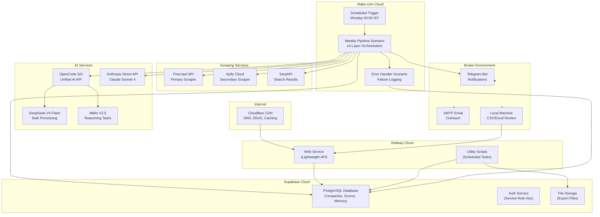
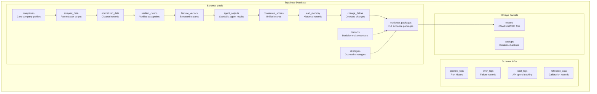
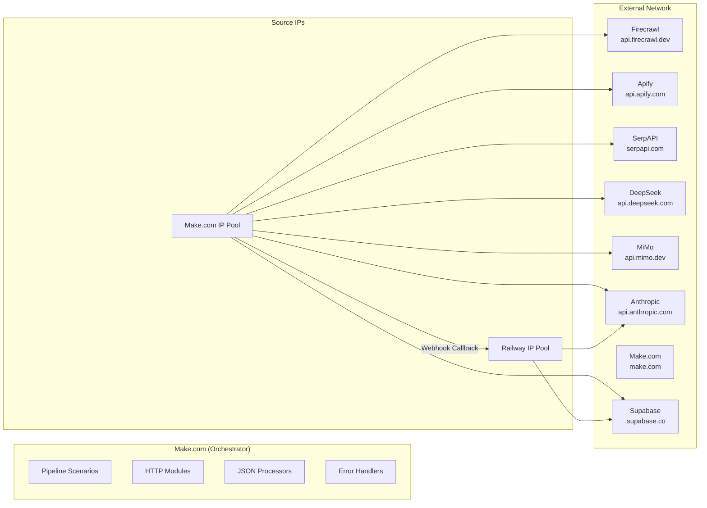
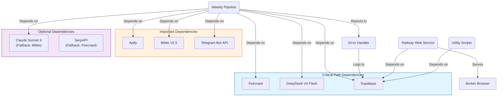
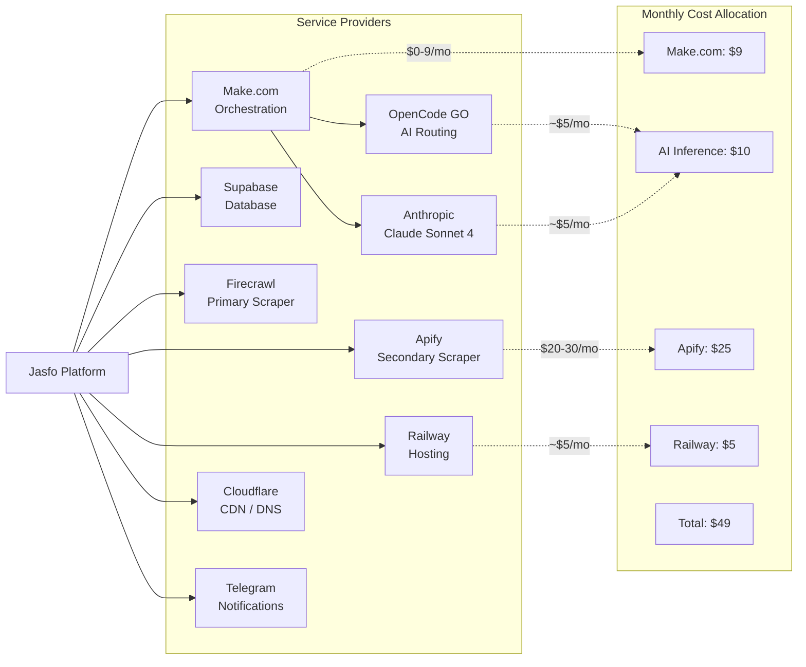

# Deployment Diagrams

This document contains Mermaid deployment diagrams illustrating the Jasfo platform's infrastructure: service topology across providers, data storage layout, network flow, and service dependencies.

## Deployment Architecture

## Data Storage Architecture

## Network Flow Diagram

## Service Dependency Diagram

## Technology Provider Map

