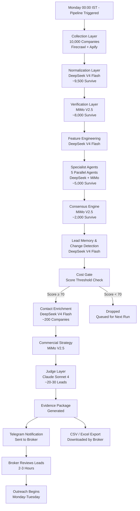
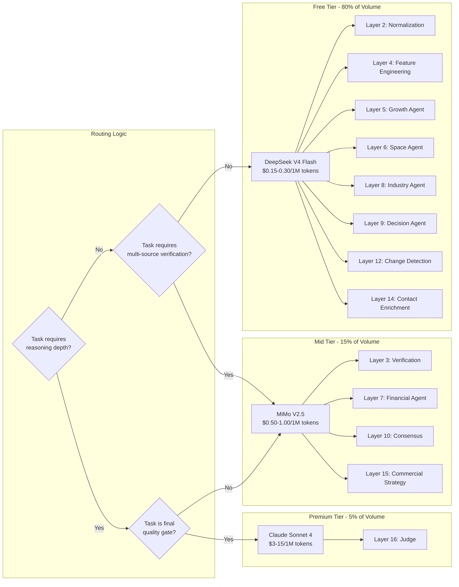
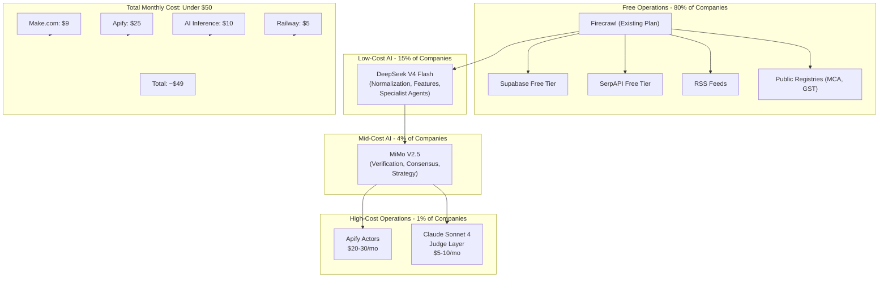
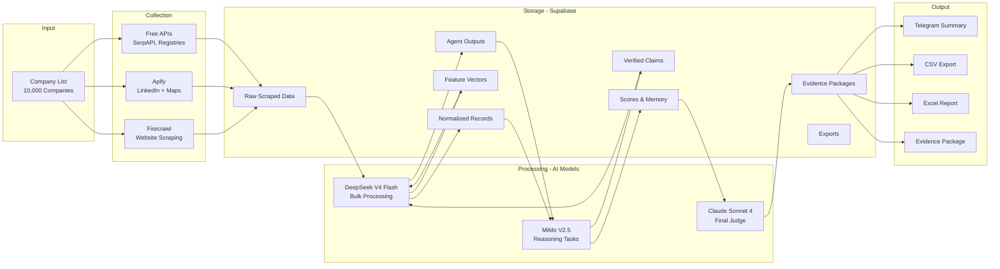

# High-Level Diagrams

This document contains Mermaid flowcharts illustrating the Jasfo platform's key workflows: the weekly pipeline, model routing across layers, cost flow through the system, and data flow from input to output.

## Weekly Pipeline Flow

## Weekly Pipeline Timeline

```mermaid
gantt
    title Weekly Pipeline Schedule
    dateFormat  HH:mm
    axisFormat  %H:%M
    
    section Collection
    Firecrawl Scraping     :c1, 00:00, 1h
    Apify Fallback         :c2, 00:30, 1h
    
    section AI Processing
    Normalization          :a1, 01:00, 30m
    Verification           :a2, 01:30, 45m
    Feature Engineering    :a3, 02:15, 30m
    Specialist Agents (5)  :a4, 02:45, 1h
    Consensus              :a5, 03:45, 30m
    
    section Memory & Gate
    Lead Memory + Change   :m1, 04:15, 30m
    Cost Gate              :m2, 04:45, 5m
    
    section Enrichment
    Contact Enrichment     :e1, 04:50, 30m
    Commercial Strategy    :e2, 05:20, 20m
    
    section Judge
    Claude Sonnet 4 Eval   :j1, 05:40, 15m
    
    section Delivery
    Export Generation      :d1, 05:55, 5m
    Telegram Notification  :d2, 06:00, 1m
    
    section Broker
    Lead Review            :b1, 09:00, 2h
```

## Model Routing Flow

## Cost Flow Diagram

## Data Flow Diagram

