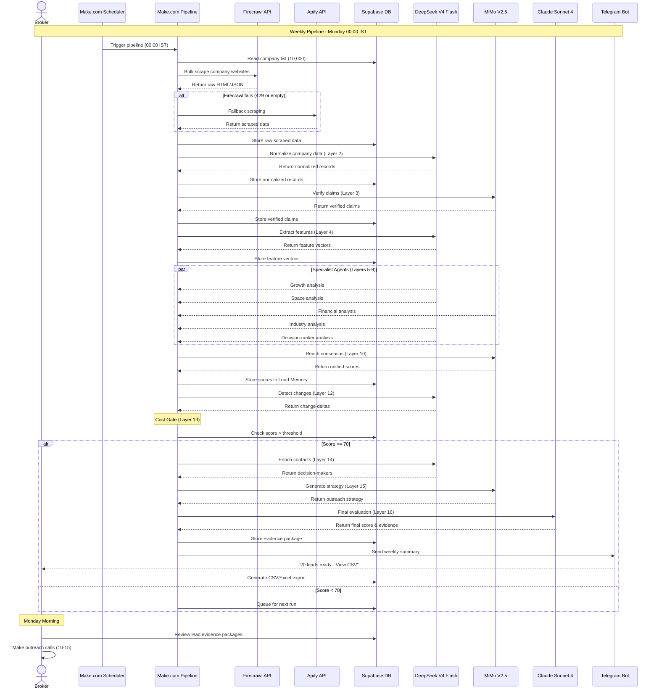
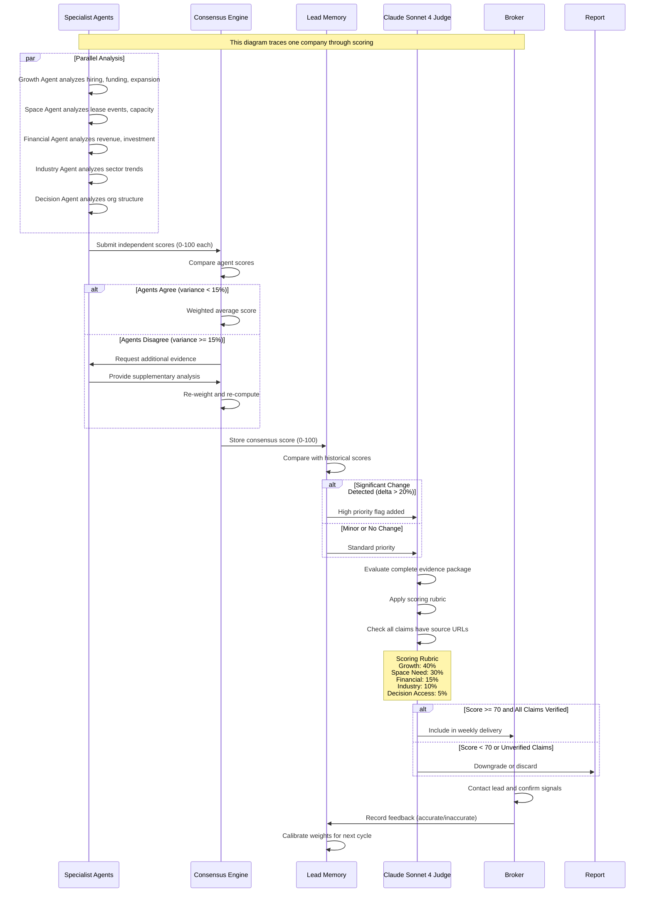
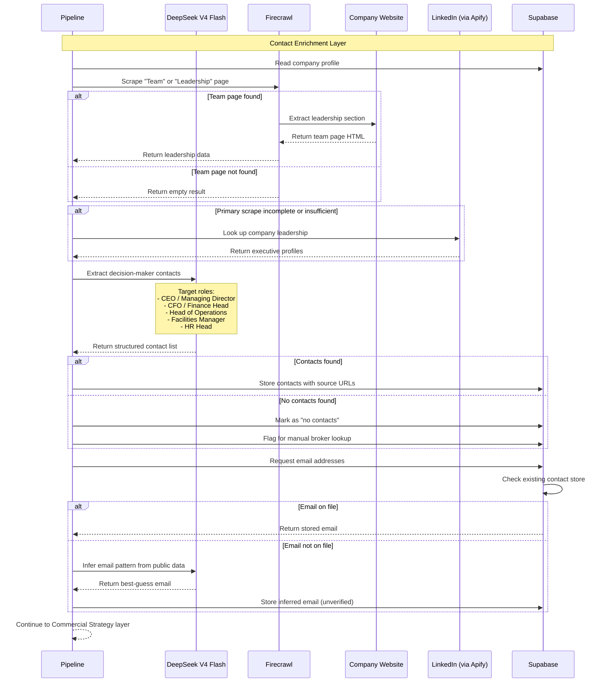
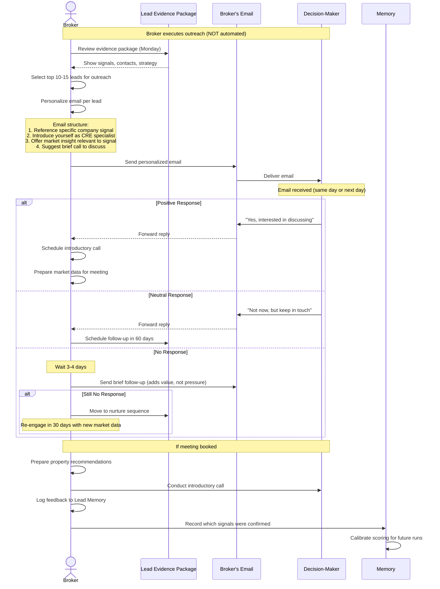

# Sequence Diagrams

This document contains Mermaid sequence diagrams illustrating key workflows in the Jasfo platform: the weekly pipeline execution, the scoring workflow, the decision-maker lookup process, and the email outreach sequence.

## Weekly Pipeline Execution

## Scoring Workflow

## Decision-Maker Lookup

## Email Outreach Sequence

