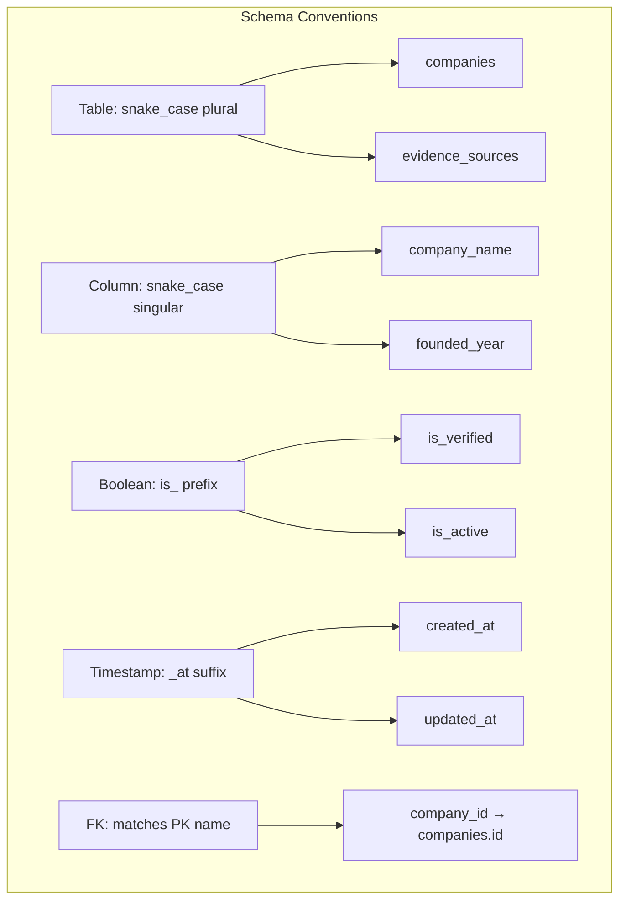
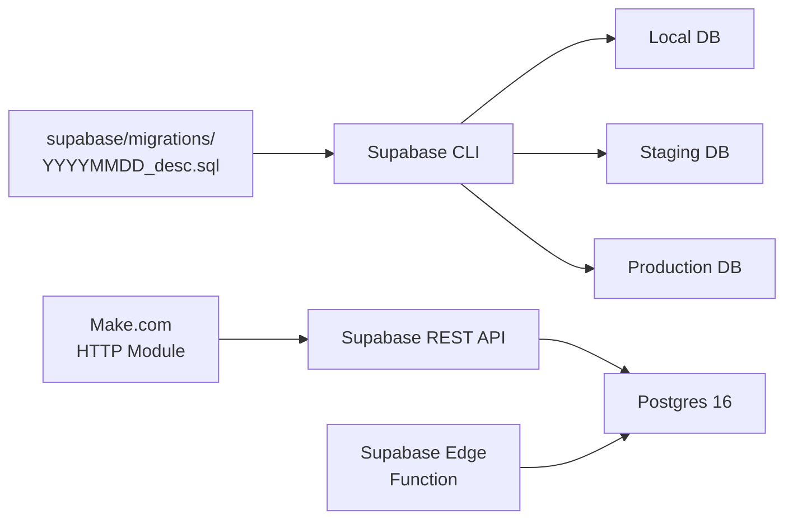

# Database Overview

> **Supabase PostgreSQL 16** — The single source of truth for the Jasfo Lead Intelligence Platform.

## Schema Philosophy

The database follows a **flat, single-user schema design** aligned with the Lazy-First development principle. There are no `user_id` foreign keys, no multi-tenant partitioning, and no complex role hierarchies because the platform serves exactly one broker. Every table uses `uuid` primary keys generated client-side via `gen_random_uuid()` to support offline-compatible insert patterns from Make.com scenarios. Timestamps are stored as `timestamptz` (always UTC) to avoid timezone ambiguity across the pipeline's distributed execution environment.

The schema is organized into four logical namespaces reflected in table naming prefixes:

| Prefix | Purpose | Example |
|--------|---------|---------|
| `companies_*` | Core company profiles and scraped attributes | `companies`, `companies_scores` |
| `leads_*` | Lead lifecycle, states, and engagement | `leads`, `leads_events` |
| `evidence_*` | Source citations, claims, snapshots | `evidence_claims`, `evidence_sources` |
| `audit_*` | Change tracking and history | `audit_log`, `audit_changes` |

This naming convention makes table purpose immediately clear in queries and keeps related tables grouped alphabetically in tooling.

## Naming Conventions

Every table and column follows a strict convention. Table names are **snake_case plural nouns** (`companies`, `evidence_sources`). Column names are **snake_case singular nouns** (`company_name`, `founded_year`). Boolean columns use the `is_` prefix (`is_verified`, `is_active`). Timestamp columns use the `_at` suffix (`created_at`, `updated_at`, `verified_at`). Foreign key columns match the referenced table's primary key name exactly (e.g., `company_id` references `companies.id`). This consistency enables automatic JOIN resolution in ORM tooling and makes the schema predictable for AI agents generating queries.

## Migration Strategy

Migrations are managed through **Supabase CLI** with raw SQL files committed to the repository under `supabase/migrations/`. Each migration file follows the naming pattern `YYYYMMDD_HHMMSS_description.sql` to guarantee chronological ordering. Migrations are designed to be **idempotent** — every `CREATE` is wrapped with `IF NOT EXISTS`, and destructive operations are avoided. Schema changes are rolled out through Supabase's built-in migration runner during the weekly pipeline execution window (Sunday 00:00–02:00 UTC).

The platform does not use an ORM. All database interactions happen through **raw SQL** executed by Make.com HTTP modules (Supabase REST API) or by Supabase Edge Functions. This keeps the query layer transparent, debuggable, and free of abstraction overhead. View definitions, function definitions, and trigger bodies are stored in `supabase/migrations/` alongside table DDL, ensuring the entire database definition is version-controlled and deployable from a clean state.

## Connection Architecture

The platform connects to Supabase through two paths. **Make.com scenarios** use the Supabase REST API with a service role key for admin-level operations (inserting companies, updating scores). **Supabase Edge Functions** use the `@supabase/supabase-js` client with the service role key for operations requiring transactional integrity (batch scoring updates, evidence snapshot creation). All connections use HTTPS with TLS 1.3. The service role key is stored as a Make.com variable and a GitHub secret respectively — never in code.
