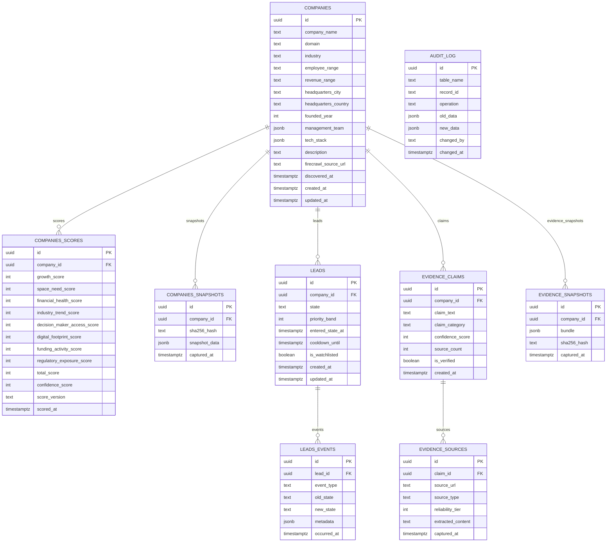

# Database Schema

> Complete entity-relationship model for the Jasfo platform. All tables live in the `public` schema.

## Entity Relationship Diagram

## Table Reference

| Table | Rows (Est.) | Size | Purpose |
|-------|-------------|------|---------|
| `companies` | 50,000 | ~50 MB | Core company profiles |
| `companies_scores` | 200,000 | ~80 MB | Scoring history per cycle |
| `companies_snapshots` | 200,000 | ~2 GB | Change detection snapshots |
| `leads` | 5,000 | ~5 MB | Active lead records |
| `leads_events` | 100,000 | ~50 MB | State transition history |
| `evidence_claims` | 500,000 | ~200 MB | Per-company evidence claims |
| `evidence_sources` | 1,000,000 | ~500 MB | Source URLs + extracted content |
| `evidence_snapshots` | 50,000 | ~1 GB | Immutable evidence bundles |
| `audit_log` | 1,000,000 | ~300 MB | Change audit trail |

## Key Relationships

- **companies → companies_scores**: One-to-many. Each weekly scoring cycle produces a new score record. The latest record per company is resolved by `DISTINCT ON (company_id) ORDER BY scored_at DESC`.
- **companies → leads**: One-to-one (active leads). A company has at most one active lead record. Historical lead records are soft-deleted via state transitions.
- **evidence_claims → evidence_sources**: One-to-many. Each claim must have at least one source record. The 2-source verification rule is enforced at the application layer, not the database layer, to allow partial evidence during pipeline execution.
- **audit_log**: Standalone. References `table_name` and `record_id` as text fields rather than foreign keys, keeping the audit system decoupled from table schemas.

## Type Conventions

| Pattern | Used For | Example |
|---------|----------|---------|
| `uuid` | Primary keys, foreign keys | `id uuid DEFAULT gen_random_uuid()` |
| `text` | Names, URLs, descriptions | `company_name text NOT NULL` |
| `integer` | Scores (0–100), years | `growth_score integer CHECK (growth_score >= 0 AND growth_score <= 100)` |
| `jsonb` | Dynamic / nested data | `management_team jsonb DEFAULT '[]'` |
| `timestamptz` | All timestamps | `created_at timestamptz DEFAULT now()` |
| `boolean` | Flags | `is_verified boolean DEFAULT false` |
