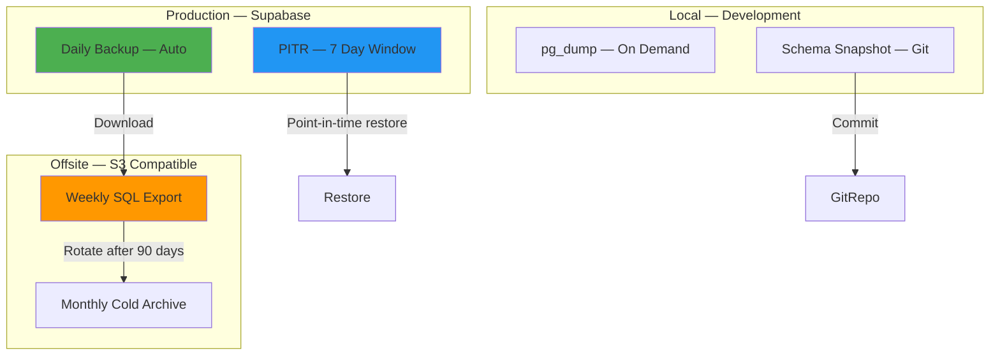

# Backup Strategy

The Jasfo Lead Intelligence Platform implements a multi-layered backup strategy following the 3-2-1 rule: three copies of data, on two different media types, with one copy offsite. The strategy covers database backups, file exports, and configuration snapshots, automated on a daily schedule with formal restore testing to ensure recovery readiness.

## Backup Architecture



## Database Backups

### Supabase Native Backups (Primary)

Supabase Pro plan includes automated daily backups for the PostgreSQL database. Key specifications:

| Feature | Detail |
|---|---|
| Frequency | Daily (automatic, no configuration required) |
| Retention | 7 days on Pro plan |
| Contents | Full database dump (schema + data), Auth config, Storage files |
| Download Format | `.sql` dump file via Supabase Dashboard > Database > Backups |
| Cost | Included in Pro plan ($25/month) |

Backups are automatically created during off-peak hours (typically 02:00–04:00 UTC). The Supabase team manages the backup infrastructure — no manual intervention is required for creation or retention.

### Point-in-Time Recovery

PITR supplements daily backups by enabling granular restoration to any second within the last 7 days. This is essential for recovering from accidental data deletion, corrupt migrations, or application-level data loss that occurred between daily backup snapshots.

PITR is configured under **Supabase Dashboard > Database > Backups > Point-in-Time Recovery**. Once enabled, Supabase continuously archives Write-Ahead Log (WAL) files, allowing restoration to any point within the retention window.

**Limitations**: PITR restores to a new database instance (not in-place). The application connection string must be updated after restoration. Allow 1-2 hours for restoration of a 1 GB database.

### Weekly SQL Exports (Secondary)

A weekly scheduled job exports the database to SQL format and stores it in an S3-compatible bucket (Backblaze B2 or Cloudflare R2) for long-term retention:

```sql
-- Scheduled via cron: exports full database
pg_dump \
  --host=$SUPABASE_HOST \
  --username=$SUPABASE_USER \
  --dbname=$SUPABASE_DB \
  --format=custom \
  --compress=9 \
  --file=/tmp/backups/jasfo_$(date +%Y%m%d).dump

# Upload to S3-compatible storage
aws s3 cp \
  /tmp/backups/jasfo_$(date +%Y%m%d).dump \
  s3://jasfo-backups/database/ \
  --storage-class STANDARD_IA
```

Weekly exports are retained for 90 days in hot storage, then transitioned to cold archive (Glacier Deep Archive equivalent) for 12 months.

## File and Configuration Backups

Beyond the database, the following assets are backed up:

| Asset | Method | Frequency | Retention |
|---|---|---|---|
| Docker images | Railway build cache | Every deploy | 30 days |
| Environment variables | GitHub Secrets + Railway backup | On change | Permanent |
| Scoring prompts | Git version control | Every commit | Permanent |
| Golden dataset | Git version control | Every commit | Permanent |
| CSV export artifacts | Railway persistent volume | Every pipeline run | 90 days |

## Automation Schedule

```mermaid
gantt
    title Backup Schedule
    dateFormat  HH:mm
    axisFormat %H:%M

    section Daily
    Supabase Auto Backup    :done, d1, 02:00, 1h
    Health Check Logs       :done, d2, 03:00, 30m

    section Weekly (Sunday)
    Full SQL Export         :done, w1, 02:00, 2h
    Upload to S3            :done, w2, 04:00, 30m
    Restore Test (Staging)  :done, w3, 05:00, 1h

    section Monthly (1st)
    Cold Archive Migration   :done, m1, 02:00, 1h
    Retention Cleanup        :done, m2, 03:00, 30m
```



## Restore Testing

A backup is only as good as its last successful restore. The platform performs automated restore testing weekly:

1. **Provision** — Create an ephemeral Supabase project (or use staging environment)
2. **Restore** — Download the latest backup and restore using `pg_restore`:
   ```bash
   pg_restore \
     --host=$EPHEMERAL_HOST \
     --username=$EPHEMERAL_USER \
     --dbname=jasfo_restore_test \
     --jobs=4 \
     --verbose \
     /tmp/latest_backup.dump
   ```
3. **Validate** — Run a series of validation queries:
   - Row counts match expected ranges across all tables
   - Scoring functions execute without errors
   - RLS policies are intact
   - Indexes are present and valid
4. **Report** — Results are posted to the `#backup-alerts` Telegram channel
5. **Cleanup** — Ephemeral project is destroyed

## Retention Policy

| Backup Type | Retention Period | Action After Expiry |
|---|---|---|
| Supabase daily backup | 7 days | Automatic deletion by Supabase |
| Weekly SQL export | 90 days (hot storage) | Transition to cold archive |
| Cold archive | 12 months | Permanent deletion |
| PITR WAL archives | 7 days | Automatic deletion |
| CSV exports | 90 days | Permanent deletion |

## Incident Recovery

In the event of data loss, the recovery procedure follows this priority:

1. **PITR** (last 7 days, any point-in-time) — preferred for granular recovery
2. **Latest daily backup** (within 24 hours) — fastest full recovery
3. **Weekly export** (within 90 days) — fallback if above options are unavailable
4. **Git version history** — for code, prompts, and configuration; always recoverable

Refer to the **Disaster Recovery** documentation for step-by-step recovery runbooks.
