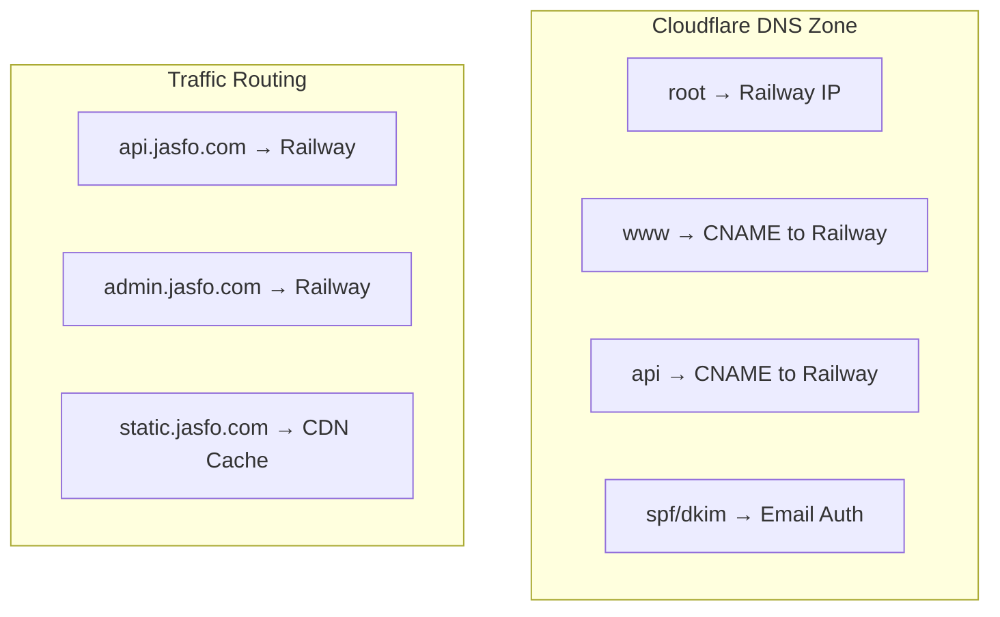
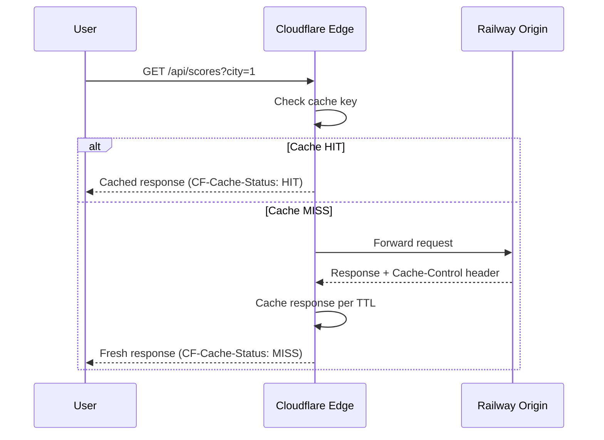

# Cloudflare Configuration

Cloudflare serves as the edge layer for the Jasfo Lead Intelligence Platform, handling DNS resolution, content caching, DDoS mitigation, and SSL/TLS termination. All traffic routes through Cloudflare before reaching the Railway origin, providing security and performance benefits at no additional compute cost to the application.

## DNS Configuration

The platform uses Cloudflare for authoritative DNS. Key DNS records are configured as follows:



| Record | Type | Target | Proxy |
|---|---|---|---|
| `jasfo.com` | A | Railway egress IP | Proxied (orange cloud) |
| `api.jasfo.com` | CNAME | `jasfo.up.railway.app` | Proxied |
| `admin.jasfo.com` | CNAME | `jasfo.up.railway.app` | Proxied |
| `static.jasfo.com` | CNAME | `jasfo.up.railway.app` | Proxied, cached |

All production DNS records are proxied through Cloudflare (orange cloud) to benefit from DDoS protection, CDN caching, and origin IP masking. Development and staging subdomains bypass Cloudflare proxy for direct debugging access.

## CDN Caching Strategy

Static assets and cacheable API responses are served from Cloudflare's global edge network, reducing latency for end users and decreasing origin load on Railway.



Cache rules are configured via Cloudflare Page Rules and Cache Rules:

| Pattern | Cache TTL | Bypass Criteria |
|---|---|---|
| `static.jasfo.com/*` | 30 days | — |
| `api.jasfo.com/scores*` | 5 minutes | `Authorization` header present |
| `api.jasfo.com/companies*` | 1 hour | Query parameter `?fresh=true` |
| `api.jasfo.com/*` | No cache | All dynamic endpoints |

## WAF and DDoS Protection

Cloudflare's Web Application Firewall is configured with the following rule sets active:

- **Cloudflare Managed Ruleset** — OWASP Top 10 protection, SQL injection, XSS, and RFI blocking
- **Rate Limiting** — 100 requests per minute per IP on API endpoints; 10 requests per minute on auth endpoints
- **DDoS L3/L4** — Automatic mitigation for volumetric attacks; no configuration required
- **Bot Fight Mode** — Enabled for login pages to block credential stuffing bots

Custom WAF rules enforce platform-specific security policies:

```
# Block requests without a valid User-Agent
(http.host eq "api.jasfo.com" and not http.user_agent contains "Jasfo-Client")

# Rate limit scoring endpoint
(http.host eq "api.jasfo.com" and http.request.uri.path eq "/api/score") 
-> rate limit: 60 req/min per IP

# Block known malicious IP ranges
(ip.src in { 10.0.0.0/8 172.16.0.0/12 192.168.0.0/16 } and not cf.worker)
-> block
```

## SSL/TLS Configuration

Cloudflare manages SSL/TLS certificates automatically with the following settings:

- **SSL Mode**: Full (strict) — requires a valid certificate on the origin server
- **Minimum TLS Version**: 1.3 for all API traffic; TLS 1.2 permitted for legacy client compatibility
- **Automatic HTTPS Rewrites**: Enabled — rewrites `http://` to `https://` in all responses
- **HSTS**: Enabled with `max-age=31536000`, `includeSubDomains`, `preload`
- **Certificate Type**: Cloudflare Universal SSL (auto-renewed) for production; Custom certificate option available for enterprise grade

## Origin Security

Railway's origin IP is protected through Cloudflare's proxy. Additional origin security measures include:

1. **Allowlist Origin Access** — Railway firewall rules restrict inbound traffic to Cloudflare's published egress IP ranges only
2. **Authenticated Origin Pulls** — Cloudflare signs all requests to the origin using a client certificate; Railway validates this certificate before accepting connections
3. **Zero Trust Access** — Admin endpoints require Cloudflare Access authentication with Google Workspace SSO for broker dashboard access

## Performance Optimization

Cloudflare's performance features configured for this platform:

- **Auto Minify** — JavaScript, CSS, and HTML are minified at the edge
- **Brotli Compression** — Responses compressed with Brotli for modern browsers, Gzip fallback for legacy
- **HTTP/2 and HTTP/3** — Both protocols enabled; HTTP/3 (QUIC) preferred for reduced connection setup latency
- **Rocket Loader** — Enabled for admin dashboard pages to defer non-critical JavaScript
- **Early Hints** — Enabled for API documentation pages to preload CSS and fonts
