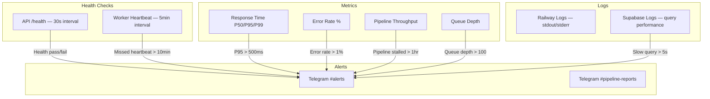

# Monitoring

The Jasfo Lead Intelligence Platform implements a lightweight monitoring architecture focused on system health, pipeline execution status, cost tracking, and automated alerting via Telegram. The approach prioritizes actionable alerts over dashboards — notifications are sent only when human intervention is required, reducing alert fatigue while ensuring critical issues are addressed promptly.

## Monitoring Architecture



## System Health Checks

The platform runs periodic health checks to verify core system components are operational. Health checks are implemented as a lightweight Python script executed via Railway cron every 5 minutes:

```python
# health_check.py — simplified logic
async def run_health_check():
    results = {}
    
    # API health
    async with httpx.AsyncClient() as client:
        try:
            r = await client.get("https://api.jasfo.com/health", timeout=10)
            results["api"] = r.status_code == 200
        except Exception:
            results["api"] = False
    
    # Database connectivity
    try:
        async with asyncpg.create_pool(CONNECTION_STRING) as pool:
            async with pool.acquire() as conn:
                await conn.execute("SELECT 1")
                results["database"] = True
    except Exception:
        results["database"] = False
    
    # Worker heartbeat — check recent pipeline activity
    # Look for worker_run records in last 10 minutes
    
    # Report failures
    failed = [k for k, v in results.items() if not v]
    if failed:
        await send_alert(f"Health check failed: {', '.join(failed)}")
```

Health check results are posted to the Telegram `#alerts` channel. If three consecutive checks fail for any component, an escalation alert is sent.

## Cost Alerts

Cost monitoring ensures the platform operates within budget across all service providers:

| Metric | Threshold | Action |
|---|---|---|
| Railway monthly spend | > $50/month | Review scaling configuration; optimize replica count |
| OpenAI API cost | > $20/month | Review prompt token usage; optimize prompt length |
| Firecrawl usage | > 5,000 pages/month | Review scraping efficiency; cache more aggressively |
| Supabase compute hours | > 75% of plan | Evaluate need for compute upgrade |
| Weekly cost anomaly | > 30% above average | Investigate for unauthorized usage or runaway processes |

A weekly cost summary is posted to the Telegram `#pipeline-reports` channel every Monday at 09:00:

```python
async def weekly_cost_report():
    costs = {
        "railway": await get_railway_costs(),
        "openai": await get_openai_usage(),
        "firecrawl": await get_firecrawl_usage(),
        "supabase": await get_supabase_usage(),
    }
    
    message = format_cost_message(costs)
    await send_pipeline_report(message)
```

## Pipeline Workflow Alerts

The weekly lead scoring pipeline is the platform's core workflow. Monitoring focuses on pipeline execution success, duration, and data quality:

| Event | Severity | Notification |
|---|---|---|
| Pipeline started | Info | `#pipeline-reports` |
| Pipeline completed successfully | Info | `#pipeline-reports` with summary stats |
| Pipeline completed with warnings | Warning | `#pipeline-reports` + `#alerts` |
| Pipeline failed | Critical | `#alerts` immediate |
| Pipeline stalled (> 2 hours) | Warning | `#alerts` |
| Pipeline produced 0 scores | Critical | `#alerts` + worker service restart |

Pipeline status is checked every 15 minutes via a cron job that queries the `pipeline_runs` table:

```sql
-- Check pipeline health
SELECT 
    id, started_at, completed_at,
    status, companies_scored, errors
FROM pipeline_runs
WHERE started_at > NOW() - INTERVAL '24 hours'
ORDER BY started_at DESC;
```

## Telegram Notification Setup

All alerts are routed through a dedicated Telegram bot to the appropriate channels:

### Bot Configuration

1. Create a bot via [@BotFather](https://t.me/BotFather) and obtain the API token
2. Set `TELEGRAM_BOT_TOKEN` in Railway environment variables
3. Create channels: `#alerts`, `#pipeline-reports`, `#backup-alerts`
4. Add bot as administrator to each channel
5. Set `TELEGRAM_ALERTS_CHAT_ID`, `TELEGRAM_REPORTS_CHAT_ID`, `TELEGRAM_BACKUP_CHAT_ID` in environment variables

### Alert Format

All alerts follow a structured format:

```
🔴 [CRITICAL] API Health Check Failed
Service: jasfo-api (production)
Error: 5 consecutive health checks failed
Time: 2026-07-12 14:30 UTC
Action: https://railway.app/project/jasfo/service/jasfo-api

🧹 Pipeline Summary — 2026-07-12
✅ 142 companies scored
⚠️ 3 companies failed (timeout)
⏱ Duration: 47 minutes
💰 Pipeline cost: $1.24
```

### Escalation Policy

| Severity | First Alert | If Unresolved (30 min) | If Unresolved (2 hours) |
|---|---|---|---|
| Critical | `#alerts` | DM to on-call engineer | Phone call |
| Warning | `#alerts` | `#alerts` follow-up | DM to on-call engineer |
| Info | `#pipeline-reports` | — | — |

## Runbook Automation

Common remediation actions are automated through Railway cron jobs and can be triggered manually via Telegram commands:

| Command | Action |
|---|---|
| `/retry-pipeline` | Re-trigger the last failed pipeline run |
| `/restart-worker` | Restart the worker service |
| `/check-health` | Run an immediate health check and report |
| `/cost-summary` | Post an immediate cost summary |
| `/validate-backup` | Trigger a backup restore validation test |

These commands are processed by a lightweight Telegram bot running as a Railway cron service that executes the corresponding Railway CLI or API action.

## Dashboard

While the platform emphasizes actionable alerts, a simple Grafana dashboard is available for trend analysis. The dashboard is hosted on Railway and pulls metrics from:

- **Railway API** — Service metrics (CPU, memory, response times)
- **Supabase Reporting Schema** — Database-level metrics (query performance, connection count, storage usage)
- **Application Metrics Table** — Custom metrics written by the application (`pipeline_runs`, `scoring_events`, `error_logs`)
