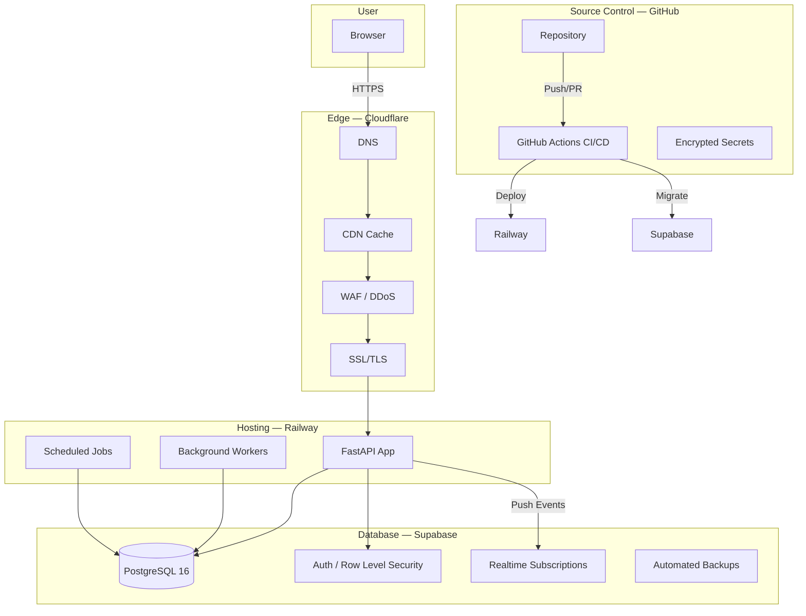

# Deployment Architecture Overview

The Jasfo Lead Intelligence Platform is deployed across a multi-provider architecture optimized for cost efficiency, global performance, and operational simplicity. The stack combines Railway for application hosting, Supabase for managed PostgreSQL with built-in authentication and real-time capabilities, Cloudflare for CDN and edge security, and GitHub for source control and CI/CD orchestration. This separation of concerns ensures each layer is managed by the best-in-class provider for its role, with minimal vendor lock-in.

## Architecture Diagram

## Component Responsibilities

**Railway** runs the FastAPI application server, background worker processes for lead scoring and enrichment, and scheduled cron jobs for weekly pipeline execution. Each service is containerized via Dockerfile and deployed from the `main` branch with zero-downtime rollouts. Railway's built-in observability provides logs, metrics, and alerting at no additional cost.

**Supabase** serves as the primary data store. PostgreSQL handles all structured data — companies, scores, contacts, and pipeline state — while Supabase Auth provides JWT-based authentication for API access. Row-Level Security policies enforce tenant isolation between brokers and cities. Database migrations run through the Supabase CLI and are executed as part of the CI/CD pipeline.

**Cloudflare** sits in front of all HTTP traffic, providing DNS resolution, CDN caching of static assets, Web Application Firewall rules, DDoS mitigation, and automatic SSL/TLS certificate management. The CDN layer reduces origin load by caching API responses at the edge with configurable TTLs based on content freshness requirements.

**GitHub** hosts the monorepo containing application code, infrastructure definitions, CI/CD workflows, and documentation. GitHub Actions orchestrates build, test, migration, and deployment steps. Environment-specific secrets are stored in GitHub Encrypted Secrets and injected at deploy time.

## Request Flow

A typical request flows through the entire stack in under 100ms. The browser connects via HTTPS to Cloudflare's edge, which terminates TLS, applies WAF rules, serves cached responses when possible, or proxies to Railway. Railway's FastAPI application authenticates via Supabase JWT validation, executes business logic against PostgreSQL, and returns structured JSON responses. Background workers asynchronously process scoring pipelines, with results pushed to connected clients via Supabase Realtime subscriptions.

## Security Posture

All inter-service communication occurs over TLS 1.3. API keys for Firecrawl, OpenAI, and external services are stored as Railway environment variables and never committed to the repository. Database connections use password authentication over encrypted channels, and Supabase's built-in IP restriction rules limit access to Railway egress IPs. The Cloudflare WAF blocks common attack patterns before they reach the application layer.
