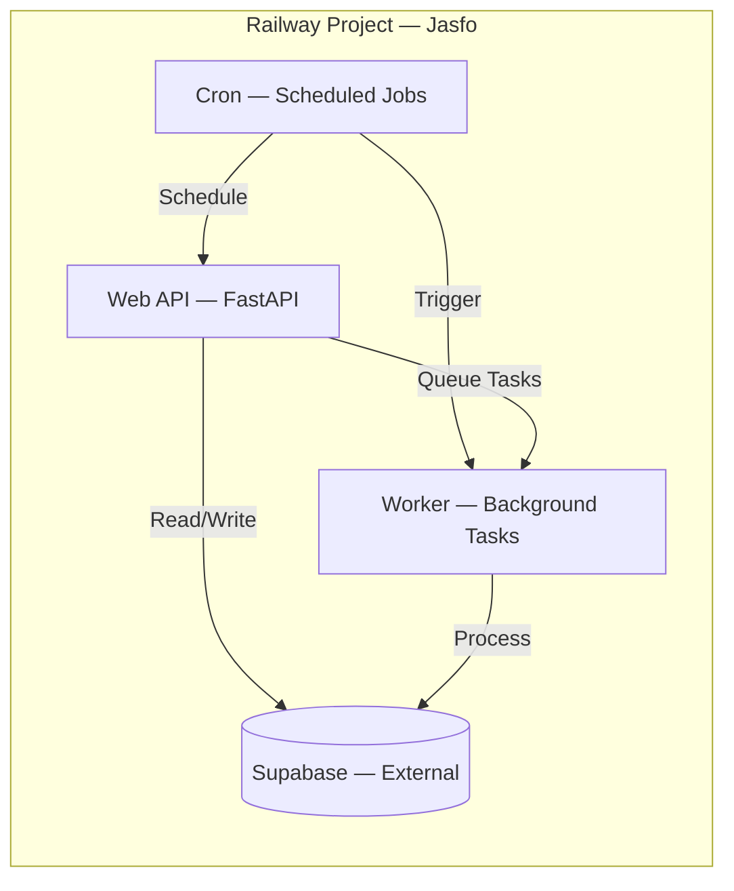

# Railway Deployment

Railway is the primary hosting platform for the Jasfo Lead Intelligence Platform, chosen for its seamless Docker integration, built-in observability, and zero-downtime deployments. The platform runs three distinct services — the FastAPI web application, background workers for lead processing, and scheduled cron jobs — each deployed as a separate Railway service within the same project and network.

## Service Architecture



**Web API** — A FastAPI application exposing RESTful endpoints for lead ingestion, scoring retrieval, and report generation. Configured with multiple replicas for high availability. Health check endpoints are monitored by Railway's built-in TCP checker.

**Worker** — A lightweight Python process consuming scoring tasks from the pipeline queue. It runs Firecrawl web scraping, GPT-based scoring, and contact enrichment workflows. Workers scale independently from the API to handle variable pipeline throughput.

**Cron** — A scheduled job runner executing weekly lead pipeline execution, database housekeeping, and report generation. Runs on a configurable cron schedule defined in `railway.json`.

## Environment Variables

All sensitive configuration is stored as Railway environment variables, never in code. Key variables are organized by category:

| Category | Variable | Purpose |
|---|---|---|
| Database | `SUPABASE_URL` | PostgreSQL connection string |
| Database | `SUPABASE_SERVICE_KEY` | Admin API key for migrations |
| Scraping | `FIRECRAWL_API_KEY` | API key for web scraping |
| AI | `OPENAI_API_KEY` | GPT scoring model access |
| AI | `ANTHROPIC_API_KEY` | Claude specialist agent access |
| Notifications | `TELEGRAM_BOT_TOKEN` | Bot token for alerts |
| Notification | `TELEGRAM_CHAT_ID` | Target chat for notifications |
| Auth | `JWT_SECRET` | Token signing key |

## Scaling Configuration

Railway supports horizontal scaling via replica count configuration. The recommended production configuration uses the following settings:

```json
{
  "services": [
    {
      "name": "web-api",
      "replicas": 2,
      "healthcheck": "/health",
      "port": 8000
    },
    {
      "name": "worker",
      "replicas": 1,
      "sleep": false
    },
    {
      "name": "cron",
      "replicas": 1,
      "cron": "0 9 * * 1"
    }
  ]
}
```

The API service runs two replicas for fault tolerance. The worker runs as a single instance processing tasks sequentially to avoid race conditions on scoring updates. The cron service is ephemeral — it executes its scheduled task and terminates.

## Deployment Workflow

Deployments are triggered automatically from the `main` branch via GitHub Actions. The deployment pipeline runs the following steps sequentially:

1. **Build** — Docker image is built from `Dockerfile` with `--target production` stage
2. **Test** — Unit tests and integration tests execute against an ephemeral PostgreSQL instance
3. **Migrate** — Supabase migrations apply via `supabase db push`
4. **Deploy** — Railway deploys the new image with zero-downtime rolling update
5. **Health Check** — Post-deploy health endpoint is polled for 60 seconds
6. **Rollback** — Automatic rollback if health checks fail within 3 consecutive attempts

## Logs and Monitoring

Railway provides integrated logging with real-time log streaming accessible via the dashboard or CLI. Each service's stdout and stderr are captured, indexed, and searchable. Key monitoring practices:

- **Error Rate** — Track 5xx response rate in Railway metrics dashboard; alert if >1% over 5 minutes
- **Response Time** — P95 response time should remain under 500ms; investigate sustained deviations
- **Worker Backlog** — Monitor queue depth; alert if pending tasks exceed 100
- **Memory** — Each replica should stay under 70% memory utilization; scale up if sustained

## Cost Optimization

Railway bills on a per-service basis for compute and storage. Cost-saving measures include:
- Worker service sleeps when idle (no cron tasks running)
- API replicas scaled to 1 during off-peak hours (nights/weekends)
- Build cache optimization reduces Docker build times and associated costs
- Log retention set to 7 days for standard tier

## Troubleshooting

Common deployment issues and resolution steps:

| Issue | Diagnosis | Resolution |
|---|---|---|
| Build failure | Check build logs for dependency errors | Verify `requirements.txt` and Dockerfile |
| Migration error | `supabase db push` fails | Run migration locally first; check for conflicts |
| Health check timeout | `/health` returns 5xx | Check database connectivity; verify env vars |
| Worker stuck | Tasks queued but not processing | Restart worker service; check API key validity |
| High memory | Replica exceeding 512MB | Review memory leaks; scale to larger plan |
