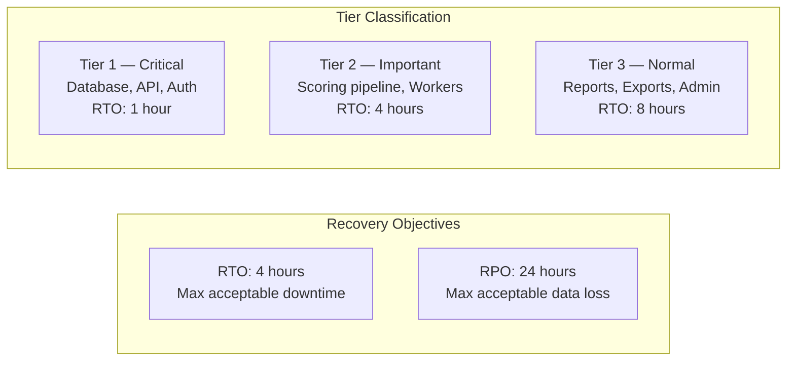

# Disaster Recovery

The Jasfo Lead Intelligence Platform maintains defined Recovery Time Objectives (RTO) and Recovery Point Objectives (RPO) to guide disaster recovery procedures. This document outlines the target metrics, recovery strategies for each failure scenario, and step-by-step runbooks for the most common and critical failure modes.

## Recovery Targets



| Tier | Component | RTO | RPO | Severity |
|---|---|---|---|---|
| T1 | PostgreSQL database | 1 hour | 5 minutes (PITR) | Critical |
| T1 | API server | 15 minutes | N/A | Critical |
| T1 | Authentication | 1 hour | N/A | Critical |
| T2 | Scoring pipeline | 4 hours | 24 hours | High |
| T2 | Background workers | 4 hours | N/A | High |
| T2 | Webhook integrations | 4 hours | 24 hours | High |
| T3 | Admin dashboard | 8 hours | N/A | Normal |
| T3 | CSV exports | 24 hours | 24 hours | Normal |
| T3 | Historical reports | 24 hours | 24 hours | Normal |

## Failure Scenarios and Runbooks

### Scenario 1: Database Corruption or Accidental Data Loss

**Symptoms**: Application returns 500 errors; queries fail; data appears missing or corrupt.

**Runbook**:

1. **Assess Damage** — Identify scope and timing of the corruption
   ```sql
   -- Check recent destructive operations
   SELECT query, calls, total_time
   FROM pg_stat_statements
   ORDER BY total_time DESC
   LIMIT 20;
   ```

2. **Engage PITR** — If corruption occurred within the last 7 days:
   - Open Supabase Dashboard > Database > Backups > Point-in-Time Recovery
   - Request restoration to a timestamp just before the corruption event
   - Supabase provisions a new database instance with the restored data

3. **Update Connection** — After restoration completes:
   - Copy the new database connection string from Supabase Dashboard
   - Update `SUPABASE_URL` in Railway environment variables
   - Restart all Railway services

4. **Validate** — Run validation queries against the restored database:
   - Verify company row counts: `SELECT COUNT(*) FROM companies;`
   - Verify scoring data: `SELECT COUNT(*) FROM scores;`
   - Run a sample scoring function: `SELECT * FROM score_company('123');`

5. **Communicate** — Post recovery summary to Telegram `#alerts` channel

**Fallback**: If PITR is unavailable, restore from the latest daily backup using `pg_restore`.

### Scenario 2: Application Server Failure

**Symptoms**: Railway dashboard shows unhealthy replicas; `/health` returns 503; API unreachable.

**Runbook**:

1. **Check Railway Dashboard** — Navigate to Railway project > Deployment tab
2. **Inspect Logs** — Review recent logs for error patterns:
   ```bash
   railway logs --service jasfo-api --tail 100
   ```
3. **Restart Service** — Trigger a restart from Railway dashboard or CLI:
   ```bash
   railway service restart jasfo-api
   ```
4. **Verify Health** — Poll the health endpoint until it returns 200:
   ```bash
   curl -f https://api.jasfo.com/health
   ```
5. **Escalation** — If the service fails to start within 5 minutes:
   - Check environment variables are intact (Railway > Variables)
   - Re-deploy the last known-good image version
   - If unresolved, roll back to the previous Railway deployment

### Scenario 3: Cloudflare Outage or Misconfiguration

**Symptoms**: DNS resolution fails; Cloudflare returns 5xx; traffic cannot reach origin.

**Runbook**:

1. **Verify Cloudflare Status** — Check `cloudflarestatus.com` for ongoing incidents
2. **Bypass Cloudflare (Emergency)** — If prolonged outage, configure traffic to bypass Cloudflare proxy:
   - Set DNS record to DNS Only (grey cloud) instead of Proxied (orange cloud)
   - Update DNS TTL to 60 seconds for rapid propagation
   - Direct traffic flows directly to Railway origin

3. **Restore Proxied Traffic** — After Cloudflare resolves:
   - Re-enable proxy (orange cloud) on all DNS records
   - Verify SSL handshake completes: `openssl s_client -connect api.jasfo.com:443`
   - Run full integration test suite against the API

### Scenario 4: API Key Compromise

**Symptoms**: Unauthorized API calls detected; unusual billing patterns; security alert from provider.

**Runbook**:

1. **Identify Compromised Key** — Review access logs to determine which key was exposed
2. **Revoke Immediately** — Rotate the compromised key in the provider's dashboard
3. **Update Environment** — Replace the key in Railway environment variables:
   ```bash
   railway variables set OPENAI_API_KEY=<new-key>
   ```
4. **Restart Services** — Restart all services that use the rotated key:
   ```bash
   railway service restart jasfo-api
   railway service restart jasfo-worker
   ```
5. **Audit Impact** — Review billing and usage logs for unauthorized usage
6. **Rotate All Keys** — As a precaution, rotate all API keys (even if not compromised)

### Scenario 5: Complete Platform Failure

**Symptoms**: Multiple simultaneous failures across database, application, and edge.

**Runbook**:

1. **Declare Incident** — Post to `#incidents` Telegram channel with severity status
2. **Stand Up New Environment** — Deploy to a fresh Railway project:
   - Fork the repository to a new Railway project
   - Configure environment variables from GitHub Secrets backup
   - Deploy using the production Docker image tag

3. **Provision New Database** — Create a new Supabase project on Pro plan:
   - Pull the latest backup from S3-compatible storage
   - Restore using `pg_restore` with the `--jobs=4` flag for parallel restoration
   - Run migration validation: `supabase db push --dry-run`

4. **Update DNS** — Point Cloudflare DNS to the new Railway project:
   - Update CNAME records to the new Railway deployment URL
   - Set DNS TTL to 60 seconds for rapid failover

5. **Validate End-to-End** — Run the complete integration test suite:
   ```bash
   pytest tests/integration/ --url https://api.jasfo.com --verbose
   ```

6. **Post-Mortem** — Within 48 hours, document root cause and preventive measures

## Runbook Quick Reference

| Scenario | Key Action | Time Estimate |
|---|---|---|
| Database corruption | PITR restoration via Supabase | 1-2 hours |
| API server down | Restart via Railway dashboard | 5 minutes |
| Cloudflare outage | Bypass proxy, set DNS to grey cloud | 5 minutes |
| API key compromised | Rotate key, restart services | 15 minutes |
| Full platform failure | Stand up new environment from backup | 2-4 hours |

## Communication Protocol

All recovery actions follow a structured communication cadence:

1. **Incident Detected** — Automatic alert to Telegram `#alerts`
2. **Acknowledged (15 min)** — On-call engineer acknowledges via Telegram reaction
3. **Status Update (30 min)** — Initial assessment posted to `#status`
4. **Mitigation (2 hours)** — Recovery actions underway; updated every 30 minutes
5. **Resolution** — All tiers restored and healthy
6. **Post-Mortem (48 hours)** — Root cause analysis and preventive measures documented

## Regular Testing

Disaster recovery procedures are tested monthly during off-peak hours:

- **Monthly PITR Drill** — Restore database to an ephemeral project using PITR
- **Monthly Failover Drill** — Deploy to a secondary Railway project and redirect traffic
- **Quarterly Full DR Test** — Complete platform recovery from scratch using documentation
