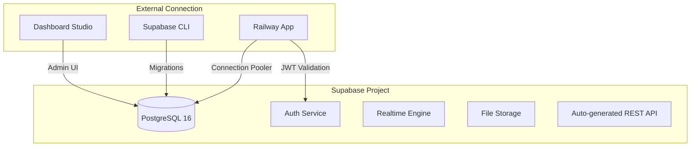

# Supabase Deployment

Supabase provides the PostgreSQL database foundation for the Jasfo Lead Intelligence Platform, along with built-in authentication, Row-Level Security, and real-time data synchronization. The platform uses a single Supabase project per environment (production, staging, development), with database migrations managed through the Supabase CLI and integrated into the GitHub Actions deployment pipeline.

## Project Setup

Each Supabase project is provisioned through the Supabase dashboard with the following configuration:



The production project is provisioned on the Supabase Pro plan with the following specifications:

| Resource | Allocation |
|---|---|
| Compute | 2 vCPU, 4 GB RAM |
| Storage | 8 GB PostgreSQL, 100 GB file storage |
| Connections | 200 max connections via connection pooler |
| Point-in-Time Recovery | 7-day retention |
| Daily Backups | Enabled (automatic) |
| Realtime | 5 concurrent connections |
| Branching | Enabled for preview deployments |

## Database Migrations

All schema changes are version-controlled as SQL migration files in the `supabase/migrations/` directory. The migration workflow follows a strict pattern:

```
supabase/
  migrations/
    20250101_initial_schema.sql
    20250115_add_scoring_functions.sql
    20250201_company_pipeline.sql
    20250215_contact_enrichment.sql
    20250301_add_rls_policies.sql
```

Each migration file is timestamped, immutable after merge to `main`, and tested against an ephemeral database branch before production deployment. Migration execution flow:

1. Developer creates a migration locally with `supabase migration new <name>`
2. Migration is reviewed as part of the PR
3. On merge to `main`, GitHub Actions runs `supabase db push` against the staging project
4. Integration tests validate the schema against the staging database
5. `supabase db push` executes against production with automatic rollback on failure

**Rollback Strategy**: Each migration must include a corresponding `revert` script stored in `supabase/migrations/revert/`. The deployment pipeline uses these revert scripts to roll back partially applied migrations.

## Row-Level Security

RLS policies enforce multi-tenant isolation at the database level. Every table includes a `broker_id` column, and policies automatically filter rows based on the authenticated user's broker affiliation:

```sql
-- Example RLS policy for companies table
CREATE POLICY "Brokers can only see their own companies"
ON companies
FOR ALL
USING (broker_id = auth.jwt() ->> 'broker_id');
```

Service role API keys bypass RLS for administrative operations and background worker processes.

## Connection Pooling

Supabase's built-in connection pooler (PgBouncer) sits between applications and the database. Railway services connect through the pooler using the connection string format:

```
postgresql://[user]:[password]@[project].pooler.supabase.com:6543/postgres?pgbouncer=true
```

The pooler is configured in transaction mode, distributing connections efficiently across the application's replicas. Long-running analytics queries use the direct connection (port 5432) to bypass the pooler's statement timeout.

## Backup Strategy

Supabase provides automated daily backups as a Pro plan feature. Each backup includes:

- Full database dump (schema + data)
- Auth configuration
- Storage bucket contents

Backups are retained for 7 days on the Pro plan and can be downloaded from the Supabase dashboard for long-term archival to S3-compatible storage (see Backups documentation for details).

## Point-in-Time Recovery

Point-in-Time Recovery (PITR) enables restoration to any point within the last 7 days at one-second granularity. This is critical for recovering from accidental data deletion or corruption without losing recent changes. PITR is configured in the Supabase dashboard under Database > Backups > Point-in-Time Recovery.

**Recovery Procedure**: To restore a database to a specific point in time, the Supabase support team performs the restoration to a new database instance. The application's connection string is then updated to point to the restored instance. This process takes approximately 1-2 hours for a 1 GB database on the Pro plan.

## Supabase CLI Commands

Key CLI commands used in the development workflow:

```bash
# Local development
supabase start                          # Start local Supabase stack
supabase migration new add_city_table   # Create a new migration
supabase db diff                        # Diff local vs remote schema
supabase db push                        # Push migrations to remote

# CI/CD
supabase link --project-ref <ref>       # Link project in CI
supabase db push --linked               # Run migrations against linked project
supabase gen types typescript --linked  # Generate TypeScript types
```
